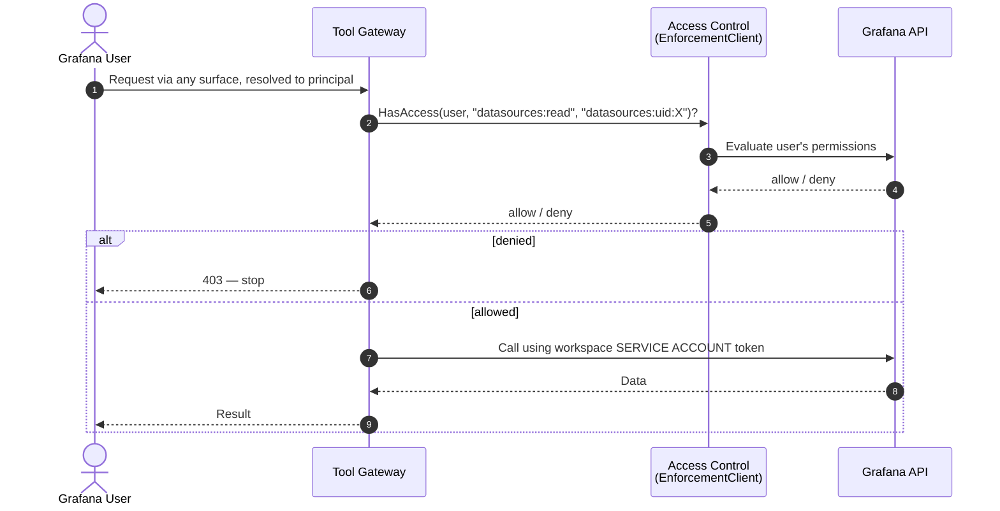

# Grafana Permission Enforcement — check-then-act

> **Status: 🟢 Resolved for v1, verified 2026-09-12.** Arose from a forum report
> describing the `app-with-rbac` plugin example. Materially affects
> `01-identity-and-access.md` A4. §3.3, §5, and §7 updated to reflect two
> confirmed facts, and §5 further updated with **live-tested** results against
> a real Grafana OSS `latest` instance:
>
> 1. **`externalServiceAccounts` does not work in multi-org setups**
>    (confirmed by a Grafana maintainer on GitHub) — irrelevant to us anyway,
>    see point 2.
> 2. **The platform owns the Grafana instance; customers are orgs within it.**
>    Both service accounts this document discusses are provisioned by
>    `grafana-mcp-provisioning.md`'s platform-Server-Admin flow, synchronously
>    at workspace creation — never dependent on a customer admin's session or
>    rights. This resolves what was previously §7 Q1 and Q4.
> 3. **`/api/access-control/user/permissions` reachability — confirmed live**
>    against Grafana OSS `latest` (v13.0.2): 200 with full RBAC data, but only
>    with **session-cookie auth** (Basic Auth 404s against it). Custom-role
>    creation (`POST /api/access-control/roles`) 404s in OSS, confirming
>    fine-grained custom-role evaluation is **Enterprise-only** — the
>    basic-role (Viewer/Editor/Admin) fallback in §6 decision 5 is not just a
>    fallback, it is the only option available to us in OSS. See §5.

---

## 1. What the forum post is describing

The plugin author wanted to check, inside their plugin backend, whether the
calling Grafana user is allowed to touch a particular Grafana resource.

The pattern they found:

1. Plugin backend receives a request carrying the user's context and ID token.
2. Before doing anything, it asks Grafana's access-control system:
   *"does **this user** have action `X` on resource `Y`?"* — via an
   **`EnforcementClient`** (Grafana's `authlib`).
3. Only if that check passes does the plugin proceed, using its **own service
   account token** to make the actual Grafana API call.

Names to search for:

| Term | What it is |
|---|---|
| **`app-with-rbac`** | Example in `grafana/grafana-plugin-examples` |
| **`EnforcementClient`** | Client in `github.com/grafana/authlib`, evaluates permissions for a user |
| **`/api/access-control/user/permissions`** | The underlying endpoint — **live-verified reachable in OSS `latest`, session-cookie auth required (§5)** |
| **Actions and scopes** | Permission model, e.g. action `datasources:read`, scope `datasources:uid:abc123` |
| **`externalServiceAccounts`** | Feature toggle for a *single, Grafana-managed* SA — broken for multi-org, and moot for us regardless (see revision note) |

**Important distinction:** the permission-evaluation half of this pattern
(`EnforcementClient`, step 2) is entirely independent of how the plugin's own
service account was created. Only the *convenience provisioning* half was ever
in question — and that's now settled by the platform-owned-Grafana fact.

---

## 2. Why it matters — the confused deputy

A plugin's service account is typically **more privileged than the user calling
it**. That is the whole point of a service account: it works when the user's
session cannot.

So this is a privilege escalation bug waiting to happen:

```
Viewer asks plugin to read datasource X
  → plugin uses its service account (which can read everything)
  → Viewer gets data they were never permitted to see
```

The plugin has become a **confused deputy**: a privileged component performing a
privileged act on behalf of an unprivileged caller, without checking.

Check-then-act fixes it:

```
Viewer asks plugin to read datasource X
  → plugin asks Grafana: may THIS USER read datasources:uid:X?
  → no  → 403, stop
  → yes → plugin uses service account to perform the read
```

The service account still does the work. The **user's** permissions still decide
whether the work happens.

**The key separation:** *authorisation* uses the user's identity, *execution* uses
the service identity. They are deliberately different.

---

## 3. The resolved architecture

### 3.1 Where the check happens — resolved (was §7 Q1)

**The harness (Tool Gateway) performs the enforcement check directly.** Not
the plugin backend.

Reasoning, now confirmed rather than merely leaning:

- The Tool Gateway is the actual security boundary (D7). A boundary that
  delegates its decision to a caller's assertion is weaker than one that
  checks independently — the same principle already applied to D10 (the
  Tool Gateway validates the capability token itself, never trusts the agent
  worker).
- **Slack-triggered runs have no plugin in the request path at all.** If
  enforcement lived in the plugin, Slack-initiated Grafana access would have
  no enforcement point whatsoever. Centralising the check in the Tool Gateway
  gives every surface — Grafana, Slack, webhook — the same enforcement path.



### 3.2 It validates the hybrid model (A4)

`01-identity-and-access.md` A4 framed the choice as *user identity vs service
identity*. Check-then-act shows that's a false dichotomy: accurate
authorisation from the user's identity, reliable execution via the service
identity, simultaneously. Restated as a Tool Gateway invariant:

> Every tool call performs an authorisation check against the **principal**,
> then executes with whatever **downstream credential** is correct for that
> target. The two are never the same decision, and the audit record captures
> both.

Already reflected in the audit schema's `actor`/`downstream_identity` split.

### 3.3 Best option for datasource access

Better than `oauthPassThru` (needs Grafana to be an OIDC client of the same
IdP) and better than "service account + our own policy" (reimplements
Grafana's permission model and drifts from it). **Default for all
Grafana-scoped resources** (datasources, dashboards, folders, alert rules),
with `oauthPassThru` reserved for datasources that must see the end user.

### 3.4 Both service accounts — resolved (was §3.3's open dependency)

Both the plugin's own enforcement SA and the `grafana-mcp` tool server's SA
are provisioned by the **same platform-internal mechanism**: a platform-level
Grafana Server Admin credential creates both, synchronously, at workspace/org
creation — see `grafana-mcp-provisioning.md` §2. No per-customer admin
session or rights dependency exists anymore. This also means the
multi-org `externalServiceAccounts` limitation, while still true as a Grafana
platform fact, is now simply **irrelevant to us** — we were never going to use
that mechanism regardless, once the platform-owns-Grafana fact was confirmed.

### 3.5 Closes a hole in J3

J3 has the user attaching context by reference — *this panel, this dashboard,
this alert rule*. Every `@context` reference must pass an enforcement check
**before** the agent sees the resource, not after, and not as an output filter
— otherwise a Viewer can reference a dashboard they cannot open and have the
agent read and summarise it with workspace credentials.

### 3.6 Slack-initiated runs and Grafana permissions — resolved (was §7 Q2)

**Decision: no per-user check for Slack-initiated runs. Always evaluate at the
workspace service account's ceiling.** Chosen deliberately as the simpler path
for v1, to be revisited once there's PoC usage data — a Slack-triggered run
never resolves to a live Grafana request context, so building the
resolve-linked-principal-and-check-out-of-band path (the more accurate
alternative) is deferred until real usage shows it's worth the complexity.

**Consequence:** a Slack-initiated action against a Grafana resource is
authorised only by whatever the workspace SA can already do — which means
the SA's role (Viewer by default, Editor only where a write tool is
explicitly enabled per D16) **is** the real access-control boundary for the
Slack surface. This is consistent with, not an exception to, the hybrid model.

### 3.7 System-initiated runs — resolved (was §7 Q3)

No user, therefore no user permissions to check. The workspace service
account's own permissions are the ceiling — identical mechanism to §3.6,
and consistent with D13 (`system_initiated` runs are structurally read-only,
enforced by the capability token never containing a write tool class, so this
ceiling is actually never tested against a write attempt in practice).

---

## 4. What it does *not* solve

- **Only covers Grafana resources.** Kubernetes, GitHub, Jira and cloud APIs
  have their own authorisation models. K8s impersonation remains the
  equivalent mechanism there; GitHub remains a bot identity.
- **Does not authenticate the user to us.** Answers *"may this user do X?"*,
  not *"who is this user?"* — that's still ID forwarding (`X-Grafana-Id`,
  D9). The enforcement client needs that ID token as input, so this
  *reinforces* rather than replaces the ID-forwarding dependency.
- **Does not remove the need for our own policy layer.** Grafana can say the
  user may read a datasource; only we can say the agent may act autonomously,
  or spend this much, or run this tool class.

---

## 5. Verified (2026-09-12) — live-tested against Grafana OSS `latest`

Ran a disposable Grafana OSS `latest` container (resolved to **v13.0.2**) and
tested directly rather than relying on documentation:

1. **`/api/access-control/user/permissions` reachability — confirmed.**
   Returns 200 with the full RBAC permission map for the authenticated user.
   **Important nuance not previously known:** this requires **session-cookie
   authentication** (`POST /login`, then the returned cookie) — a request
   authenticated with Basic Auth against this endpoint returns 404 (the SPA's
   catch-all route, not a real 404 from the access-control API). Whatever
   calls this from the Tool Gateway needs to either hold a Grafana session for
   the calling identity or use an equivalent mechanism; a bare API-key/Basic
   Auth call will silently look like "endpoint not found."
2. **Custom-role evaluation confirmed Enterprise-only in OSS.**
   `POST /api/access-control/roles` (creating a custom RBAC role) returns 404
   in OSS. This confirms decision 5 in §6 below is not merely a fallback for a
   hypothetical OSS limitation — it is the **only** option available to us:
   evaluation must be expressed in terms of the built-in Viewer/Editor/Admin
   org roles, never custom action/scope combinations, unless/until Grafana
   Enterprise is in play.
3. **`authlib`/`EnforcementClient` maturity** — not resolved by this pass
   (requires inspecting the Go module directly, not just the HTTP surface);
   still an open verification item, see §7.
4. **Latency/caching and action/scope vocabulary** — not addressed by this
   pass; still open, see §7.

---

## 6. Decisions

| # | Decision |
|---|---|
| 1 | **Check-then-act is a Tool Gateway invariant** for all targets: authorise as the principal, execute as the correct downstream identity, audit both |
| 2 | **The Tool Gateway performs the enforcement check itself** — never delegated to the plugin backend |
| 3 | **Grafana resource access defaults to enforcement-check + service account**, with `oauthPassThru` reserved for datasources that must see the end user |
| 4 | **Every `@context` reference is enforcement-checked before the agent sees the resource**, never filtered afterwards |
| 5 | If OSS lacks fine-grained permission evaluation, fall back to **org-role-based checks** (Viewer/Editor/Admin) — coarser, still not a confused deputy. **Confirmed the only option in OSS (§5 item 2), not merely a fallback.** |
| 6 | **Slack-initiated and system-initiated runs never get a per-user check** — both are bounded by the workspace service account's own role, by design, revisited only after PoC feedback |
| 7 | **Calls to `/api/access-control/user/permissions` must use session-cookie auth**, not Basic Auth/API key — confirmed by live test (§5 item 1). Whatever component performs the enforcement check needs a session-capable credential path for this specific endpoint. |

---

## 7. Remaining open questions

1. **PoC feedback trigger for §3.6** — what usage signal would tell us the
   "always workspace-SA-ceiling" simplification for Slack is actually costing
   something (e.g. Viewers in Slack getting refused actions an Editor could do,
   often enough to be a UX complaint)? Not resolved by the live-verification
   pass — this is a product-judgement call, not a technical fact. Proposed
   metric: track denials where the linked user's actual Grafana role would
   have allowed the action but the workspace SA's role didn't; revisit past an
   agreed threshold.
2. **`authlib` maturity and API stability** — is `EnforcementClient` a
   supported public API or an internal package that may move? Still requires
   inspecting the Go module directly; not covered by this session's HTTP-level
   verification.
3. **Latency and caching** — an enforcement call per referenced resource,
   during an incident, at alert-storm concurrency. Is the permission set
   cacheable per request, and for how long without going stale? Still open.
4. **Action/scope vocabulary** for the resources we care about: datasources,
   dashboards, folders, alert rules. Still open.
5. **How the Tool Gateway obtains a session-cookie-equivalent credential** for
   calling `/api/access-control/user/permissions` on behalf of the resolved
   principal (new, arising from §5 item 1) — needs a concrete mechanism, e.g.
   minting a short-lived Grafana session server-side per check, or an
   equivalent `authlib` client path that accepts a bearer/ID token directly
   instead of a cookie.
