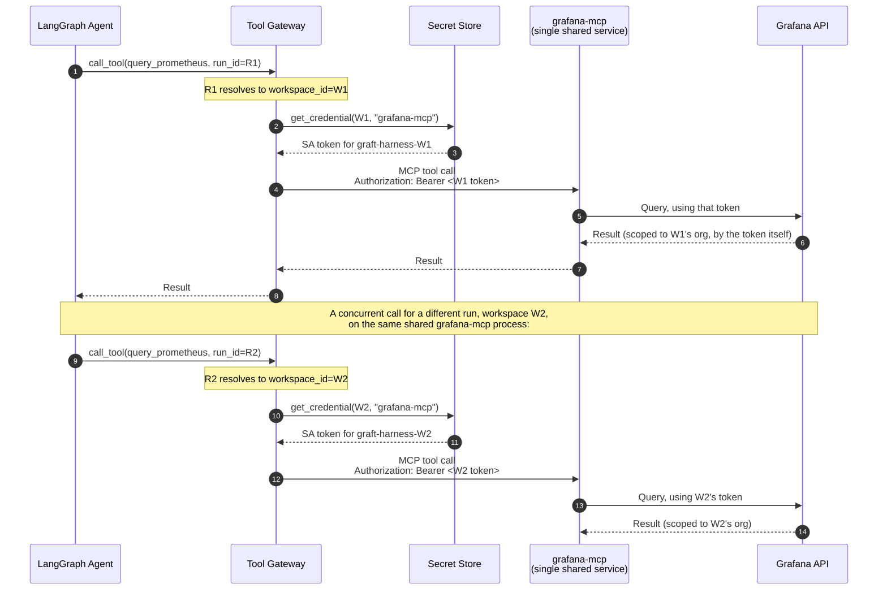

# Multi-Tenancy for the Grafana MCP Server

> **Status: 🟡 In review.** Answers: is `grafana-mcp` one shared server using the
> SA token handed to it, and what happens with multiple concurrent users?
>
> Related: D7/D7a/D7b (Tool Gateway shape), `grafana-mcp-provisioning.md` (where
> the SA token comes from), `grafana-authz-delegation.md` (check-then-act).
>
> **Confidence note:** whether the reference OSS `grafana-mcp` implementation
> supports per-request credential override, or only a single startup-time
> credential, is a **must-verify**, not an assumption. This document is written
> to be correct either way.

---

## 1. Two questions that need separating

1. **Is there one `grafana-mcp` process, or one per workspace?** — an
   infrastructure/deployment question.
2. **How does a single process serve many workspaces without leaking one
   workspace's credential or data into another's request?** — an identity/
   isolation question, and the one that actually matters.

Getting (1) right and (2) wrong is how you build a multi-tenant-shaped system
that is not actually multi-tenant-safe.

---

## 2. Why "single central server, SA token passed in" is the right shape

D7a already states the reasoning that applies here: **stdio MCP is
single-identity by construction — no per-user RBAC, no central throttling
point.** That is exactly the failure mode a *shared, static-credential* server
would reproduce even over HTTP: a process that reads one Grafana URL and one
token from its environment at startup can only ever act as one workspace,
forever, for every caller.

The correct shape, consistent with D7a/D7b, is:

- **One logical `grafana-mcp` service** (scaled horizontally as needed — this is
  an ordinary stateless-service scaling question, not an identity one).
- **No credential baked into the process at startup.**
- **The credential is supplied per call**, resolved by the Tool Gateway from the
  workspace-scoped secret store (per `grafana-mcp-provisioning.md`), and attached
  to that specific outbound MCP request.

This is precisely why D7a mandates streamable-HTTP: the transport carries a
request, and a request can carry an `Authorization` header. stdio has no
equivalent — the process's identity is fixed for its entire lifetime.

**The isolation guarantee comes entirely from the token, per call, never from
which process happened to handle the request.** Grafana itself enforces the
org boundary based on the token it's given — `grafana-mcp` doesn't need to know
anything about our tenancy model at all. It just has to be honest about not
caching or reusing credentials across requests, which is §4's verification item.

---

## 3. What "multiple users" actually resolves to

Worth being precise about *which* multiplicity is being asked about — there are
two, and they're handled at different layers.

### 3.1 Multiple workspaces (orgs) — handled above

Covered by §2: different token per call, resolved by `run_id → workspace_id`.
`grafana-mcp` never sees two workspaces' credentials conflated, because it never
sees "a workspace" at all — only "a token for this one call."

### 3.2 Multiple human users within the *same* workspace — handled upstream, not here

This is the more interesting case, and the answer is: **`grafana-mcp` never
knows which human triggered the call, and it shouldn't.**

Per `grafana-authz-delegation.md`, authorisation (may *this specific user* do
this?) is decided **before** the call ever reaches the Tool Gateway's dispatch to
`grafana-mcp` — either by the plugin backend's check-then-act, or by the Tool
Gateway performing the equivalent check using the resolved principal from the
run's capability token. By the time a call reaches `grafana-mcp`, the question
"is this allowed" is already answered; all that remains is "do it, as the
workspace."

So: two engineers in the same org, one a Viewer and one an Editor, running
concurrent investigations, produce calls to `grafana-mcp` that are
**indistinguishable from each other** at that layer — same workspace SA token,
same org. The difference between what they're permitted to trigger was enforced
earlier, and is what's recorded in the `actor` block of the audit record,
**not** derivable from anything `grafana-mcp` saw.

This is a deliberate consequence of the hybrid model (A4): user identity is
where authorisation happens, service identity is where execution happens, and
they are different layers on purpose. Trying to make `grafana-mcp` itself
user-aware would mean re-implementing authorisation at the execution layer,
which is exactly the drift-from-Grafana's-own-model problem check-then-act was
adopted to avoid.

### 3.3 Concurrency correctness (a real engineering constraint, not a design choice)

Given many simultaneous calls across many workspaces hit one shared service, it
must hold **no mutable state that survives past a single request** — no global
"current token," no connection cached against a mutable credential slot. Each
request's credential, org context, and response must be fully local to that
request's handling. This is a standard stateless-service requirement, but it is
worth stating explicitly here because it's exactly the assumption that breaks if
someone integrates a `grafana-mcp` implementation that was written assuming
"one process, one Grafana instance, one token, set once at startup."

---

## 4. Must verify before building

This is the load-bearing unknown for this whole document:

1. **Does the reference OSS `grafana-mcp` server support a per-request/per-call
   credential override** (e.g., reading the Grafana token from an incoming
   `Authorization` header on each streamable-HTTP request), **or only a single
   token supplied via environment variable at process startup?**
   - Many "MCP server for Grafana" reference implementations in the wild were
     built for a single person's single Grafana instance (a personal-use case),
     not multi-tenant SaaS. If that's what we're looking at, it is **not** safe
     to share one process across workspaces as-is.
2. If per-request override is **not** supported upstream, the options are, in
   order of preference:
   - **(a) Contribute/fork a thin change** so it accepts credential-per-request
     — smallest deviation from upstream, keeps one shared service.
   - **(b) Run a lightweight sidecar/wrapper we own** in front of unmodified
     `grafana-mcp`, which pools per-workspace instances or processes and routes
     each Tool Gateway call to the right one based on `workspace_id` — more
     moving parts, but zero upstream modification.
   - **(c) One `grafana-mcp` process per workspace** — simplest code, but scales
     with workspace count, and credential rotation means restarting a process,
     which reintroduces exactly the "static config, redeploy to rotate" problem
     `grafana-mcp-provisioning.md` was designed to avoid.
   - **Reject a single process reading one shared token for everyone** — that is
     the single-tenant shape we are explicitly not building.
3. **Does the streamable-HTTP MCP transport, as `langchain-mcp-adapters` and our
   Tool Gateway implement it, actually support attaching a per-call
   `Authorization` header**, or does it establish one session-level auth context
   for the life of a connection? If it's session-level, a "session" from the
   Tool Gateway's perspective must be scoped to **one workspace's calls**, not
   shared across workspaces even transiently — connection pooling would then need
   to be keyed by `workspace_id`, not just reused globally.

---

## 5. Decision

| # | Decision |
|---|---|
| 1 | **One logical `grafana-mcp` service**, horizontally scaled as an ordinary stateless service — not one process per workspace, as a starting position. |
| 2 | **No credential is ever baked into the service at startup.** Every credential is resolved per call by the Tool Gateway and attached to that call. |
| 3 | **Isolation between workspaces is enforced by the token Grafana receives, per call** — not by which process or instance handled the request. |
| 4 | **`grafana-mcp` never receives or reasons about which human triggered a call.** Per-user authorisation is fully resolved before dispatch; the service only ever acts as "the workspace." |
| 5 | If upstream `grafana-mcp` cannot accept a per-call credential, **fall back to option 4.2(a) or (b)** before accepting per-workspace processes (4.2c) — in that order. |

---

## 6. Open questions

1. Resolve §4.1 by inspecting the actual `grafana-mcp` implementation we intend
   to run — this is a concrete, answerable engineering task, not a design
   trade-off, and it should happen before any of this is built against.
2. If §4.2(a)/(b) is needed, **who owns that fork/sidecar long-term** — us,
   maintained against upstream, or a dependency we now carry indefinitely?
3. Does per-call credential attachment have a **performance cost** worth caring
   about (e.g., losing HTTP/2 connection reuse if credentials must vary per
   request on the same connection)? Likely negligible next to LLM inference
   latency, but worth a note rather than an assumption.
