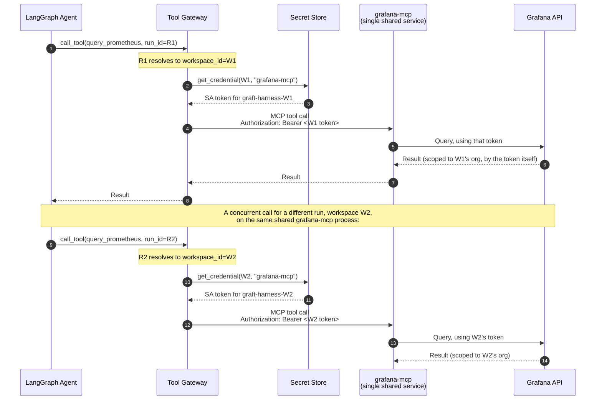

# Multi-Tenancy for the Grafana MCP Server

> **Status: 🟢 Blocking verification resolved (2026-09-12).** Answers: is
> `grafana-mcp` one shared server using the SA token handed to it, and what
> happens with multiple concurrent users?
>
> Related: D7/D7a/D7b (Tool Gateway shape), `grafana-mcp-provisioning.md` (where
> the SA token comes from), `grafana-authz-delegation.md` (check-then-act).
>
> **Resolution:** the reference OSS `grafana-mcp` (`github.com/grafana/mcp-grafana`)
> was cloned and read directly. It **does** support per-request credential
> forwarding via `GRAFANA_FORWARD_HEADERS`, and its internal Grafana client
> cache is genuinely keyed by credential (`url, apiKey, username, password,
> orgID, forwardedHeaders`) rather than being a single global client. This is
> better than the "personal single-instance tool" shape this document worried
> about — see §4 for the full result and the one new constraint it surfaced.

---

## 1. Two questions that need separating

1. **Is there one `grafana-mcp` process, or one per workspace?** — an
   infrastructure/deployment question.
2. **How does a single process serve many workspaces without leaking one
   workspace's credential or data into another's request?** — an identity/
   isolation question, and the one that actually matters.

Getting (1) right and (2) wrong is how you build a multi-tenant-shaped system
that is not actually multi-tenant-safe.

---

## 2. Why "single central server, SA token passed in" is the right shape

D7a already states the reasoning that applies here: **stdio MCP is
single-identity by construction — no per-user RBAC, no central throttling
point.** That is exactly the failure mode a *shared, static-credential* server
would reproduce even over HTTP: a process that reads one Grafana URL and one
token from its environment at startup can only ever act as one workspace,
forever, for every caller.

The correct shape, consistent with D7a/D7b, and **now confirmed as what the
real implementation actually does (§4)**:

- **One logical `grafana-mcp` service** (scaled horizontally as needed — this is
  an ordinary stateless-service scaling question, not an identity one).
- **No credential baked into the process at startup**, or — more precisely, per
  §4 — a startup credential may exist as a *default*, but it is not the only
  credential the process can act with; a per-request forwarded header can
  override it for that call.
- **The credential is supplied per call**, resolved by the Tool Gateway from the
  workspace-scoped secret store (per `grafana-mcp-provisioning.md`), and attached
  to that specific outbound MCP request.

This is precisely why D7a mandates streamable-HTTP: the transport carries a
request, and a request can carry an `Authorization` header (or, as confirmed
in §4, another forwarded header, since `Authorization` is reserved for a
different purpose in this implementation). stdio has no equivalent — the
process's identity is fixed for its entire lifetime.

**Note (2026-09-12):** the diagram above shows `Authorization` carrying the
downstream Grafana credential. §4 found this collides with the real
implementation's use of `Authorization` for **caller** authentication
(`MCP_GRAFANA_SERVER_TOKEN`) when that feature is enabled. In practice the
downstream credential must ride on a different forwarded header (e.g.
`Cookie`) if caller authentication via `Authorization` is also in use — see §4
for the resolved mechanics.

**The isolation guarantee comes entirely from the credential attached per
call, never from which process happened to handle the request.** Grafana
itself enforces the org boundary based on the credential it's given —
`grafana-mcp` doesn't need to know anything about our tenancy model at all. It
just has to be honest about not caching or reusing credentials across
requests, which §4 confirms it is (the client cache key includes the
forwarded-header set).

---

## 3. What "multiple users" actually resolves to

Worth being precise about *which* multiplicity is being asked about — there are
two, and they're handled at different layers.

### 3.1 Multiple workspaces (orgs) — handled above

Covered by §2: different credential per call, resolved by `run_id →
workspace_id`. `grafana-mcp` never sees two workspaces' credentials conflated,
because it never sees "a workspace" at all — only "a credential for this one
call," and (per §4) its own client cache is keyed on exactly that credential.

### 3.2 Multiple human users within the *same* workspace — handled upstream, not here

This is the more interesting case, and the answer is: **`grafana-mcp` never
knows which human triggered the call, and it shouldn't.**

Per `grafana-authz-delegation.md`, authorisation (may *this specific user* do
this?) is decided **before** the call ever reaches the Tool Gateway's dispatch to
`grafana-mcp` — either by the plugin backend's check-then-act, or by the Tool
Gateway performing the equivalent check using the resolved principal from the
run's capability token. By the time a call reaches `grafana-mcp`, the question
"is this allowed" is already answered; all that remains is "do it, as the
workspace."

So: two engineers in the same org, one a Viewer and one an Editor, running
concurrent investigations, produce calls to `grafana-mcp` that are
**indistinguishable from each other** at that layer — same workspace SA token,
same org. The difference between what they're permitted to trigger was enforced
earlier, and is what's recorded in the `actor` block of the audit record,
**not** derivable from anything `grafana-mcp` saw.

This is a deliberate consequence of the hybrid model (A4): user identity is
where authorisation happens, service identity is where execution happens, and
they are different layers on purpose. Trying to make `grafana-mcp` itself
user-aware would mean re-implementing authorisation at the execution layer,
which is exactly the drift-from-Grafana's-own-model problem check-then-act was
adopted to avoid.

### 3.3 Concurrency correctness — confirmed by source inspection (2026-09-12)

Given many simultaneous calls across many workspaces hit one shared service, it
must hold **no mutable state that survives past a single request** — no global
"current token," no connection cached against a mutable credential slot. Each
request's credential, org context, and response must be fully local to that
request's handling.

**This is no longer an assumption to verify — it was confirmed by reading the
actual `client_cache.go`:** the internal Grafana client cache key
(`clientCacheKey`) is built per-request from `{url, apiKey, username, password,
orgID, forwardedHeaders}` (the last one a sorted, serialised digest of the
forwarded-header set), with a `singleflight`-based cache to collapse duplicate
concurrent builds for the *same* credential without ever sharing a client
across *different* credentials. This is precisely the credential-scoped,
stateless-per-request shape this document called for, not the "one process,
one Grafana instance, one token, set once at startup" shape it worried a naive
reference implementation might have.

---

## 4. Verified 2026-09-12 — the load-bearing unknown, resolved

The reference OSS `grafana-mcp` was cloned (`github.com/grafana/mcp-grafana`,
current `main`) and read directly, rather than assumed. Findings:

1. **Per-request credential override — supported, via `GRAFANA_FORWARD_HEADERS`.**
   This environment variable takes a comma-separated allow-list of header
   names to copy from the **incoming** request to every outbound Grafana API
   request (documented use case: forwarding a `Cookie` session so a gateway
   sitting in front of SSO can associate calls with the right user). This *is*
   the per-request credential-attachment mechanism this document called for —
   it is not limited to a single startup-time token. It's designed for
   SSE/streamable-HTTP transports specifically (no effect in stdio mode,
   consistent with D7a's reasoning for banning stdio).
2. **New constraint, not previously known: `Authorization` is reserved for
   caller authentication, and cannot simultaneously carry the downstream
   credential.** The server supports its own caller-auth middleware
   (`RequireBearerToken`, gated by `MCP_GRAFANA_SERVER_TOKEN`) that
   authenticates *who is calling the MCP server* via `Authorization: Bearer
   <token>`, constant-time-compares it, and then **strips the header** before
   the request proceeds further — specifically so the caller's credential can
   never leak downstream to Grafana or into a cache key. The codebase
   explicitly checks for and **refuses to start** if `GRAFANA_FORWARD_HEADERS`
   is *also* configured to forward `Authorization` while caller auth is
   enabled (`ForwardsAuthorizationHeader()`), since the two purposes for that
   header conflict.
   - **Practical consequence for our design:** if the Tool Gateway needs to (a)
     authenticate itself to `grafana-mcp` as a caller, **and** (b) attach a
     distinct, per-workspace Grafana credential to that same call, it cannot
     do both via the `Authorization` header. Two workable options:
     - **(preferred) Forward a different header for the downstream credential**
       — e.g. `Cookie` carrying a per-workspace Grafana session, or a custom
       header the deployment is comfortable mapping to Grafana session/API-key
       semantics — while `Authorization` continues to carry the Tool
       Gateway's own caller-auth token to `grafana-mcp`.
     - **(alternative) Skip `grafana-mcp`'s built-in caller auth** and rely on
       network isolation (private link / mTLS / service mesh policy) between
       the Tool Gateway and `grafana-mcp`, freeing `Authorization` to carry the
       per-workspace Grafana SA token directly. Weaker defence-in-depth at
       that specific hop, but simpler, and consistent with the general shape
       of internal-service-to-internal-service calls elsewhere in this system.
3. **Client cache is genuinely credential-scoped** — see §3.3. No further
   verification needed on isolation correctness at the caching layer.
4. **Multi-org support exists natively**, including a `--dynamic-multi-org`
   flag that lets a single connection target different orgs **per tool call**
   via an optional `orgId` argument (driving `X-Grafana-Org-Id` and, for
   app-platform APIs, the resolved Kubernetes namespace). Not required for our
   shape (we resolve one workspace = one org per call via the credential
   itself), but confirms the upstream project already thinks about
   multi-tenancy as a first-class concern, which lowers the risk of relying on
   it going forward.
5. **Not yet verified:** whether attaching a different forwarded-header value
   per call defeats HTTP/2 connection reuse in a way worth caring about
   (§6 item 3 in the original open-questions list) — no measurement was taken
   this session; likely negligible next to LLM inference latency, but still
   just an assumption.

---

## 5. Decision

| # | Decision |
|---|---|
| 1 | **One logical `grafana-mcp` service**, horizontally scaled as an ordinary stateless service — not one process per workspace. **Confirmed compatible with the real implementation (§4).** |
| 2 | **Every credential is resolved per call by the Tool Gateway and attached to that call** via `GRAFANA_FORWARD_HEADERS`-forwarded headers — **not** necessarily `Authorization`, since that header is reserved for `grafana-mcp`'s own caller-auth when `MCP_GRAFANA_SERVER_TOKEN` is set (§4 item 2). |
| 3 | **Isolation between workspaces is enforced by the credential Grafana receives, per call**, and confirmed at the `grafana-mcp` layer by its credential-keyed client cache (§3.3/§4 item 3) — not by which process or instance handled the request. |
| 4 | **`grafana-mcp` never receives or reasons about which human triggered a call.** Per-user authorisation is fully resolved before dispatch; the service only ever acts as "the workspace." |
| 5 | **If the Tool Gateway needs both caller-auth to `grafana-mcp` and a distinct per-workspace downstream credential, use a header other than `Authorization` for the downstream credential** (e.g. `Cookie`), or forgo `grafana-mcp`'s built-in caller auth in favour of network-level isolation for that hop (§4 item 2). |

---

## 6. Open questions

1. ~~Resolve §4.1 by inspecting the actual `grafana-mcp` implementation we
   intend to run~~ — **done, 2026-09-12, see §4.**
2. **Which of §4 item 2's two options do we take** — forward a non-`Authorization`
   header for the downstream credential (keeping `grafana-mcp`'s own caller
   auth active), or rely on network isolation and skip it? This is now a live
   design decision, not a research gap. Leaning towards the former (defence in
   depth costs little here), but not yet decided.
3. Does per-call credential attachment have a **performance cost** worth
   caring about (e.g., losing HTTP/2 connection reuse if credentials must vary
   per request on the same connection)? Still not measured — see §4 item 5.
   Likely negligible next to LLM inference latency, but worth a note rather
   than an assumption.
4. **Who owns the deployment configuration for `GRAFANA_FORWARD_HEADERS` and
   `MCP_GRAFANA_SERVER_TOKEN`** long-term, and is it captured in
   `grafana-mcp-provisioning.md` or here? Not yet assigned.
