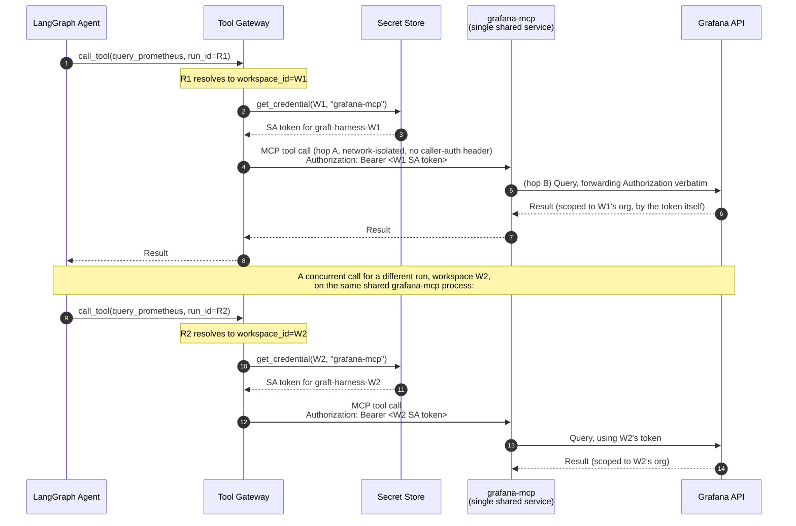

# Multi-Tenancy for the Grafana MCP Server

> **Status: 🟢 Resolved (2026-09-12).** Answers: is `grafana-mcp` one shared
> server using the SA token handed to it, and what happens with multiple
> concurrent users?
>
> Related: D7/D7a/D7b (Tool Gateway shape), `grafana-mcp-provisioning.md` (where
> the SA token comes from), `grafana-authz-delegation.md` (check-then-act).
>
> **Resolution:** the reference OSS `grafana-mcp` (`github.com/grafana/mcp-grafana`)
> was cloned and read directly. It **does** support per-request credential
> forwarding via `GRAFANA_FORWARD_HEADERS`, and its internal Grafana client
> cache is genuinely keyed by credential (`url, apiKey, username, password,
> orgID, forwardedHeaders`) rather than being a single global client. The one
> constraint this surfaced (both hop A and hop B in §2 wanting the
> `Authorization` header) is now a **locked decision** — see §4 item 2 and §5
> decision 2.

---

## 1. Two questions that need separating

1. **Is there one `grafana-mcp` process, or one per workspace?** — an
   infrastructure/deployment question.
2. **How does a single process serve many workspaces without leaking one
   workspace's credential or data into another's request?** — an identity/
   isolation question, and the one that actually matters.

Getting (1) right and (2) wrong is how you build a multi-tenant-shaped system
that is not actually multi-tenant-safe.

---

## 2. Two hops, two credentials — the shape that matters here

It's worth being precise about *which* credential is being discussed at each
point in this document, because there are two distinct hops, each with its own
credential, and (per §4) they collide on HTTP header choice if not deliberately
separated:

```
Tool Gateway ──MCP call (hop A)──▶ grafana-mcp ──REST call (hop B)──▶ Grafana API
```

- **Hop B (`grafana-mcp` → Grafana)** is "the downstream Grafana credential"
  referenced throughout this document and `01-identity-and-access.md`/D11. It
  is a **Grafana Service Account (SA) token**, sent as `Authorization: Bearer
  glsa_...` — confirmed directly against Grafana's own docs (the SA-token
  debugging guide uses exactly this header). One SA per workspace, provisioned
  per D12/D22. No ambiguity here: MCP-to-Grafana auth **is** the SA token, full
  stop.
- **Hop A (Tool Gateway → `grafana-mcp`)** is a separate, optional concern:
  `grafana-mcp` can itself demand proof that its *caller* (the Tool Gateway) is
  allowed to talk to it at all, via `MCP_GRAFANA_SERVER_TOKEN` — a static
  shared secret checked with `Authorization: Bearer <token>`, unrelated to
  Grafana. This is about protecting `grafana-mcp`'s own network endpoint, not
  about which workspace's data is being accessed.

Since `grafana-mcp` is **one shared process serving every workspace**, hop B's
SA token must vary **per call** — the Tool Gateway has to hand `grafana-mcp`
the correct workspace's SA token on every request, for `grafana-mcp` to then
forward on to Grafana. The only header Grafana's own API will accept a bearer
SA token on is `Authorization` — `grafana-mcp` forwards header names supplied
via `GRAFANA_FORWARD_HEADERS` **verbatim**, it does not translate a
custom-named header into `Authorization` for Grafana's benefit.

**This means hop A and hop B both want to use the `Authorization` header on
the same MCP request (Tool Gateway → `grafana-mcp`), for two different
purposes** — hop A wants a static shared secret there; hop B wants the
per-workspace SA token forwarded through it. They cannot coexist in one
header on one request. §4 resolves this.

---

## 3. Why "single central server, SA token passed in" is the right shape

D7a already states the reasoning that applies here: **stdio MCP is
single-identity by construction — no per-user RBAC, no central throttling
point.** That is exactly the failure mode a *shared, static-credential* server
would reproduce even over HTTP: a process that reads one Grafana URL and one
token from its environment at startup can only ever act as one workspace,
forever, for every caller.

The correct shape, consistent with D7a/D7b, and **confirmed as what the real
implementation actually does (§4)**:

- **One logical `grafana-mcp` service** (scaled horizontally as needed — this is
  an ordinary stateless-service scaling question, not an identity one).
- **No credential baked into the process at startup** as the *only* credential
  it can act with — a startup default (`GRAFANA_SERVICE_ACCOUNT_TOKEN`) may
  still exist for single-workspace/dev use, but production, multi-workspace
  calls override it per request.
- **The credential (hop B's SA token) is supplied per call**, resolved by the
  Tool Gateway from the workspace-scoped secret store (per
  `grafana-mcp-provisioning.md`), and attached to that specific outbound MCP
  request's `Authorization` header.

This is precisely why D7a mandates streamable-HTTP: the transport carries a
request, and a request can carry an `Authorization` header. stdio has no
equivalent — the process's identity is fixed for its entire lifetime.



**The isolation guarantee comes entirely from the SA token attached per call,
never from which process happened to handle the request.** Grafana itself
enforces the org boundary based on the token it's given — `grafana-mcp`
doesn't need to know anything about our tenancy model at all. It just has to
be honest about not caching or reusing credentials across requests, which §4
confirms it is (the client cache key includes the forwarded-header set).

---

## 4. What "multiple users" actually resolves to

Worth being precise about *which* multiplicity is being asked about — there are
two, and they're handled at different layers.

### 4.1 Multiple workspaces (orgs) — handled above

Covered by §3: different SA token per call, resolved by `run_id →
workspace_id`. `grafana-mcp` never sees two workspaces' credentials conflated,
because it never sees "a workspace" at all — only "a credential for this one
call," and its own client cache is keyed on exactly that credential.

### 4.2 Multiple human users within the *same* workspace — handled upstream, not here

This is the more interesting case, and the answer is: **`grafana-mcp` never
knows which human triggered the call, and it shouldn't.**

Per `grafana-authz-delegation.md`, authorisation (may *this specific user* do
this?) is decided **before** the call ever reaches the Tool Gateway's dispatch to
`grafana-mcp` — either by the plugin backend's check-then-act, or by the Tool
Gateway performing the equivalent check using the resolved principal from the
run's capability token. By the time a call reaches `grafana-mcp`, the question
"is this allowed" is already answered; all that remains is "do it, as the
workspace."

So: two engineers in the same org, one a Viewer and one an Editor, running
concurrent investigations, produce calls to `grafana-mcp` that are
**indistinguishable from each other** at that layer — same workspace SA token,
same org. The difference between what they're permitted to trigger was enforced
earlier, and is what's recorded in the `actor` block of the audit record,
**not** derivable from anything `grafana-mcp` saw.

This is a deliberate consequence of the hybrid model (A4): user identity is
where authorisation happens, service identity is where execution happens, and
they are different layers on purpose. Trying to make `grafana-mcp` itself
user-aware would mean re-implementing authorisation at the execution layer,
which is exactly the drift-from-Grafana's-own-model problem check-then-act was
adopted to avoid.

### 4.3 Concurrency correctness — confirmed by source inspection (2026-09-12)

Given many simultaneous calls across many workspaces hit one shared service, it
must hold **no mutable state that survives past a single request** — no global
"current token," no connection cached against a mutable credential slot. Each
request's credential, org context, and response must be fully local to that
request's handling.

**This is no longer an assumption to verify — it was confirmed by reading the
actual `client_cache.go`:** the internal Grafana client cache key
(`clientCacheKey`) is built per-request from `{url, apiKey, username, password,
orgID, forwardedHeaders}` (the last one a sorted, serialised digest of the
forwarded-header set), with a `singleflight`-based cache to collapse duplicate
concurrent builds for the *same* credential without ever sharing a client
across *different* credentials. This is precisely the credential-scoped,
stateless-per-request shape this document called for, not the "one process,
one Grafana instance, one token, set once at startup" shape it worried a naive
reference implementation might have.

---

## 5. Verified 2026-09-12 — the load-bearing unknown, resolved

The reference OSS `grafana-mcp` was cloned (`github.com/grafana/mcp-grafana`,
current `main`) and read directly, rather than assumed. Findings:

1. **Per-request credential override — supported, via `GRAFANA_FORWARD_HEADERS`.**
   This environment variable takes a comma-separated allow-list of header
   names to copy from the **incoming** request to every outbound Grafana API
   request, verbatim (same header name, same value) — confirming hop B's SA
   token can indeed vary per call, exactly as this document's design requires.
2. **The `Authorization`-header collision is real, and is now resolved as a
   locked decision, not an open question.** `grafana-mcp` supports its own
   caller-auth for hop A (`RequireBearerToken`, gated by
   `MCP_GRAFANA_SERVER_TOKEN`), which authenticates the *caller* via
   `Authorization: Bearer <token>`, constant-time-compares it, and then
   **strips the header** so it can never leak downstream or into a cache key.
   The codebase explicitly detects and **refuses to start** if
   `GRAFANA_FORWARD_HEADERS` is *also* configured to forward `Authorization`
   while this caller-auth is enabled (`ForwardsAuthorizationHeader()`), since
   the two purposes for that header conflict on the same request.
   - Since Grafana's own API only accepts SA-token bearer auth on
     `Authorization` (confirmed against Grafana's docs — SA tokens are always
     `Authorization: Bearer glsa_...`, never an arbitrary custom header), and
     since `grafana-mcp` forwards header names verbatim rather than
     translating them, there is **no way to route hop B's SA token through a
     differently-named header and still have it work against Grafana**.
     Cookie-based forwarding (`GRAFANA_FORWARD_HEADERS=Cookie`) is a *different*
     use case — a live Grafana **user session**, not an SA token — and would
     mean provisioning and refreshing a Grafana session per workspace, which
     contradicts the SA-token provisioning model already locked in D12/D22.
   - **Locked decision: drop `grafana-mcp`'s built-in hop-A caller-auth
     (`MCP_GRAFANA_SERVER_TOKEN`) and protect the Tool Gateway↔`grafana-mcp`
     hop with network-level isolation instead** (private network / mTLS /
     service-mesh authorization policy — the same pattern already assumed for
     other internal-service-to-internal-service calls in this architecture).
     This frees `Authorization` to carry only hop B's per-workspace Grafana SA
     token, forwarded verbatim end-to-end. See §5 decision 2.
3. **Client cache is genuinely credential-scoped** — see §4.3. No further
   verification needed on isolation correctness at the caching layer.
4. **Multi-org support exists natively**, including a `--dynamic-multi-org`
   flag that lets a single connection target different orgs **per tool call**
   via an optional `orgId` argument (driving `X-Grafana-Org-Id` and, for
   app-platform APIs, the resolved Kubernetes namespace). Not required for our
   shape (we resolve one workspace = one org per call via the credential
   itself), but confirms the upstream project already thinks about
   multi-tenancy as a first-class concern, which lowers the risk of relying on
   it going forward.
5. **Not yet verified:** whether attaching a different forwarded-header value
   per call defeats HTTP/2 connection reuse in a way worth caring about — no
   measurement was taken this session; likely negligible next to LLM inference
   latency, but still just an assumption. See §7 item 1.

---

## 6. Decision

| # | Decision |
|---|---|
| 1 | **One logical `grafana-mcp` service**, horizontally scaled as an ordinary stateless service — not one process per workspace. **Confirmed compatible with the real implementation (§5).** |
| 2 | **`grafana-mcp`'s built-in caller-auth (`MCP_GRAFANA_SERVER_TOKEN`) is not used.** The Tool Gateway↔`grafana-mcp` hop (hop A) is protected by network-level isolation (private network / mTLS / service-mesh authorization policy) instead. This frees the `Authorization` header, on every MCP call to `grafana-mcp`, to carry only the per-workspace Grafana SA token (hop B), forwarded verbatim to Grafana via `GRAFANA_FORWARD_HEADERS=Authorization`. **Locked 2026-09-12** — resolves the collision found in §5 item 2. |
| 3 | **Isolation between workspaces is enforced by the SA token Grafana receives, per call**, and confirmed at the `grafana-mcp` layer by its credential-keyed client cache (§4.3/§5 item 3) — not by which process or instance handled the request. |
| 4 | **`grafana-mcp` never receives or reasons about which human triggered a call.** Per-user authorisation is fully resolved before dispatch; the service only ever acts as "the workspace." |

---

## 7. Open questions

1. Does per-call credential attachment have a **performance cost** worth
   caring about (e.g., losing HTTP/2 connection reuse if the `Authorization`
   header must vary per request on the same connection)? Not measured — see
   §5 item 5. Likely negligible next to LLM inference latency, but worth a
   note rather than an assumption.
2. **Who owns the deployment configuration** (network-isolation policy between
   Tool Gateway and `grafana-mcp`, and the absence of
   `MCP_GRAFANA_SERVER_TOKEN`) long-term, and is it captured in
   `grafana-mcp-provisioning.md` or here? Not yet assigned — a small piece of
   platform/infra work, not a design gap.
