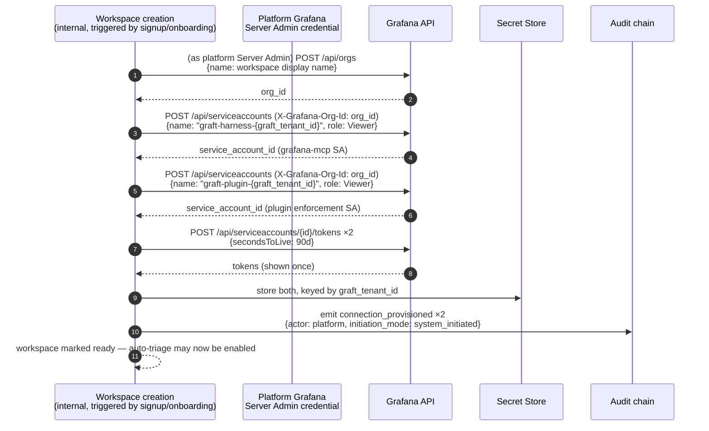

# Provisioning Credentials for the Grafana MCP Server

> **Status: 🟢 Resolved for v1**, simplified substantially by a confirmed
> deployment fact: **the platform owns the Grafana instance; customers are
> orgs within it** (not customer-hosted Grafana). This removes the dependency
> on a customer admin's session/rights that the original design assumed.
>
> Answers: when a workspace is created, where does its Grafana MCP server's
> service account + token come from?
>
> Related: `grafana-authz-delegation.md` (check-then-act, the plugin's *own*
> service account), `ux-mcp-tool-configuration.md` (the screen this feeds),
> `audit-and-attribution.md` (every provisioning act is a record).

---

## 1. The resolving fact

Earlier revisions of this document assumed the harness would provision a
Grafana service account **using the acting customer admin's own org-scoped
session** — because the working assumption was a customer-hosted or
customer-administered Grafana. That assumption is now confirmed false for our
actual deployment: **we run one Grafana instance; each customer is an org
within it.** We are the Grafana operator.

This collapses most of the original complexity:

| Was (customer-hosted assumption) | Now (platform-owned confirmed) |
|---|---|
| Provisioning needs the customer admin's live session | Provisioning uses **our own platform-level Grafana Server Admin credential** |
| "Does Org Admin have SA-management rights?" — had to verify per customer/edition | **Moot.** We are Server Admin; org-scoped SA creation via `X-Grafana-Org-Id` needs no per-customer permission at all |
| Provisioning could only happen when an admin first interacted with the plugin | Provisioning happens **synchronously at workspace/org creation**, before any customer ever logs in |
| Cold-start gap (section 9.3, old revision) — a webhook could arrive before provisioning | **Eliminated.** Nothing is provisioned lazily; it exists before the workspace is marked ready |
| Two service accounts, two separate triggers | Still two service accounts (plugin enforcement SA, `grafana-mcp` tool-server SA) — but **both provisioned in the same platform-internal step**, no separate customer-facing trigger for either |

---

## 2. The flow, as it actually works now



**Nothing here depends on a customer ever logging in.** Both service accounts
exist, scoped to `Viewer`, before the workspace is usable at all.

---

## 3. Tool enablement still works exactly as designed

`ux-mcp-tool-configuration.md`'s step-up flow for enabling write-capable tools
is unchanged — that part was always workspace-admin-initiated and stays so.
What changes is only the *mechanism* underneath it: when a workspace admin
enables `update_alert_rule` and completes step-up, the harness calls Grafana
**using the platform Server Admin credential** (not the admin's own session)
to bump that workspace's SA role to `Editor`. The admin authorises the
*policy* change; the platform performs the *Grafana-side* mechanics.

---

## 4. Lifecycle — resolved, per Q6

Two distinct events, two distinct behaviours:

| Event | Behaviour |
|---|---|
| **A tool is disabled, but the Grafana MCP server remains enabled** | SA role is **recomputed to the minimum required** across the tools still enabled — may stay the same, may downgrade (e.g. Editor → Viewer if the only Act-class tool was just turned off) |
| **The Grafana MCP server itself is disabled for a workspace** | The service account and its token are **deprovisioned entirely** — not merely downgraded. `DELETE /api/serviceaccounts/{id}`, token revoked, secret store entry removed |

Full removal on server-disable, not just downgrade, is the confirmed decision
(Q6): a disabled connection should leave **no live credential** behind at all,
not a dormant Viewer-scoped one. This also means re-enabling the server later
is a **fresh provisioning event**, not a reactivation — clean audit trail,
no risk of a forgotten stale credential resurfacing.

---

## 5. What Screen 1 looks like now

Unchanged from the admin's point of view — the "Connect" step from
`ux-mcp-tool-configuration.md` section 3 effectively **disappears** for Grafana MCP,
because it's already connected the moment the workspace exists:

```
┌───────────────────────────────────────────────────────────────────────┐
│ ● Grafana MCP           Connected · service account: graft-harness-ws1│
│   Provisioned automatically when this workspace was created.          │
│   Role: Viewer (auto) · Token expires in 63 days · [ Rotate now ]     │
│   14 of 22 tools enabled · 3 write-capable            [ Configure › ] │
└───────────────────────────────────────────────────────────────────────┘
```

No "Connect" action ever appears for Grafana MCP specifically — it's the one
tool server that's always already connected, which is a direct, visible
consequence of the platform owning the instance.

---

## 6. Decision

| # | Decision |
|---|---|
| 1 | **Both service accounts (plugin enforcement SA, `grafana-mcp` SA) are provisioned synchronously at workspace/org creation**, using a platform-level Grafana Server Admin credential — never a customer admin's session. |
| 2 | **No cold-start gap exists.** Provisioning is a precondition of a workspace being marked ready, not a lazy or first-use action. |
| 3 | **SA role starts at Viewer** and is recomputed to the minimum required whenever tool policy changes. |
| 4 | **Disabling the Grafana MCP server entirely deprovisions its SA and token** (delete, not downgrade). Re-enabling is a fresh provisioning event. |
| 5 | **Manual paste (the old Option A fallback) is no longer needed for Grafana MCP** — it was only ever a fallback for customer-hosted Grafana we didn't control. Retained conceptually only for any *non-Grafana* MCP server where we don't operate the target. |
| 6 | **Tokens always carry an expiry** (90 days, illustrative); rotation reuses the provisioning call, scoped to the platform Server Admin credential, not per-workspace admin action. |

---

## 7. What actually still needs attention

The risk profile moved, it didn't disappear — it's now concentrated in one
place instead of spread across every customer:

1. **The platform Grafana Server Admin credential is now a single, very
   high-value secret.** It can create/modify/delete service accounts across
   *every* workspace. It must be stored with the strongest available
   protection (HSM-backed secret store, not the same per-workspace vault
   tier), rotated on a tight schedule, and every use of it must emit an audit
   record distinguishable from ordinary per-workspace activity.
2. **Service account token max-lifetime and rotation API specifics** — still
   worth confirming against current Grafana docs, though now a one-time
   platform-engineering concern rather than a per-customer variable.
3. **Multi-org scaling limits** — does Grafana have a practical ceiling on
   orgs-per-instance we should know about before assuming unbounded workspace
   growth on one instance?
4. **Blast radius of a compromised platform Server Admin credential** — worth
   an explicit incident-response runbook, given it's now the single most
   powerful credential in the system.
