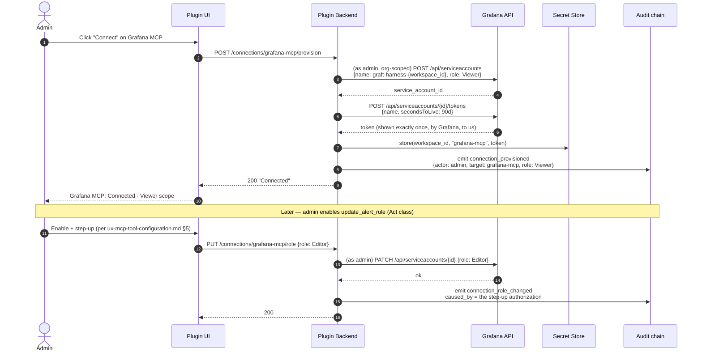

# Provisioning Credentials for the Grafana MCP Server

> **Status: 🟡 In review.** Answers: when a workspace admin configures the
> Grafana MCP server, where does its Grafana Service Account + token come from?
>
> **Revision note:** a Grafana maintainer confirmed `externalServiceAccounts`
> (the "let Grafana auto-manage the plugin's SA" mechanism) **does not work in
> multi-org setups** — see `grafana-authz-delegation.md` revision note. Since
> workspace = Grafana Org (C2) means multi-org is our default shape, **this
> document's imperative provisioning approach (Option C, §2) is now the
> mechanism for both service accounts the system needs**, not only the one
> described here. §9 covers the unification.
>
> Related: `grafana-authz-delegation.md` (check-then-act, the plugin's *own*
> service account), `ux-mcp-tool-configuration.md` (the screen this feeds),
> `audit-and-attribution.md` (every provisioning act is a record).
>
> **Confidence note:** Grafana SA-creation permissions and Cloud-specific
> mechanisms (Access Policies vs Service Accounts) need verifying against
> current docs.

---

## 1. Two service accounts, not one — do not conflate them

The forum pattern (`grafana-authz-delegation.md`) and this question sound
similar but are **different credentials, different owners, different lifetimes**:

| | Plugin's own SA | Grafana MCP server's SA |
|---|---|---|
| **Used by** | The App Plugin backend, for check-then-act enforcement | The `grafana-mcp` **tool server**, an independent streamable-HTTP service per D7a |
| **Calls Grafana how** | In-process, inside Grafana's plugin runtime | Over Grafana's HTTP API, from outside Grafana entirely |
| **Provisioning path** | ~~`externalServiceAccounts`~~ **confirmed unusable for multi-org — see revision note.** Now: the same imperative, per-org API call as the column to the right | Always manual/imperative provisioning — Grafana never auto-manages an external server's credential |

**Both columns now use the identical mechanism** (§2 Option C). That is the
resolution the multi-org bug forces, and it turns out to be a simplification:
one provisioning flow, reused, rather than one automatic mechanism plus one
manual one.

---

## 2. The three options for a Grafana service account, in general

### Option A — Admin creates the SA manually, pastes the token

```
Admin → Grafana UI → Administration → Service accounts → New
     → generates token → copies it → pastes into our "Connect" form
```

- **Pros:** zero engineering. Works on every Grafana version, OSS or Enterprise,
  self-hosted or Cloud.
- **Cons:** the token transits the admin's clipboard and browser DOM — an
  avoidable exposure. Admin, not us, decides scope, and typically over-grants
  ("just give it Admin, easier"). No rotation unless the admin remembers.

This is the **fallback**, not the design — see §5.

### Option B — Platform pre-provisions one SA per workspace, out of band

An operator (us) runs a one-time script per customer deployment that creates the
SA and token, and it ships baked into workspace setup.

- **Rejected.** A static, centrally-created token with no natural rotation
  trigger and no tie to *who* authorised *which* scopes is exactly the ambient
  credential `01-identity-and-access.md` warns against.

### Option C — Harness self-provisions the SA imperatively, per org, on the admin's authority *(the answer)*

Rather than relying on Grafana to auto-create anything, **we call Grafana's own
API ourselves**, using the org admin's existing, org-scoped session, the first
time it's needed for that org:

1. Admin's session (or a stored setup-time credential — see §9.3) authorises
   the call.
2. Our backend calls `POST /api/serviceaccounts`, scoped to that org by the
   caller's own session context — no central registry of orgs required, no
   enable/disable-per-org bookkeeping, because **provisioning is the per-org
   enable event**, not a separate step that has to stay in sync with one.
3. A token is requested with an **expiry**, never a permanent token.
4. The token is written straight to our workspace-scoped secret store and never
   rendered back to the admin.
5. The SA starts with a **minimal role** and is upgraded automatically as tool
   policy changes (§3).

This is what directly answers *"does the plugin have the power to provision
service accounts?"* — **yes, imperatively, via the same HTTP API a human would
use, as long as the calling session already holds that right** (normally true
for Grafana Org Admin — to verify, see §7). It is a different mechanism from
`externalServiceAccounts` entirely: that one is *declarative* ("Grafana, please
manage one SA for my plugin, forever"); this one is *imperative* ("right now, on
this org's behalf, create this SA"), which is exactly why it isn't subject to
the multi-org limitation — there is no global declaration to fan out, only a
per-org action repeated per org.

**This is the recommended default**, and — per the revision note — now the
**only** mechanism used, for both service accounts.

---

## 3. The flow



The **plugin's own SA** (`graft-plugin-{workspace_id}`) follows the identical
sequence, triggered instead by first admin interaction with the plugin in that
org, per `grafana-authz-delegation.md` §3.3 — same diagram, different trigger
and a different SA name, kept distinct from `graft-harness-{workspace_id}` for
blast-radius separation between the enforcement/proxy identity and the tool-
execution identity.

Two properties worth naming:

- **The SA's Grafana role tracks tool policy, automatically, in the same
  transaction as the step-up.** An admin who enables a write tool is not left
  with a mismatched SA that Grafana would reject at call time.
- **Token expiry (90 days, illustrative) forces a rotation path to exist from
  day one.** The same provisioning call in steps 2–4 is the rotation call —
  press "Rotate now" and it repeats with a new token, old one revoked.

---

## 4. What Screen 1 looks like with this decided

```
┌───────────────────────────────────────────────────────────────────────┐
│ ● Grafana MCP           Connected · service account: graft-harness-ws1│
│   Datasources, dashboards, alert rules, Explore queries.               │
│   Role: Viewer (auto) · Token expires in 63 days · [ Rotate now ]     │
│   14 of 22 tools enabled · 3 write-capable            [ Configure › ] │
└───────────────────────────────────────────────────────────────────────┘
```

No token field. No paste box. The admin's only affordances are **Connect**,
**Configure tools**, and **Rotate now** — the credential itself is not
something they ever hold or see.

---

## 5. The fallback (Option A), when it's actually needed

Auto-provisioning fails or is unavailable in real cases:

- Grafana Cloud with **Access Policies** instead of classic Service Accounts —
  different API shape, must verify.
- An admin's Grafana role permits login but not service-account management
  (some hardened configs restrict this to Grafana Server Admin).
- Air-gapped or heavily firewalled installs where our backend cannot reach the
  Grafana API path used for provisioning, even though the admin's browser can.

For these, degrade to Option A, but **keep the constraints**, don't fully open
the door:

```
┌───────────────────────────────────────────────────────────────────────┐
│  Automatic setup isn't available for this Grafana instance.           │
│  Create a service account manually:                                    │
│                                                                          │
│   1. In Grafana: Administration ▸ Service accounts ▸ New               │
│      Name: graft-harness-ws1   Role: Viewer                            │
│   2. Create a token, set an expiry (recommend 90 days)                 │
│   3. Paste it below — it will be encrypted and never displayed again   │
│                                                                          │
│   Token:  [ ••••••••••••••••••••••••  ]                                │
│                                                                          │
│                                              [ Cancel ]  [ Save ]      │
└───────────────────────────────────────────────────────────────────────┘
```

- Field is **write-only** — accepts input, never re-renders the value.
  Confirmed by showing only "Configured on {date} · last 4 chars: •••• a91c."
- We still **prescribe the role and an expiry** in the instructions.
- Still emits the same `connection_provisioned` audit record.

---

## 6. Decision

| # | Decision |
|---|---|
| 1 | **Default: harness self-provisions every Grafana-side service account imperatively**, using the acting admin's org-scoped session, at first-need. Admin never sees or handles the token. Applies to **both** the `grafana-mcp` server's SA and the plugin's own enforcement SA — one mechanism, not two. |
| 2 | **SA role starts minimal (Viewer) and is upgraded automatically** when the admin enables a higher tool class, as part of the same step-up transaction. |
| 3 | **Manual paste is a fallback**, gated behind detecting that auto-provisioning isn't possible; still enforces write-only storage, a prescribed role, and an expiry. |
| 4 | **Tokens always have an expiry**; rotation reuses the provisioning call. No permanent tokens, automatic or manual. |
| 5 | **`externalServiceAccounts` is not used at all**, for either service account, because of the confirmed multi-org limitation — superseding the earlier framing where it was assumed to cover the plugin's own SA. |

---

## 7. Must verify before building

1. **Does Org Admin actually carry service-account-management rights**, or is it
   Server-Admin-only in some Grafana editions/versions? This decides how often
   the fallback in §5 actually triggers — and now matters for *both* SAs, not
   just one, since both go through this path.
2. **Grafana Cloud's equivalent mechanism** — Access Policies and Cloud API keys
   have a different creation API. Confirm whether the same auto-provisioning
   approach ports, or needs a second implementation.
3. **Service account token max-lifetime and rotation API** — confirm
   `secondsToLive` behaviour and whether rotating a token requires revoking the
   old one explicitly or it's implicit on creation of a new one.
4. **Does the `POST /api/serviceaccounts` call correctly scope to the calling
   org** when invoked from inside a plugin backend request, and does that hold
   for both an admin's live session and any stored setup-time credential used
   for §9.3's unattended case? This is now the single mechanism both SAs depend
   on, so its org-scoping correctness is the highest-leverage thing to verify.

---

## 8. Open question

**Does the "upgrade SA role automatically" step in §3 ever need to *downgrade*?**
If an admin disables `update_alert_rule` later, should the SA's role drop back
to Viewer, or stay at Editor until nothing needs it? Leaning: compute the
**minimum role needed across all currently-enabled tools** on every change, in
both directions.

---

## 9. Unification with the plugin's own service account

This section supersedes the earlier framing (this doc previously treated the
plugin's own SA as "solved by `externalServiceAccounts`" and only this document's
subject — the `grafana-mcp` server's SA — as needing imperative provisioning).

### 9.1 Both SAs, one mechanism, two identities

| | `graft-plugin-{workspace_id}` | `graft-harness-{workspace_id}` |
|---|---|---|
| Role in the system | Check-then-act enforcement + proxying (`grafana-authz-delegation.md`) | Executing `grafana-mcp` tool calls (this document) |
| Provisioned by | §2 Option C | §2 Option C — identical flow |
| Triggered by | First admin interaction with the plugin, in that org | Admin clicking "Connect" on the Grafana MCP tool server |
| Kept separate because | A single shared SA would make an audit record ambiguous about which role a given Grafana API call was playing — enforcement-adjacent vs agent-tool-execution | (same reason, mirrored) |

### 9.2 Why this is a simplification, not added scope

Before the revision, the design had **two provisioning stories**: an automatic
one for the plugin (`externalServiceAccounts`) and a bespoke imperative one for
the tool server. Now there is **one story, applied twice**. Less to build, less
to explain to an admin, and zero dependency on an unscheduled upstream Grafana
feature.

### 9.3 The gap this creates — first-run with no admin present

Both triggers above assume **an admin acts first**. But J1 (alert fires, nobody
awake) may be the very first interaction a brand-new workspace ever has with the
harness — a webhook or Slack event arriving before any admin has opened the
plugin at all.

**Unresolved:** provisioning cannot wait for a UI visit that may never come
before it's needed. Two directions worth evaluating:

- Require a **one-time setup step during workspace onboarding** (J7) that
  provisions both SAs immediately, before auto-triage is switched on for that
  workspace — i.e., "enable auto-triage" is gated on provisioning being complete,
  not the other way around.
- Or, allow a stored **setup-time admin credential** (captured once, during
  onboarding, with its own expiry and rotation) to perform provisioning
  unattended on first webhook/Slack event for an org that has none yet.

The first option is simpler and avoids inventing a second stored credential
type. Leaning toward making **provisioning a mandatory, blocking step of J7**
rather than something that happens lazily on first tool use.
