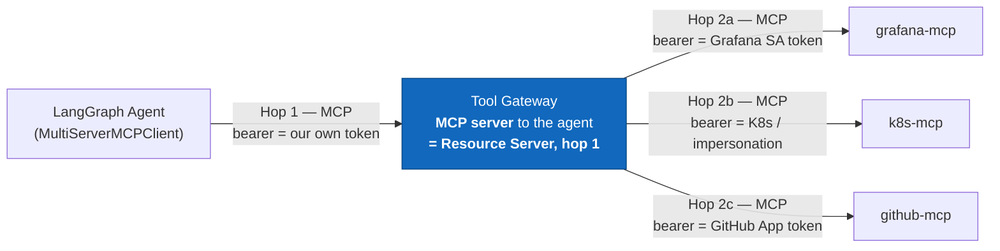

# Where the MCP Authorization Server Lives

> **Status: 🟡 In review.** This is the living mechanism companion for
> [ADR-0079](../adr/identity/0079-internal-surface-credential-resolution-uses-mtls-and-typed-decisions.md).
> It describes the Authority Service two-call identity-resolution and mint
> sequence; it does not accept ADR-0079 or claim implementation evidence.
>
> The wider MCP placement remains governed by ADR-0007, ADR-0010, ADR-0019,
> ADR-0069 and ADR-0070. The Authority Service is one deployable containing
> logically distinct Token Service/Authorisation Server, Tool Gateway and Tool
> Registry modules.

---

## 1. Mapping spec roles onto our architecture

The MCP model is that an MCP server is an OAuth 2.1 Resource Server (RS). It
publishes protected-resource metadata (RFC 9728) naming the Authorisation
Server (AS) it trusts. A client obtains an audience-bound token (RFC 8707)
from the AS and presents it to the RS.

There are two distinct MCP hops:



- **Hop 1 (agent → Tool Gateway)** is the AS/RS relationship. The Tool
  Gateway is the RS and the Authority Service Token Service mints the
  run-scoped, audience-bound token.
- **Hop 2 (Tool Gateway → upstream MCP servers)** is not a new AS
  relationship per upstream server. The Tool Gateway resolves each target's
  native credential under ADR-0011, ADR-0012 and ADR-0018. Those credentials
  are not tokens minted by an AS operated by Graft.

The Harness API is the first-party caller of the internal Token Service
routes. It transports the raw surface credential but is not an identity
authority. The agent, DBOS worker and Tool Gateway cannot call those routes.

## 2. Authority Service placement and trust boundaries

The Authority Service is the deployable boundary selected by ADR-0069:

| Module | Responsibility | Boundary |
|---|---|---|
| Token Service / MCP Authorisation Server | Verifies raw surface credentials, resolves verified identity and authority, and mints run-scoped capability tokens | Internal mTLS routes for the configured first-party Harness API; separate AS listener and network policy |
| Tool Gateway | Independently validates capability tokens and enforces the authority lattice | MCP listener and network policy; it never mints tokens |
| Tool Registry | Supplies curated, hash-pinned Tool definitions | Registry interface; it does not resolve surface identity |

One deployable does not create shared authority. Signing-key access is limited
to the Token Service; the Tool Gateway validates through its published JWKS;
listeners, network policy, mutable request context and rate limits remain
separate.

The two internal routes are:

```text
POST /internal/authority/v1/surface-resolution
POST /internal/authority/v1/run-capability-mint
```

Both routes are mTLS-only. The configured trust material authenticates the
peer during the TLS handshake, and an application allow-list then checks that
the authenticated peer is the first-party Harness API. The first-party
assumption is a deliberate current boundary: if more than one Token Service
caller is introduced, this trust assumption is invalid and a new ADR is
required before adding that caller or a fallback.

### 2.1 mTLS status and denial semantics

| Condition | Layer | Result |
|---|---|---|
| Certificate cannot be validated, peer is untrusted, certificate is expired, or TLS handshake fails | TLS | The HTTP request is never admitted; there is no application response and no typed decision. |
| TLS handshake succeeds and the peer identity is not the configured first-party Harness API | Application | Typed `deny` with `graft_deny_code: mtls_peer_not_allowlisted`; no identity and no token. |
| Peer is first-party and request is valid | Application | Continue to surface verification or minting. |
| Plain HTTP, bearer, cookie, static-header, or other non-mTLS attempt | Transport/configuration | No fallback; it is not an accepted internal call. |

The peer allow-list is configuration, never a request header. No internal
route accepts caller-asserted identity, a caller-supplied service identity,
or a caller-supplied audit actor.

## 3. Two-call sequence

The calls deliberately cross the raw credential boundary twice. The Token
Service verifies the raw credential signature and freshness on both calls;
the Harness API never substitutes its own identity result for either
verification.

```mermaid
sequenceDiagram
    autonumber
    participant SURF as Surface
    participant API as Harness API
    participant TS as Authority Service<br/>Token Service
    participant RUN as Harness Run repository
    participant TG as Tool Gateway
    participant AGENT as LangGraph Agent

    SURF->>API: Native credential + webhook envelope when applicable
    API->>TS: mTLS call 1: raw credential verbatim + envelope
    TS->>TS: Verify signature and freshness; resolve identity,
    TS->>TS: service identity, Roles and initiation mode
    TS-->>API: typed allow/deny + verified result + short expiry
    API->>RUN: atomic new/existing/conflict replay binding and Run record
    RUN-->>API: result and graft_run_id for new/existing
    API->>TS: mTLS call 2: raw credential verbatim again + same envelope
    TS->>TS: Re-verify signature and freshness; derive fresh result
    TS-->>API: typed allow/deny + fresh result + token on allow
    API->>API: compare fresh result and fingerprint to immutable binding
    API-->>AGENT: start Run with token only after matching comparison
    AGENT->>TG: MCP call, Authorization: Bearer <token>
    TG->>TG: independently validate signature, aud, exp and authority
    TG-->>AGENT: Result
```

The Token Service trusts the `graft_run_id` on call 2 only because the
authenticated peer is the application-allow-listed first-party Harness API.
It does not query the Harness Run store. The Harness replay transaction and
the Token Service verification/mint operation are not one distributed
transaction.

### 3.1 Versioned request schemas

The following are the v1 semantic wire schemas. JSON objects are closed at
this boundary: an unrecognised identity, authority or transport field is a
contract error. The raw credential value is represented as an opaque string
in JSON, and its exact value is preserved verbatim by the Harness API and
Token Service for every surface.

#### Call 1: `surface-resolution` request

```json
{
  "graft_authority_schema_version": "v1",
  "graft_surface": "grafana|slack|webhook|schedule|api",
  "graft_surface_credential": "<opaque raw value, verbatim>",
  "graft_webhook_envelope": {
    "graft_envelope_version": "v1",
    "graft_source": {},
    "graft_event": {},
    "graft_delivery": {},
    "graft_alert": {}
  },
  "graft_request_correlation_id": "<Harness correlation id>"
}
```

`graft_webhook_envelope` is required for `webhook` and absent for every
other surface. Its exact semantic field configuration is the integration
configuration in section 4. The request cannot contain
`graft_principal_id`, `graft_tenant_id`, `graft_role_ids`,
`graft_initiation_mode`, `graft_service_identity`, `graft_audit_actor`,
`graft_run_id`, a replay key, or a resolution handle.

#### Call 1: response

An allow response has this shape:

```json
{
  "graft_authority_schema_version": "v1",
  "graft_decision": "allow",
  "graft_verified_identity": {
    "graft_principal_id": "<verified Graft Principal or null>",
    "graft_tenant_id": "<verified Graft Tenant>",
    "graft_role_ids": ["<effective graft_role_id>"],
    "graft_initiation_mode": "user_initiated|system_initiated",
    "graft_service_identity": "<verified service identity>",
    "graft_audit_actor": {
      "graft_principal_id": "<verified Graft Principal or null>",
      "graft_tenant_id": "<verified Graft Tenant>",
      "graft_role_ids": ["<effective graft_role_id>"],
      "graft_surface": "<verified surface>",
      "graft_initiation_mode": "user_initiated|system_initiated",
      "graft_trust_mode": "<configured non-secret trust mode>"
    }
  },
  "graft_event_fingerprint": "sha256:<lower-case hex or null>",
  "graft_resolution_expires_at": "<configured short-TTL instant>",
  "graft_verifier_revision": "<configured verifier revision>",
  "graft_request_correlation_id": "<Harness correlation id>"
}
```

For a non-webhook surface, `graft_event_fingerprint` is `null`. The allow
response contains no Run identifier, replay result, token, raw credential,
downstream credential or resolution handle.

A deny response is:

```json
{
  "graft_authority_schema_version": "v1",
  "graft_decision": "deny",
  "graft_deny_code": "<stable non-secret code>",
  "graft_request_correlation_id": "<Harness correlation id>"
}
```

Denial codes include unsupported surface, malformed envelope,
`credential_invalid`, `credential_expired`, `resolution_expired`,
`mtls_peer_not_allowlisted` and contract violation. A deny response never
contains unverified identity claims. A TLS handshake failure is not this
response: it has no application response as specified in section 2.1.

#### Call 2: `run-capability-mint` request

```json
{
  "graft_authority_schema_version": "v1",
  "graft_surface": "grafana|slack|webhook|schedule|api",
  "graft_surface_credential": "<the exact call-1 raw value, verbatim>",
  "graft_webhook_envelope": {
    "graft_envelope_version": "v1",
    "graft_source": {},
    "graft_event": {},
    "graft_delivery": {},
    "graft_alert": {}
  },
  "graft_run_id": "<Harness-created or Harness-returned Run id>",
  "graft_first_resolution": {
    "graft_resolution_expires_at": "<copied from call-1 allow>",
    "graft_verifier_revision": "<copied from call-1 allow>",
    "graft_event_fingerprint": "<copied call-1 fingerprint or null>"
  },
  "graft_request_correlation_id": "<Harness correlation id>"
}
```

For `webhook`, the canonical normalised envelope is repeated exactly on call
2, not reconstructed from the raw credential. It is absent for all other
surfaces. `graft_first_resolution` is copied from the immutable Harness
record and is binding metadata, not an identity assertion or a
server-generated handle. The Token Service checks its expiry and verifier
revision but derives authority afresh.

The request contains no caller-supplied Principal, Tenant, Role, service
identity, initiation mode, audit actor, capability token or resolution
handle. `graft_run_id` is accepted as a binding input only from the
authenticated first-party Harness peer; the Token Service does not look it
up.

#### Call 2: response

On a fresh allow, the Token Service returns the fresh verified result and the
opaque capability token:

```json
{
  "graft_authority_schema_version": "v1",
  "graft_mint_decision": "allow",
  "graft_verified_identity": "<same shape as call-1, freshly derived>",
  "graft_event_fingerprint": "sha256:<fresh fingerprint or null>",
  "graft_run_id": "<exact supplied Run id>",
  "graft_capability_token": "<opaque token>",
  "graft_request_correlation_id": "<Harness correlation id>"
}
```

A mint deny has no token:

```json
{
  "graft_authority_schema_version": "v1",
  "graft_mint_decision": "deny",
  "graft_deny_code": "<stable non-secret code>",
  "graft_request_correlation_id": "<Harness correlation id>"
}
```

The Harness API must compare the fresh identity block, service identity,
initiation mode and webhook fingerprint to the immutable binding before it
uses or forwards `graft_capability_token`. A mismatch is a typed
`binding_conflict`; the Harness discards the token and does not start or
continue the Run. Matching does not permit use after the configured short
TTL.

### 3.2 Short TTL and freshness

The first allow response carries a configured short
`graft_resolution_expires_at`, and the Harness persists it in the immutable
Run/replay record. The Harness does not make call 2 after that instant. The
Token Service also checks the copied expiry and re-verifies credential
signature and freshness on both calls. An expired first resolution or stale
credential is a typed deny and produces no usable token.

This is deliberately an immediate Run-start mint exchange. It does not
support delaying tool use until after the resolution TTL, nor does it define
refresh of a token or first resolution. A later refresh requires a separate
run-token renewal design.

## 4. Canonical normalised webhook envelope and fingerprint

The envelope is semantic event data, not authentication material. The v1
configured envelope has exactly these top-level groups:

```json
{
  "graft_envelope_version": "v1",
  "graft_source": {
    "graft_source_ref": "<configured semantic source reference>",
    "graft_source_type": "<configured source type>"
  },
  "graft_event": {
    "graft_event_ref": "<configured semantic event reference>",
    "graft_event_type": "<configured event type>"
  },
  "graft_delivery": {
    "graft_delivery_ref": "<configured semantic delivery reference>",
    "graft_delivery_sequence": "<configured sequence or null>"
  },
  "graft_alert": {
    "graft_alert_name": "<configured alert name>",
    "graft_alert_status": "<configured alert status>",
    "graft_alert_labels": {},
    "graft_alert_annotations": {}
  }
}
```

The displayed scalar fields are the v1 contract shape; a surface integration
may enable only the fields configured for that provider, but it must version
that configuration and reject unconfigured semantic fields. The envelope
never includes a raw provider payload, secret, signature, signature base
string or transport-only receipt time.

The canonical construction is:

1. Select the configured semantic source, event, delivery and alert fields.
2. Apply the configured normalisation to each semantic scalar and reject
   malformed values.
3. Recursively sort object keys by Unicode code-point order and encode the
   selected object as compact UTF-8 JSON with no insignificant whitespace.
   Arrays declared as unordered semantic collections are sorted by the
   canonical form of each member; ordered arrays retain their order.
4. Compute `graft_event_fingerprint` as `sha256:` followed by lower-case
   hexadecimal SHA-256 over those canonical UTF-8 bytes.

Object field order therefore cannot change the fingerprint. Transport-only
receipt time, raw provider payload, raw provider secret and credential cannot
change it because they are excluded before canonicalisation. The selected
field set, scalar normalisation and canonicalisation revision are versioned
and configured in this design/integration entry. This fingerprint
canonicalisation is a separate configuration boundary from every provider's
HMAC canonicalisation, signature base string and verifier parsing rules.

The Harness derives `graft_harness_replay_key` from the configured stable
surface event identity. For a webhook it uses the accepted source and
delivery identity, not the fingerprint alone. This permits the repository to
classify a same-key semantic change as `conflict` rather than silently
creating or reusing the wrong Run.

## 5. Harness replay transaction and immutable binding

The Harness Run repository owns the replay record. It performs one atomic
transaction keyed by `(graft_tenant_id, graft_harness_replay_key)`; it does
not use a check-then-insert sequence or an API-process-local cache.

The immutable record contains at least:

| Field | Rule |
|---|---|
| `graft_tenant_id` | Verified from the first Token Service allow; the scope on every Run/replay row. |
| `graft_harness_replay_key` | Harness-generated from the configured surface event identity. |
| `graft_run_id` | Created in the `new` transaction and returned unchanged for `existing`. |
| `graft_event_fingerprint` | Canonical semantic fingerprint, or `null` for a non-webhook surface. |
| `graft_verified_identity` | First verified identity block, stored without raw credential or token. |
| `graft_service_identity` | First verified service identity. |
| `graft_initiation_mode` | First verified `user_initiated` or `system_initiated` value. |
| `graft_resolution_expires_at` | First-call short-TTL expiry. |
| `graft_verifier_revision` | The configured first-call verifier revision. |

The repository result is exhaustive:

| `graft_replay_result` | Repository behaviour |
|---|---|
| `new` | Atomically insert the immutable binding and create one Run. |
| `existing` | Return the original Run and binding only when fingerprint, verified identity, service identity and initiation mode all match. |
| `conflict` | The same Tenant and replay key exists but any binding member differs. Create no Run, overwrite nothing, and return a stable typed conflict code. |

The transaction can be implemented as an insert-once unique constraint with
conflict classification inside the same transaction. It must make the
result, immutable binding and Run durable before reporting success. Concurrent
equivalent deliveries produce one `new` and `existing` results with the same
Run. A same-key changed delivery produces `conflict`, never a duplicate or a
generic denial. Timeout, process restart and response loss retry with the
same Harness key. The Token Service has no replay state to commit and does
not participate in this transaction.

## 6. Harness comparison and token use

The Harness stores the first verified binding before it asks for the mint
exchange. On call 2, the Token Service returns a fresh verified result after
rechecking the raw credential signature and freshness. The Harness compares:

```text
graft_event_fingerprint
graft_verified_identity
graft_service_identity
graft_initiation_mode
```

against the immutable record. Only an exact match within the configured
short TTL permits the Harness to use the token. A changed credential,
changed envelope, changed verified identity, changed service identity,
changed initiation mode, stale credential, expired binding or wrong peer
causes typed denial or token discard. The Tool Gateway then performs its own
independent token validation; it never trusts the Harness comparison as a
substitute for RS validation.

No identity-provider provisioning, account linking, or external-identity to
Graft Principal, Tenant or Role mapping is decided by this companion or
ADR-0079. Those are an explicit future provisioning/mapping contract. The
verifier configuration is assumed to return already verified attributes and
must not accept mappings asserted in either request.

## 7. What MCP OAuth compliance requires here

Hop 1 is a backend presenting a token to a Tool Gateway that Graft controls.
It is not an interactive human authorisation flow. The required mechanisms
remain:

| Spec mechanism | Needed for hop 1? | Mechanism |
|---|---|---|
| RFC 9728 protected-resource metadata | Yes | The Tool Gateway names the Authority Service AS. |
| RFC 8707 audience-bound token | Yes | The minted token is restricted to the Tool Gateway. |
| `WWW-Authenticate` challenge on 401 | Yes | The Tool Gateway can advertise the AS to a compliant client. |
| Interactive authorisation-code + PKCE redirect | No for this backend hop | Surface verification and the internal two-call exchange precede the MCP bearer token. |
| Dynamic Client Registration | Not yet | Revisit only if the Tool Gateway is exposed to external MCP clients, under a new decision if the first-party caller model changes. |

The client may attach the already minted bearer token through the official
MCP SDK or the LangGraph adapter. The internal Harness-to-Token-Service
exchange is not implemented as an interactive OAuth redirect.

## 8. Current decision and revisit triggers

| # | Living mechanism |
|---|---|
| 1 | The Token Service is logically distinct from the Tool Gateway and mints; the Tool Gateway is an RS only and validates independently. |
| 2 | The Authority Service is one deployable with three independently enforcing modules, separate listeners and network policy, signing-key isolation, no shared mutable request context and independent rate limits. |
| 3 | Surface resolution and capability minting use two mTLS-only calls from the first-party Harness API. Raw credentials are repeated verbatim on both calls for every surface; webhook envelopes are repeated as canonical normalised event data. |
| 4 | The Harness persists the first verified identity binding with an immutable Run/replay record, classifies `new`, `existing` and `conflict`, and compares the fresh second-call result before token use. The Token Service trusts the first-party peer's `graft_run_id` and does not query the Harness Run store. |
| 5 | A configured short TTL binds first resolution to immediate Run-start minting. Signature and freshness are checked on both calls; expiry is typed denial with no token. Later renewal is a separate design. |
| 6 | More than one Token Service caller invalidates the first-party mTLS trust assumption and requires a new ADR. Non-mTLS fallback is never introduced by this document. |

The earlier co-located Harness API verification/mint narrative is not the
current mechanism. The Harness API is the trusted mTLS peer for transport
and Run binding, while the Authority Service Token Service remains the sole
surface verifier and token issuer.

## 9. Open implementation questions

1. Define provider integration entries for verifier parsing, provider HMAC
   canonicalisation, certificate profiles and key rotation. Those entries
   must not change the v1 request boundary or conflate HMAC canonicalisation
   with the semantic fingerprint in section 4.
2. Define signing-key rotation and JWKS overlap so tokens for Runs already in
   flight remain valid for their configured lifetime.
3. Implement and retain the verification matrix in ADR-0079 section 5,
   including positive `new`/`existing` replay fixtures and negative same-key
   `conflict` fixtures, reordered-field fingerprint fixtures, exact raw
   credential repeat/no-leakage fixtures, expiry fixtures, and handshake
   versus typed peer-denial fixtures.
4. Revisit the AS deployment and client registration only if the Tool Gateway
   is exposed beyond the first-party agent/runtime path. More than one Token
   Service caller is specifically a new-ADR trigger, not an implementation
   variation.
