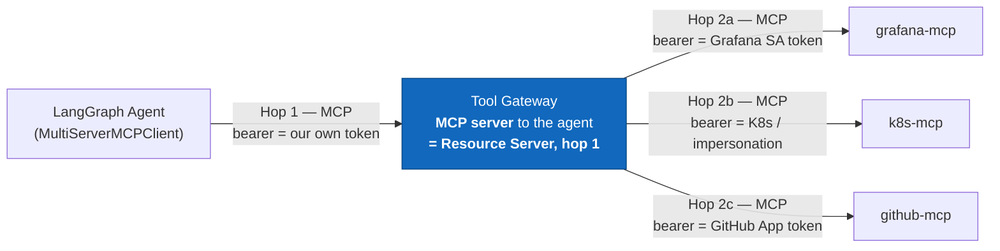
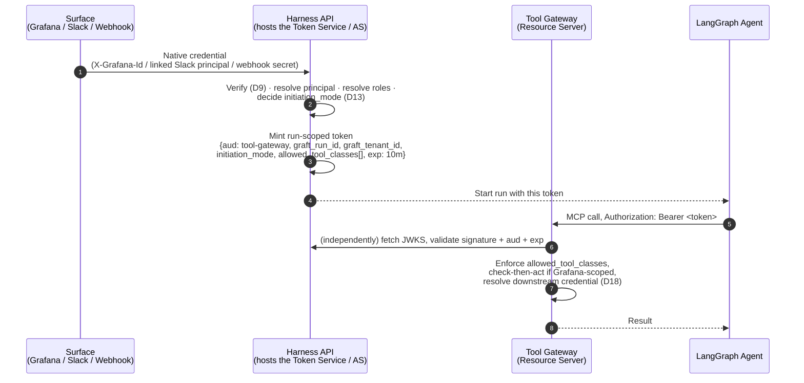

# Where the MCP Authorization Server Lives

> **Status: 🟡 In review.** Answers: given the MCP Authorization spec (OAuth
> 2.1 + RFC 9728 protected resource metadata + RFC 8707 audience-bound tokens),
> is the Authorization Server (AS) a separate component from the Tool Gateway?
>
> Related: D7/D7a/D7b (Tool Gateway shape), D9 (Grafana ID token), D10 (harness
> session/capability token), D18 (per-call credential to upstream MCP servers).
>
> **Update (2026-09-12):** open question 1 (does our MCP client library
> perform RFC 9728 discovery) is resolved — see §7.

---

## 1. Mapping spec roles onto our architecture — and where it stops applying

The spec's model: an **MCP server is an OAuth 2.1 Resource Server (RS)**. It
publishes **protected resource metadata** (RFC 9728, `/.well-known/oauth-
protected-resource`) naming which **Authorization Server(s) (AS)** it trusts. A
client discovers this, gets an **audience-bound token** (RFC 8707 — `aud`
restricted to that specific RS) from the AS, and presents it to the RS.

We have **two distinct MCP hops**, and the spec applies very differently to each:

- **Hop 1 (agent → Tool Gateway)** is where a real Authorization Server question
  exists — the Tool Gateway is the RS, and *something* has to mint the token the
  agent presents.
- **Hop 2 (Tool Gateway → upstream MCP servers)** is **not** a new AS
  relationship per upstream server. Per D18/D12/D11, the Tool Gateway already
  resolves the correct **target-native credential** per call (a Grafana SA
  token, a K8s impersonation header, a GitHub App token) from the secret store.
  Those are the target systems' own credentials, not tokens minted by an AS we
  operate. Treating hop 2 as "needs its own OAuth AS per upstream" would mean
  reinventing what D11/D12/D18 already solved, with a heavier mechanism, for no
  new capability.

**So: the AS question is specifically about who mints the token for hop 1.**

---

## 2. Is the AS the Tool Gateway itself?

**No — and it shouldn't be, for the same reason D7 makes the Tool Gateway a
separate service in the first place.**

The spec technically permits AS and RS to be the same entity. But collapsing
them here would mean the Tool Gateway — our security enforcement boundary —
also takes on:

- Dynamic client registration
- The token endpoint itself, and its grant-type logic
- Signing key custody and rotation
- Revocation-list or introspection endpoint hosting

That's a second job, orthogonal to policy enforcement, bolted onto the same
process whose entire justification (D7) is "a security boundary, not a
library." An AS that lives inside the thing it's supposed to be issuing tokens
*for* is a weaker boundary than one that's external and independently
auditable — it's the identical argument that already ruled out in-process
policy enforcement for the agent itself.

---

## 3. Is the AS just the customer's existing IdP (Entra/Keycloak/Auth0/Okta)?

**Not directly — it has to be a broker in front of it, not a passthrough.**

Two things the customer's IdP cannot do:

1. **It doesn't know about Slack or webhooks.** A Slack-linked principal has no
   live IdP session at the moment a message arrives; a webhook has no user at
   all. Neither can complete a redirect-based OAuth flow against the customer's
   IdP per request. The IdP is only ever in the picture for the Grafana/UI path.
2. **It cannot mint our claims.** The token hop-1 needs carries `graft_run_id`,
   `graft_tenant_id`, `initiation_mode`, `allowed_tool_classes[]` (D10) — harness
   concepts the customer's IdP has no notion of, and shouldn't be taught, since
   IdP-independence is an explicit requirement (`03-tenancy-and-scoping.md` C4).

So the AS **is a harness-owned component** that:

- **Verifies** whatever the surface actually provided (Grafana ID token via
  JWKS per D9; a Slack-linked principal with no live token; a webhook shared
  secret with no principal at all), and
- **Mints** the run-scoped, audience-bound token (D10) carrying our own claims,
  and
- **Publishes** its own OIDC discovery metadata and JWKS, so the Tool Gateway
  (as RS) can validate independently — never trusting the caller, per D10.

This is a **token exchange** pattern (RFC 8693 in spirit, not necessarily
letter): external assertion in, harness-scoped, audience-restricted token out.

---

## 4. Where it lives, concretely

**A distinct logical component — call it the Token Service — separate from the
Tool Gateway, but not necessarily a fourth deployable in v1.**

| | Token Service (AS) | Tool Gateway (RS) |
|---|---|---|
| Role | Verifies surface credentials, mints run-scoped tokens, owns signing keys | Validates tokens independently, enforces authz, attaches downstream credentials, audits |
| Deployment, v1 | **Co-located with the harness API** — it already terminates every inbound surface (Grafana plugin calls, Slack events, webhooks), so it's the natural place to also mint the token once a caller is verified. Not a new network hop for callers. | Separate service (D7), unchanged |
| Deployment, later | Can be split out the moment there's a reason to — e.g. exposing the Tool Gateway to external MCP clients beyond our own agent, at which point a standalone AS with its own scaling/HA story earns its keep | — |
| Trust boundary | **Logically distinct even when co-located** — different code path, different responsibility, and the Tool Gateway must validate its tokens exactly as if it were a separate network service (independent JWKS fetch, no shared in-memory trust) | — |

**Why co-locate rather than stand up a fourth service now:** the harness API
already has to authenticate every inbound surface to do anything at all (route
a Grafana request, accept a Slack event, validate a webhook signature). Minting
the token is the natural last step of work it's already doing, not a new
responsibility grafted on. The important discipline is *architectural*
separation — the Tool Gateway must never special-case "oh, the token came from
our own process, skip verification" — not *physical* separation from day one.

---

## 5. What "spec-compliant" actually requires here — and what it doesn't

Worth being precise, because the full interactive OAuth 2.1 dance (authorization
code + PKCE, dynamic client registration) is aimed at a **human-facing** client
connecting to a **third-party** MCP server it doesn't already trust — e.g. a
desktop AI app connecting to some external SaaS's MCP endpoint for the first
time. That is **not** what hop 1 is.

Hop 1 is a backend (our agent runtime) presenting a token to another backend
(the Tool Gateway) we already fully control and that already trusts the issuer.
What we actually need from the spec for this hop is narrower:

| Spec mechanism | Needed for hop 1? | Why |
|---|---|---|
| RFC 9728 protected resource metadata on the Tool Gateway | **Yes** | Lets any spec-compliant MCP client (ours today, potentially others later) discover which AS to trust, rather than hardcoding it |
| Audience-bound tokens (RFC 8707) | **Yes** | This *is* D10 — `aud: tool-gateway` prevents a token minted for this purpose being replayed against something else |
| `WWW-Authenticate` challenge on 401 with AS location | **Yes** | Cheap, standard, and future-proofs us if a non-LangGraph client ever calls the Tool Gateway directly |
| Interactive authorization-code + PKCE redirect | **No, not for this hop** | There is no human at this hop to redirect. The "authorization" already happened upstream, at the surface (Grafana ID token verification, Slack link, webhook secret) — hop 1 only needs to *carry* that decision forward as a bearer token |
| Dynamic client registration | **Not yet** | Only matters once clients other than our own agent runtime need to register against the Tool Gateway. Revisit if/when the Tool Gateway is opened to external MCP clients |

This matters because it would be easy to over-build here — implementing a full
interactive OAuth AS for an internal, backend-only hop is effort spent on a
problem (a human needing to authorize a third-party client) that doesn't exist
yet in our system.

---

## 6. Decision

| # | Decision |
|---|---|
| 1 | **The Authorization Server is a distinct logical component from the Tool Gateway.** The Tool Gateway is a Resource Server only — it never issues, only validates, and always validates independently (unchanged from D10). |
| 2 | **The AS is harness-owned, not the customer's IdP directly.** It's a broker: verifies whatever a surface provides (including surfaces with no IdP token at all — Slack, webhooks), and mints an audience-bound token carrying harness-specific claims. |
| 3 | **Deployed co-located with the harness API in v1**, not as a fourth service — because the API already terminates every inbound surface credential and minting is the natural next step of work it already does. Split out only if/when justified (e.g. external MCP clients). |
| 4 | **The Tool Gateway publishes RFC 9728 protected resource metadata** naming this AS, and validates tokens via independent JWKS fetch — never via in-process trust, even though they may share a deployment today. |
| 5 | **Hop 2 (Tool Gateway → upstream MCP servers) does not get its own AS.** It continues to use target-native credentials resolved per D11/D12/D18. Only hop 1 uses a token minted by our AS. |
| 6 | **No interactive authorization-code/PKCE flow, no dynamic client registration, for hop 1** — narrower spec compliance (resource metadata + audience binding + `WWW-Authenticate`) is sufficient for a backend-only hop with no third-party client. Revisit if the Tool Gateway is ever exposed beyond our own agent runtime. |
| 7 | **Use `mcp.client.auth.oauth2.OAuthClientProvider` (from the official `mcp` Python SDK) as the `auth=` value passed into `langchain-mcp-adapters`**, rather than writing RFC 9728 discovery ourselves — confirmed available and spec-complete (§7). |

---

## 7. Open questions

1. ~~Does `langchain-mcp-adapters` / our chosen MCP client library support RFC
   9728 discovery at all, or does it expect a bearer token handed to it
   directly by the calling code?~~ **Resolved, 2026-09-12.**
   `langchain-mcp-adapters` (v0.3.2, inspected directly) does **not**
   implement discovery itself — its `streamablehttp_client`/`sse_client`
   wrappers accept a generic `auth: httpx.Auth | None` parameter and otherwise
   just pass through to the underlying transport. However, its dependency, the
   **official `mcp` Python SDK**, ships
   `mcp.client.auth.oauth2.OAuthClientProvider`, a ready-made `httpx.Auth`
   implementation that:
   - builds RFC 9728 protected-resource-metadata discovery URLs and issues the
     discovery request itself (`build_protected_resource_metadata_discovery_urls`,
     `handle_protected_resource_response`),
   - re-triggers discovery on a `401` mid-flow (`_auth_flow`'s
     `response.status_code == 401 or self.context.oauth_metadata is None`
     branch),
   - performs the full authorization-code + PKCE grant, token refresh, and
     resource-parameter inclusion (RFC 8707) when needed.

   **Consequence:** §5's "Yes" items (protected resource metadata, audience
   binding, `WWW-Authenticate`) are enforced by this library, not something we
   need to hand-roll, **provided** we construct and pass an
   `OAuthClientProvider` as `langchain-mcp-adapters`' `auth=` argument. Since
   §5 already concluded hop 1 doesn't need the interactive
   authorization-code/PKCE parts, we'd likely use `OAuthClientProvider` in a
   reduced mode (token-in-hand, resource-metadata-aware, no interactive
   redirect) — or, more simply, keep hop 1 as a plain bearer token attached by
   our own code and reserve `OAuthClientProvider` for a future scenario where
   a non-LangGraph client needs real discovery. Worth a short spike either way
   before locking the client-side implementation.
2. **Key rotation for the AS's signing keys** — same operational question as any
   JWKS-based system, but worth stating: rotation must not invalidate tokens for
   runs already in flight (10-minute lifetime per D10 makes this low-risk, but
   worth a stated overlap window).
3. **If the Tool Gateway is ever exposed to non-LangGraph, external callers**
   (the "single call for specific task/tool" idea from the capability
   inventory) — does that change §6 item 6's "no DCR yet" answer? Likely yes, and
   probably the point at which physically splitting the AS out of the harness
   API (§4) becomes worth doing.
