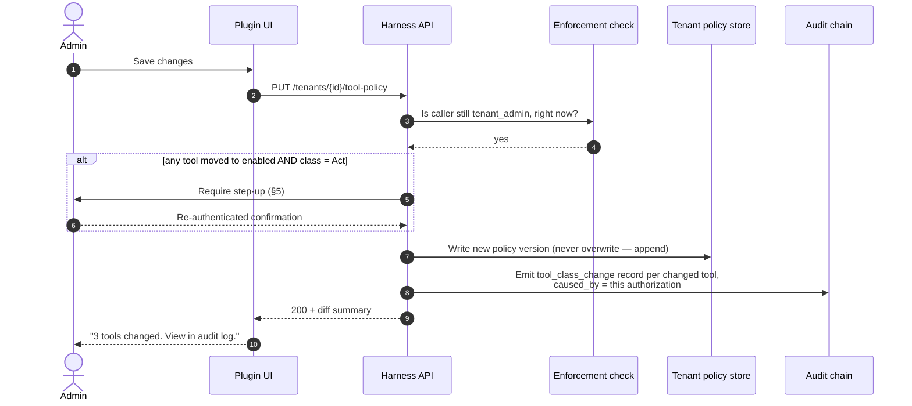

# UX — Configuring an MCP Server and Selecting Tools

> **Status: 🟡 In review.** First concrete admin screen. Lives inside the Grafana
> App Plugin per `c4-l1-system-context.md` J7 (Org Admin sets it up).
>
> Related: `../design/audit-and-attribution.md` (every change here is an audit
> record), `../design/grafana-authz-delegation.md` (why Grafana-scoped tools
> don't need re-entered credentials), `../adr/DECISION-REGISTER.md` §2 (Tool
> Gateway).

---

## 1. Who, and what they're actually doing

**Actor:** `tenant_admin` (Grafana Org Admin, or IdP-mapped equivalent).

They are not writing YAML. They are answering three questions per tool, in
order:

1. **Can the agent use this tool at all?** (enable/disable)
2. **What is it allowed to do with it?** (read-only / may propose / may act)
3. **On what, specifically?** (scope — which clusters, which repos, which
   namespaces — not "all of Kubernetes")

Three questions, three columns. Everything else in this doc is decoration around
that structure.

---

## 2. Entry point

Grafana App Plugin → full-page route, not a panel (per r2 of the L1 diagram —
admin UX needs real screen real estate).

```
Grafana ▸ Apps ▸ Graft Agent Harness ▸ Connections & Tools
                                        ├─ Connections   (datasources, clusters, repos — adopted from Grafana where possible)
                                        ├─ Tool Servers   ◀── this screen
                                        ├─ Policies
                                        └─ Budgets
```

Reached from a Grafana Org Admin's own navigation — never a URL a Viewer could
guess their way into. The route itself is gated by the enforcement check from
`grafana-authz-delegation.md`: even loading this page re-validates the caller is
actually an Admin, not just "was an Admin five minutes ago".

---

## 3. Screen 1 — Tool Servers (the catalogue)

```
┌─────────────────────────────────────────────────────────────────────────────┐
│  Connections & Tools ▸ Tool Servers                                          │
├─────────────────────────────────────────────────────────────────────────────┤
│  Available to your Tenant                                                 │
│                                                                                │
│  ┌───────────────────────────────────────────────────────────────────────┐  │
│  │ ● Grafana MCP           Connected via this Grafana instance      [ON] │  │
│  │   Datasources, dashboards, alert rules, Explore queries.               │  │
│  │   14 of 22 tools enabled · 3 write-capable          [ Configure › ]   │  │
│  ├───────────────────────────────────────────────────────────────────────┤  │
│  │ ○ Kubernetes MCP        No connection yet                       [OFF] │  │
│  │   Cluster workloads, logs, events.                                     │  │
│  │                                                       [ Connect › ]   │  │
│  ├───────────────────────────────────────────────────────────────────────┤  │
│  │ ● GitHub MCP            Connected — org "acme-corp"              [ON] │  │
│  │   Repos, PRs, deploy history.                                         │  │
│  │   6 of 9 tools enabled · 2 write-capable             [ Configure › ]  │  │
│  ├───────────────────────────────────────────────────────────────────────┤  │
│  │ ○ Jira MCP              No connection yet                       [OFF] │  │
│  │                                                       [ Connect › ]   │  │
│  └───────────────────────────────────────────────────────────────────────┘  │
│                                                                                │
│  Platform catalogue — request a server not listed here                       │
└─────────────────────────────────────────────────────────────────────────────┘
```

**Design decisions embedded in this list:**

- **A server with no connection cannot be configured yet** — "Connect" is the
  only available action, not "Configure". You cannot select tools for a Kubernetes
  cluster you haven't pointed at one. This ordering (connect → configure) is a
  deliberate constraint, not a UI accident: it prevents an admin from granting
  capability against a placeholder.
- **Grafana MCP shows "Connected via this Grafana instance"** with no separate
  connect step — it rides the org's existing identity, consistent with
  `grafana-authz-delegation.md` §3.2. This is the payoff of Tenant ≡ Grafana
  Org: one fewer credential to manage, visibly, on the first screen the admin sees.
- **Write-capable count is surfaced at the list level**, before drilling in. An
  admin scanning this list should see risk at a glance, not discover it three
  clicks deep.

---

## 4. Screen 2 — Configuring a server's tools

Clicking **Configure** on Grafana MCP:

```
┌─────────────────────────────────────────────────────────────────────────────┐
│  ‹ Tool Servers   Grafana MCP                                                 │
├─────────────────────────────────────────────────────────────────────────────┤
│  Search tools…            [ All ] [ Read ] [ Propose ] [ Act ]  Group: Category▾│
├─────────────────────────────────────────────────────────────────────────────┤
│  ▾ Querying                                                                    │
│    ☑ query_prometheus            Read       Run a PromQL query           ⓘ   │
│    ☑ query_loki                  Read       Run a LogQL query            ⓘ   │
│    ☑ list_datasources             Read       Enumerate configured datasources │
│                                                                                │
│  ▾ Dashboards & Alerts                                                       │
│    ☑ get_dashboard                Read       Fetch a dashboard definition     │
│    ☑ list_alert_rules             Read       Enumerate alert rules           │
│    ☐ create_annotation           Propose ▾  Post an annotation on a graph   │
│    ☐ update_alert_rule           ⚠ Act    ▾  Modify an alert rule           │
│                                                                                │
│  ▾ Administration                                                             │
│    ☐ create_datasource           ⚠ Act    ▾  Add a new datasource            │
│                                                                                │
├─────────────────────────────────────────────────────────────────────────────┤
│  14 of 22 enabled · 3 require step-up (see below)      [ Save changes ]     │
└─────────────────────────────────────────────────────────────────────────────┘
```

- Each tool is: **checkbox** (enabled?) + **class badge** (Read / Propose / Act) +
  one-line description + an info icon expanding to full input/output schema and
  an example call.
- **Class is fixed per tool by the platform catalogue** — an admin cannot
  reclassify `update_alert_rule` as "Read". They choose *whether* to enable it,
  not *what kind of action it is*. This stops policy drift where every Tenant
  quietly relabels risky tools as safe to avoid friction.
- **Act-class tools carry a warning glyph inline in the list**, not only inside a
  detail view, because the scan-and-decide moment is here, in the checkbox list.

---

## 5. Enabling a write-capable tool — the step-up

Checking `update_alert_rule` does not just tick a box. Per L1 commitment 9 and
the write-gating rule from `c4-l1-system-context.md` §4:

```
┌─────────────────────────────────────────────────────────────────────────────┐
│  Enable "update_alert_rule"?                                                  │
│                                                                                │
│  This tool can modify alert rules directly. Enabling it means the agent      │
│  may propose changes here, and — if your Tenant policy allows — execute   │
│  them after a human approves.                                                │
│                                                                                │
│  This will:                                                                   │
│   • Add "update_alert_rule" to the tool classes available to responders      │
│   • Still require per-action approval (approvals are never skippable)        │
│   • Be recorded in the audit trail, attributed to you                        │
│                                                                                │
│  Scope this to:                                                               │
│   ( ) All alert rules in this Tenant                                       │
│   (•) Only alert rules in folders:  [ prod-alerts ▾ ] [ + ]                   │
│                                                                                │
│  Re-enter your password or approve via your identity provider to confirm.     │
│                                                                                │
│                                          [ Cancel ]   [ Confirm & Enable ]    │
└─────────────────────────────────────────────────────────────────────────────┘
```

- **Step-up authentication**, not just a confirm dialog — consistent with J4's
  "approval is a deliberate, re-authenticated act". Enabling a write capability is
  itself a privileged action and gets the same rigour we demand of an agent's
  actual write later. Inconsistent to guard the effect but not the switch that
  permits it.
- **Scoping is mandatory at enable time**, not an afterthought. "All alert rules"
  is a selectable option, not the silent default — the wide-open choice should
  cost the same click as the narrow one, but read as a decision, not a shortcut.
- This whole step is an `authorization` + `tool_class_change` audit record on its
  own, causally upstream of every future `tool_call` of that type — the enable
  event is itself part of the chain in `audit-and-attribution.md`, not metadata
  about it.

Toggling it **off** has no step-up — removing capability is never the dangerous
direction.

---

## 6. Scoping a read-only tool

Read tools get lightweight scoping inline, no step-up:

```
    ☑ query_prometheus     Read      Run a PromQL query
      Scope: All datasources ▾   [ restrict to specific datasources… ]
```

Expands to a multi-select of the org's **existing Grafana datasources** — again,
adopted, not re-entered. This is where the earlier "org-scoped resources make
this easy" insight pays off concretely: the picker is Grafana's own datasource
list, filtered to what this Grafana org actually has.

---

## 7. Saving



**Policy is versioned, not overwritten.** A run that started under policy v3
finishes under policy v3, even if an admin saves v4 mid-run — otherwise "what was
the agent allowed to do" becomes unanswerable for any run that overlaps a config
change. The run's capability token (per `audit-and-attribution.md` §5.1) is
minted against the policy version live at run start.

---

## 8. States a tool can be in

Worth naming explicitly, because the UI must render all of them without
ambiguity:

| State | Checkbox | Badge | Cause |
|---|---|---|---|
| Enabled | ☑ | Read / Propose / Act | Admin turned it on |
| Disabled | ☐ | greyed | Default, or admin turned it off |
| **Enabled, awaiting step-up** | ☑ (pending) | Act ⚠ | Save clicked, re-auth not yet completed — must not silently activate |
| **Blocked by connection** | ☐, disabled control | — | Server has no connection yet (Screen 1) |
| **Blocked by platform** | ☐, disabled control, tooltip | — | Platform catalogue disables this tool globally, e.g. a CVE — Tenant cannot override |
| **Deprecated** | as configured | strikethrough badge | Platform marks it retiring; still runs, admin is warned |

The "Blocked by platform" state matters for the ceiling chain in
`c4-l1-system-context.md` §4 — the UI must make visible that some doors are not
the tenant admin's to open, rather than just failing silently on save.

---

## 9. Feedback loop back to the admin

After saving, and periodically after, the screen should answer *"is this
config actually being used, and safely?"* — not just "is it saved":

```
┌───────────────────────────────────────────────────────────────────┐
│  update_alert_rule           ⚠ Act        Enabled → prod-alerts    │
│  Used 3 times in the last 7 days · 3 approved, 0 rejected · view › │
└───────────────────────────────────────────────────────────────────┘
```

This closes the loop with `audit-and-attribution.md` — the configuration surface
and the audit surface are two views of the same data, not separate systems the
admin has to correlate manually.

---

## 10. Open questions

1. **Who can grant the step-up in §5 if the tenant admin's IdP session has no
   step-up mechanism configured** (no WebAuthn, no re-prompt configured at the
   IdP)? Falls back to password re-entry, but not all IdPs support that either
   for federated logins.
2. **Does "Blocked by platform" need a reason string surfaced to the admin**, or
   just "contact your platform operator"? Leaning: a short reason, since silence
   here breeds support tickets.
3. **Bulk actions** — enabling a whole category ("all Read tools") in one step.
   Useful for onboarding speed, dangerous if it becomes the default path past
   Act-class review. Leaning: allow bulk-enable for Read only; Act always
   requires the individual step-up, even inside a bulk flow.
4. **Should scoping (§6) support deny-lists as well as allow-lists** — e.g. "all
   datasources except this one"? Allow-lists are safer defaults but do not scale
   past ~30 datasources.
5. **Multi-admin conflict** — two org admins editing the same server
   simultaneously. Optimistic concurrency with a conflict screen, or a soft lock?
