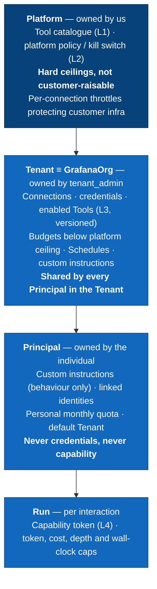

# C4 Level 1 — System Context

> **Status: 🟡 In review — revision 4.**
>
> **Changes in r4 — five decisions taken 2026-09-13 (ADR-0065–ADR-0069):**
>
> | # | Change | Driver |
> |---|---|---|
> | 1 | **Approval follows the driver, not the initiator.** J4 and J5 rewritten again; r3's J5 trade is **withdrawn**, and the on-call handover gap it accepted is closed. | ADR-0065 |
> | 2 | **Control is authority**, so every control transfer is an audited authority transfer. Auto-release is now specified as **three independent server-side clocks**, not a single vague "10 minutes". | ADR-0066 |
> | 3 | **Claiming control on a `system_initiated` Run is the upgrade point** to `user_initiated` — refining ADR-0013, which located it at approval. | ADR-0066 |
> | 4 | **Paging writes classified rather than deferred wholesale.** v1 is read-only; notification suppression is **permanently hard-denied**. Surfaced and fixed a latent J1 inconsistency: **narration is not a ToolClass**. | ADR-0067 |
> | 5 | **The harness never reaches a customer system directly** — Tool Gateway → MCP, without exception, three named non-agent exceptions. Closes r3 section 7 Q1. | ADR-0068 |
>
> *(The AS + Tool Gateway + Tool Registry merge into one deployable, ADR-0069, is an
> L2 concern and changes nothing here.)*
>
> **Changes in r3 — reconciled against the Decision Register (ADR-0001–ADR-0064) and
> [`../GLOSSARY.md`](../GLOSSARY.md), which is normative and wins on conflict:**
>
> | # | Change | Driver |
> |---|---|---|
> | 1 | **"Workspace" removed from the vocabulary entirely.** Everything that said *workspace* now says **Tenant**. **Tenant ≡ GrafanaOrg, 1:1.** | ADR-0051, ADR-0052 |
> | 2 | **"Investigation" is no longer a primitive.** Every agent interaction — chat, dashboard/alert building, RCA — is one **Run**. | ADR-0036 |
> | 3 | **Scope chain loses a layer:** `platform ≥ tenant ≥ principal ≥ run`. | ADR-0057 |
> | 4 | **Roles are the four real ones:** `platform_admin`, `tenant_admin`, `responder`, `viewer`. `observer` and `workspace_admin` never existed. | ADR-0056 |
> | 5 | **J5 rewritten.** The old "Alice is offline, Bob approves" ending is **contradicted by initiator-only approval** and has been replaced with what actually happens. | ADR-0055 |
> | 6 | **Run ownership inverted.** `user_initiated` Runs are **private by default**, irreversibly promotable to tenant-shared; `system_initiated` Runs are **born tenant-shared**. | ADR-0054 |
> | 7 | **Grafana is platform-operated, not customer-hosted** — OSS, latest, one shared multi-org instance. New visual class. | ADR-0021 |
> | 8 | **Four of the six r2 open questions are closed** (min Grafana version, approver re-auth, deployment model, compliance regime). | ADR-0009, ADR-0021, ADR-0025, ADR-0049, ADR-0055 |
> | 9 | **Two independent regional deployments** (GCP, AliCloud) with a metadata-only Tenant Directory. Drawn as a boundary note; decomposed at L2. | ADR-0049 |
> | 10 | **Identity linking is a precondition, not a convenience.** An unlinked Slack user gets a link prompt, not a Run. | ADR-0061 |
>
> **Method:** the UX comes first. Sections 1–4 describe what people experience and what
> they configure. Section 5 is the diagram those journeys force into existence. Section 6 states
> what it commits us to; section 7 lists what is still open.
>
> **Next level:** [`c4-l2-containers.md`](./c4-l2-containers.md).

---

## 1. Who this is for

Four **Principals**, distinguished by what they are allowed to do, not by job
title. *Principal* — not "user" — because webhooks and Schedules are actors too
(ADR-0052, Glossary section 5).

| Principal | What they want | Where they are | Default Role source |
|---|---|---|---|
| **On-call engineer** | "Something is broken at 03:00. Tell me what and why before I finish reading the alert." | Slack first, then Grafana | Grafana `Editor` → `responder` |
| **SRE team member** | "Join a Run someone else started. Take the wheel. Approve the fix if I'm the one holding it." | Grafana, occasionally Slack | Grafana `Editor` → `responder` |
| **Tenant admin** | "Connect our datasources, clusters and repos. Set what the agent may touch and what it costs." | Grafana plugin config pages | GrafanaOrgAdmin → `tenant_admin` |
| **Platform operator** | "Run this thing. Cap what any customer can consume. Know what it did and why." | Ops tooling, telemetry sinks | GrafanaServerAdmin → `platform_admin` |

Two non-human Principals also exist and are first-class in the audit chain: the
**alert webhook** and the **Schedule** (ADR-0047, ADR-0058). Both produce
`system_initiated` Runs.

There is no "AI user" persona. The agent is not an actor — it is the system
acting on a Principal's behalf, which is why every journey names the human it is
attributable to, and why an **unlinked** human cannot start a Run at all (ADR-0061).

**Role resolution order** (ADR-0056): explicit Group→Role mapping → explicit
per-Principal grant → zero-config default derived from the live Grafana basic
role, computed at token-mint time and never stored. **The IdP authenticates; the
harness authorises.**

---

## 2. The core loop

The whole product is one loop. Everything else is an affordance around it.

```
  Signal  ──▶  Triage  ──▶  Investigate  ──▶  Explain  ──▶  Propose  ──▶  Approve  ──▶  Act  ──▶  Record
  (alert,      (auto,       (evidence      (hypothesis  (a concrete   (whoever    (gated)   (postmortem,
   ask,         read-only)   gathering)     + confidence) change)       is driving,           audit, learn)
   schedule)                                                            in Grafana)
```

Three properties are load-bearing and shape everything downstream:

- **Everything left of "Approve" is read-only.** Triage and investigation run
  with no human present. That is what makes 03:00 useful.
- **"Approve" is the only place authority is granted.** It is a human act, in
  Grafana, re-authenticated, and it is the boundary between an assistant and a
  liability (ADR-0014). **It belongs to whoever currently holds the wheel** — which
  makes *taking the wheel* an authority-bearing act in its own right (ADR-0065).
- **The loop is one primitive.** A three-message chat and a 40-minute RCA are
  the same **Run**, with the same durable event log, audit chain and approval
  gate (ADR-0036). There is no "lightweight mode" — it was considered and rejected.

---

## 3. UX journeys

The diagram in section 5 contains nothing that is not justified by a journey here.

### J1 — Alert fires, nobody is awake *(the flagship journey)*

1. An alert fires in **Grafana Alerting** or **Alertmanager** and hits the
   harness webhook. The Tenant is derived from the alert's source GrafanaOrg
   (ADR-0051); the trigger is deduplicated by `deduplication_id` so an alert storm
   re-firing does not open twenty Runs (ADR-0042).
2. A `system_initiated` Run starts with no human attached. It is **born
   tenant-shared** — nobody initiated it, so private-by-default would make it
   invisible to everyone (ADR-0054).
3. It gathers evidence: queries **Prometheus/Mimir, Loki, Tempo** via the
   Tenant's Grafana datasources; inspects the relevant **Kubernetes** workloads;
   checks recent deploys in **GitHub**.
4. It produces a hypothesis with a confidence score and cited evidence.
5. It posts to the incident **Slack** channel and annotates the alert in
   **Grafana** — *"Likely cause: OOMKill loop on `payment-api` after deploy
   `a3f91c`. Confidence 0.82. 4 pieces of evidence."*
6. **Nothing was changed.** No page escalated, no pod restarted.

> **Why step 5 is not a write.** Posting to Slack and annotating the alert look
> like writes from a Run that is structurally read-only. They are not:
> **surface output is not a ToolClass** (ADR-0067). Narration flows from the event log
> through the surface adapters and **never through the Tool Gateway** — it acts on
> *us*, not on a customer system. A PagerDuty note, by contrast, *is* a tool call
> against a customer system and is correctly a `write`, which is exactly why v1
> does not need one: the thing on-call actually wants — the finding appearing
> where they are already looking — is narration, and costs no write capability at
> all.

**Requires:** running with no human session, and being *structurally* incapable
of writing in that mode — the Run's capability token never contains a write tool
class, rather than a policy check that could be talked around (ADR-0013).

### J2 — On-call picks it up in Slack

1. Engineer wakes, reads the Slack summary, replies in thread: *"what did the
   memory look like before the deploy?"*
2. **If their Slack identity is not verifiably linked, they get a link prompt —
   an ephemeral message with a signed single-use "Sign in with Slack" link — not
   a Run** (ADR-0020, ADR-0061). A linked Principal with no Role in that Tenant gets an
   explicit *"ask your `tenant_admin`"* refusal, not a generic error.
3. The harness answers in-thread — **batched and throttled, never token-by-token**,
   because Slack is not a streaming surface (ADR-0034) — with a rendered graph.
4. Engineer taps **"Open in Grafana"** → a deep link into the **Grafana plugin**
   with the full trajectory, evidence and tool calls already there. No context
   lost, no re-run.

**Requires:** Slack is a first-class conversational surface, not a notification
channel; an identity-linking precondition before any attributable act; and a Run
started on one surface continues on the other.

### J3 — Deep dive in Grafana, in context

1. Engineer is already on a dashboard. Opens the harness panel or full-page
   route in the **Grafana App Plugin**.
2. Attaches context by reference — *this panel, this dashboard, this alert rule,
   this time range* — rather than describing it in prose.
3. Asks *"why did this spike?"*; the narrative streams **token by token** over
   Grafana Live (ADR-0031, ADR-0034); gets an answer with **jump-to-Explore /
   jump-to-dashboard** links so every claim is verifiable in one click.
4. Raw tool output is **never streamed verbatim** — it is reduced inline, with
   the untruncated artifact fetched on demand from object storage (ADR-0034).

**Requires:** consuming Grafana object references as structured context; every
assertion traceable to a query the human can re-run.

### J3b — Build, don't just diagnose *(new in r3)*

1. Same panel, no incident. *"Add an alert rule for p99 latency above 400ms on
   this service."*
2. The agent drafts it and **proposes** it — a `write`-class action, so it stops
   at the same gate J4 uses.
3. The human sees a **diff view** of the proposed alert rule and confirms.

**Requires:** chat and authoring are not a second-class path. ADR-0036 makes them the
same Run primitive, which is precisely why they get the same audit trail and the
same approval gate rather than a quieter one.

### J4 — Propose, approve, act *(the sharp edge)*

1. Run concludes: memory limit is too low.
2. The agent **proposes** a remediation — a **GitHub** PR raising the limit — and
   pauses on a durable wait that survives restarts and deploys (ADR-0045, ADR-0047).
3. The proposal shows: exact diff, blast radius, what it is based on,
   confidence, and how to reject.
4. **Approval happens in the Grafana plugin, never in Slack.** A Slack approve
   button produces a signed, single-use, short-lived deep link into the plugin;
   the human confirms there (ADR-0014). Slack has no per-action re-authentication
   primitive, and its own AI-agent guidance treats approval gates as a UX
   pattern, not an authentication mechanism.
5. Five conditions must *all* hold (ADR-0065). The approver **is the Run's current
   driver**; they re-authenticated in Grafana; check-then-act passes for that
   specific action against their **own** Grafana permission; the Run's origin is
   `user_initiated`; and their Role holds `action:approve` — which `viewer` never
   does, because `viewer` can never drive.
6. The harness opens the PR **as the agent's own bot identity** (GitHub App,
   never impersonating the human), with the approving Principal and
   `graft_run_id` recorded in the PR body and commit trailer. A
   **Jira/ServiceNow** ticket is updated.
7. **An unanswered approval expires** (≥72h) and closes the Run as `expired`
   (ADR-0047). It does not wait forever — an unbounded wait would pin a deploy colour
   alive for weeks. The approval clock is **independent of the control clocks**:
   the driver may change, or the Run may sit unowned, without resetting it.

**Requires:** proposal and execution as separate steps with a human gate; the
approver recorded and non-repudiable; and the wait being durable rather than a
process staying alive.

### J5 — Two people, one Run *(rewritten again in r4 — r3's trade is withdrawn)*

1. Alice starts a Run. It is **private to her** until she explicitly shares it
   with the Tenant; sharing is **irreversible** (ADR-0054). While private, she is the
   driver by construction — there is nobody else.
2. Once shared, Bob joins and sees the same live stream. **One driver at a
   time.** Bob watches until he requests control and Alice hands off, or until
   control is released by one of the mechanisms in section 4.5.
3. `viewer` can never drive. `responder` and `tenant_admin` can.
4. **Alice's laptop dies. Two minutes later her disconnect clock expires,
   control is released, and Bob claims it. Bob can now approve.** Approval
   follows the wheel (ADR-0065).
5. Bob's approval screen says **"proposed while Alice was driving; you are
   approving as Bob."** The audit chain records proposer-context and approver
   separately, with the control-transfer record as a `caused_by` edge — so the
   chain shows not just *who* approved but *how they came to be allowed to*.
6. The proposal itself is **not regenerated**. Approval binds to
   `proposal_hash`, so Bob approves exactly the artefact that was reviewed —
   invalidating it on every handover would mean re-running the agent and would
   make handover useless.

> **What r3 said, and why it changed.** r3 encoded ADR-0055's initiator-only rule and
> stated the on-call handover gap as a deliberate trade. That trade is
> **withdrawn**. Driver-based approval closes the gap and costs a different,
> smaller one: **control is now authority**, so taking the wheel is an
> authority-bearing act and must be audited as one. The safety properties that
> survive the change are worth naming — a private Run degenerates to the old rule
> with no special case; `viewer` still cannot approve because it still cannot
> drive; and check-then-act still binds every approver to their *own* Grafana
> permission, so inheriting the wheel never inherits someone else's reach.### J6 — Afterwards

1. The closed Run is a permanent, readable artefact: timeline, evidence, tool
   calls, hypothesis, who approved what, under which Tenant and Principal custom
   instruction versions (ADR-0062).
2. It feeds the postmortem and the ticket. **Archival changes storage tier and
   mutability, never visibility** (ADR-0054).
3. Engineers rate it — thumbs per message, a review per Run — feeding the
   internal eval sink, **never the live agent** (ADR-0071). No product feature may
   read from the eval sink.
4. A de-provisioned Principal's private Runs become inaccessible in-product; the
   insert-only 12-month audit trail is the forensic path, not the product UI.

**Requires:** a durable auditable record, and a feedback path that is never a
runtime dependency.

### J7 — Tenant admin sets it up

1. Admin opens the harness app's **configuration pages inside Grafana**
   (full-page plugin routes, not a panel).
2. Connects datasources, clusters, repos, ticketing. Datasource connections can
   be **adopted from existing Grafana datasources** — they are already
   GrafanaOrg-scoped, and Tenant ≡ GrafanaOrg.
3. Enables tools from the platform catalogue — **per tool, never per server**,
   because "enable `grafana-mcp`" must not silently enable its write set (ADR-0063).
4. Enabling a **write- or destructive-class** tool requires a **step-up
   re-authentication** and is itself an audit record (ADR-0016). Scoping is mandatory
   at enable time; "all resources" is a selectable option, never a silent
   default.
5. Sets budgets — only ever *below* the platform ceiling. Sees spend. Requests an
   increase from the UI, which files an idempotency-keyed service-desk ticket
   pre-filled with `graft_tenant_id`, current ceiling, observed consumption and
   the triggering `graft_run_id` (ADR-0057).
6. Creates **Schedules** — recurring health sweeps, 24h post-incident
   verification, drift reports. Governed: a per-Tenant count ceiling and a
   minimum interval, counted against the Tenant's quota. All scheduled Runs are
   `system_initiated` and therefore structurally read-only, so **Schedule risk is
   bounded to cost, not blast radius** (ADR-0058).

**Requires:** all config is **Tenant-scoped and shared**; per-Principal variation
comes from Role filtering at call time, not from separate configs. Tool policy is
**versioned, never overwritten** — a Run started under policy v3 finishes under
v3.

### J8 — Platform operator holds the ceiling

1. Operator sets **hard, non-raisable limits**: concurrency, token spend, tool
   calls per Run, graph depth, wall-clock per Run.
2. Sets **per-connection** throttles protecting *customer* infrastructure — K8s
   API QPS, Loki query concurrency — independent of which Tenant is spending.
3. When 20 alerts fire at once, **partitioned durable queues keyed by
   `graft_tenant_id`** stop one Tenant's alert storm from starving another (ADR-0044).
4. At-cap behaviour is **deliberately per-scope, not uniform** (ADR-0057):
   **per-run** → graceful terminate, emitting the best hypothesis formed so far,
   never a bare failure; **per-principal / per-tenant** → hard stop, new Runs
   rejected while in-flight Runs finish; **per-connection** → throttle and queue,
   never failing the Run. **No degrade-to-a-cheaper-model** — that would silently
   change the quality characteristics an operator is about to act on.
5. Holds the **L2 platform-wide kill switch**: a hard deny that takes effect on
   in-flight Runs at their next tool call (ADR-0063).
6. **Break-glass is read, cancel and suspend in any Tenant — and explicitly not
   approve** (ADR-0055). The actor who can reach every Tenant must not also authorise
   writes in every Tenant. Every break-glass access is a non-sampled audit
   record.

**Requires:** a limit hierarchy where the effective value is the minimum across
scopes, enforced at the Tool Gateway and the orchestrator queue.

---

## 4. Configuration, scope and limits

The answer to *"is config shared?"*, *"who is an admin?"* and *"what bounds
this?"* in one place.

### 4.1 The scope chain



**Effective limit = `min(platform, tenant, principal, run)`.** A scope may only
tighten, never loosen, what the scope above it allows (ADR-0057).

> **`graft_tenant_id` is the only scoping key** (ADR-0051). It is on every row, event,
> span, audit record and token, enforced by Postgres `FORCE ROW LEVEL SECURITY`.
> `grafana_org_id` is a **mapped attribute, not a key** — it is a region-local
> integer, so org `5` exists in *both* regional deployments meaning different
> Tenants (ADR-0060).

### 4.2 Tool authority is a separate, narrower lattice

Limits bound *how much*. This bounds *what at all*. **Effective capability is the
intersection of all five layers; no layer can grant what a layer above has not**
(ADR-0063).

```mermaid
flowchart LR
    L1["<b>L1 — Platform catalogue</b><br/>What tools exist<br/>Pinned by definition hash"]
    L2["<b>L2 — Platform policy</b><br/>What may <i>ever</i> be enabled<br/><b>Hard deny · kill switch</b>"]
    L3["<b>L3 — Tenant policy</b><br/>What <i>is</i> enabled, per Tool<br/>tenant_admin · versioned · step-up"]
    L4["<b>L4 — Run capability token</b><br/>What <i>this Run</i> may call<br/>~10 min · audience-bound"]
    L5["<b>L5 — Call-time check</b><br/>May <i>this Principal, now</i><br/>check-then-act · Role · throttle"]

    L1 --> L2 --> L3 --> L4 --> L5 --> E(["<b>Effective capability</b><br/>= L1 ∩ L2 ∩ L3 ∩ L4 ∩ L5"])

    classDef lattice fill:#1168bd,stroke:#0b4884,color:#ffffff
    classDef result fill:#08427b,stroke:#052e56,color:#ffffff
    class L1,L2,L3,L4,L5 lattice
    class E result
```



Three consequences worth stating out loud:

- **`ToolClass` is the unit of policy and approval; `Tool` is the unit of
  enablement.** Enabling a server never enables its whole set.
- **Tool definitions are pinned by hash.** If an upstream MCP server changes a
  tool's name, description or schema, it is treated as **not enabled until
  re-approved** — otherwise L3 approval is an approval of whatever the upstream
  happens to serve at call time.
- **Upstream tool descriptions are untrusted input and are never forwarded to
  the model.** The registry serves our own curated description and stores the
  upstream's for diffing only. A third party's description injected into model
  context is a direct prompt-injection channel.

### 4.3 Config sharing

| Thing | Scope | Shared? |
|---|---|---|
| Tool catalogue and platform policy | Platform | Global |
| Which Tools are enabled, and their scoping | Tenant | Shared across Tenant |
| Downstream credentials | Tenant | Shared, resolved per call at the Tool Gateway |
| Budgets, Schedules | Tenant (+ per-Principal quota) | Shared |
| Custom instructions — **behaviour** | Tenant **and** Principal | Tenant wins on conflict |
| Slack ↔ IdP identity link | Principal | Private, and **mandatory** (ADR-0061) |
| Default Tenant (for Slack DMs) | Principal | Private |
| **Which Tools a given Principal may invoke** | Derived at call time from Role | **Not config — an authorisation filter** |

Last row is the important one. Everyone in a Tenant sees the same configuration;
what differs is what each Principal is permitted to invoke, decided per call at
the Tool Gateway. Per-Principal tool config would fragment the audit trail and
make "what can the agent do here?" unanswerable.

> **ADR-0062 narrows ADR-0016 rather than contradicting it.** ADR-0016 governs **capability**
> (Tenant-scoped, shared). Custom instructions govern **behaviour** (two levels,
> Tenant wins). Two different things were sharing one word. **Custom instructions
> are prompt text, never policy** — an instruction reading *"you may restart pods
> without asking"* has literally no effect, because capability came from the
> capability token minted before the instruction was ever read. The mitigation is
> structural, not a filter.

### 4.4 Roles

Four Roles, stored as **data rows, not code** (ADR-0056).

| Grafana basic role | Harness Role | May drive a shared Run? | May approve writes? |
|---|---|---|---|
| GrafanaServerAdmin | `platform_admin` | **No** | **No — separation of duties** |
| GrafanaOrgAdmin | `tenant_admin` | Yes, and may **force-release** | Yes, while driving (ADR-0065) |
| `Editor` | `responder` | Yes | Yes, while driving (ADR-0065) |
| `Viewer` | `viewer` | **No** — no `run:steer` verb | **No**, by consequence |

**`platform_admin` lost the wheel in r4.** Break-glass is read, cancel and
suspend in any Tenant — and explicitly **not** approve, **not** drive, and **not**
force-release. Once control confers approval authority, force-release becomes an
approval-authority act, so the actor who can reach every Tenant must not hold it
(ADR-0065). This *tightens* ADR-0055's separation of duties rather than relaxing it.

Overridable by IdP Group mapping, which wins where configured. The Grafana basic
role is a **zero-config default and an independent call-time ceiling** — never a
role *source* that gets stored and goes stale.

**Deliberate exception:** GrafanaOrgAdmin is a statement about Grafana, not about
who may authorise an AI agent to write to production. Inheriting *read* config
rights is free. But **enabling a write- or destructive-class Tool** requires a
step-up re-authentication. One extra deliberate step, once per capability, never
per action.

**Only basic-role granularity is available.** Fine-grained custom-role RBAC is
Grafana-Enterprise-only — confirmed live: `POST /api/access-control/roles` 404s
against Grafana OSS `latest` (ADR-0026). This is not a fallback for a hypothetical
limitation; it is the ceiling.

### 4.5 Control liveness — three clocks

Once approval follows the wheel, *"the driver went away"* stops being a UX
annoyance and becomes a security parameter. So it is specified rather than
implied (ADR-0066). State lives server-side in `run_control`; **a `NULL` driver means
unowned**, not "the last person still has it".

| Clock | Anchored on | Default | Reset by | On expiry |
|---|---|---|---|---|
| **Idle** | `last_interaction_at` | **10 min** | An *interactive act* | Warn at T−60s, then release |
| **Disconnect** | `disconnected_at` | **2 min** | Transport reconnect | Release |
| **Approval** | the `action_proposed` event | **≥72h** | **Never** | Run closes `expired` (ADR-0047) |

The three are **independent**. A driver can idle out while a proposal is still
pending; the proposal survives, unowned, until someone claims the wheel or the
approval clock runs out.

**An interactive act** is: sending a prompt, steering, cancelling, requesting,
granting or releasing control, approving or rejecting, or clicking *"keep
control"*. It is **not**: receiving events, scrolling, replaying history,
expanding an artifact, or tab focus.

> The distinction is the whole point. The **idle clock asks "is a human still
> deciding?"**; the **disconnect clock asks "is a browser still open?"**. Those
> are different questions, they fail in different ways, and one timer answering
> both would be wrong in both directions — a watcher reading a long trace would
> lose the wheel, and a dead laptop with a live socket would keep it.

**Slack has no transport liveness, so a Slack driver has only the idle clock.**
A deliberate, documented asymmetry rather than an oversight — and a Slack driver
must land in Grafana to approve anyway (ADR-0014).

**How the clocks are actually evaluated:** a **30-second scheduled sweep**, not a
durable timer per Run reset on every interaction. Resetting a durable timer on
every keystroke is write amplification against the exact Postgres we named as the
binding scale constraint. The reset is a cheap `UPDATE`; the evaluation is
periodic. **Release therefore fires within 30s of nominal** — stated openly,
because the number is now security-relevant rather than cosmetic.

**On release, control goes to nobody.** It is never auto-handed to a specific
viewer, because auto-handing control now means auto-handing *approval authority*,
and silently promoting whoever happens to be watching is precisely the failure
mode to avoid. Any eligible viewer may then claim it.

**Force-release is `tenant_admin`-only** and emits a non-sampled audit record
naming the forcer, the displaced driver and any pending `proposal_hash`.

> **We chose detection over friction.** A cool-down before the forcer may claim
> was considered and rejected — during an incident, a deliberate delay is itself a
> harm. The forcer may claim immediately; a force-release followed by that same
> person approving within the same Run is **flagged in the audit chain as a
> self-escalation pattern and tracked as a platform metric**. This is the r4
> replacement for r3's expired-approval metric.

**Claiming control on a `system_initiated` Run is the moment a human attaches**,
and is therefore the upgrade point to `user_initiated` — refining ADR-0013, which put
the upgrade at approval. Until someone claims, such a Run has no driver and
nobody can approve, which is correct, because it is structurally read-only until
exactly that moment.

---

## 5. The diagram

```mermaid
flowchart TB
    %% ---------- People ----------
    subgraph PEOPLE["Principals"]
        direction LR
        ONCALL["<b>On-call Engineer</b><br/><i>[Person]</i><br/>Triages. Initiates Runs.<br/>Approves <b>while holding<br/>the wheel</b>."]
        TEAM["<b>SRE Team Member</b><br/><i>[Person]</i><br/>Joins shared Runs.<br/>Takes the wheel, then<br/>steers <b>and approves</b>."]
        TADMIN["<b>Tenant Admin</b><br/><i>[Person]</i><br/>GrafanaOrgAdmin.<br/>Owns Connections, Tool policy,<br/>budgets, Schedules."]
        PLATOP["<b>Platform Operator</b><br/><i>[Person]</i><br/>GrafanaServerAdmin.<br/>Hard ceilings, kill switch,<br/>break-glass read/cancel/suspend.<br/><b>Never drives. Never approves.<br/>Never force-releases.</b>"]
    end

    %% ---------- Our system ----------
    HARNESS["<b>Graft Agent Harness</b><br/><i>[Software System]</i><br/><br/>Runs LLM agents against production telemetry.<br/>Gathers evidence, forms hypotheses, proposes changes,<br/>executes them only after the <b>current driver</b> approves in Grafana.<br/><br/>One primitive: the <b>Run</b>. One scoping key: <b>graft_tenant_id</b>.<br/><b>Never a direct client on a customer system</b> — MCP only.<br/>API-first. Every act attributable to a verified Principal.<br/><br/><i>Two independent regional deployments (GCP, AliCloud).<br/>Run data never leaves its home region — ADR-0049.</i>"]

    %% ---------- Surfaces ----------
    subgraph SURFACES["Surfaces — v1"]
        direction LR
        GRAFANA["<b>Grafana</b><br/><i>[External System — platform-operated]</i><br/>OSS, latest, single shared multi-org<br/>instance. <b>We run it.</b><br/>Hosts our App Plugin.<br/>Asserts human identity (X-Grafana-Id).<br/><b>The only place approval happens.</b><br/>J2–J8"]
        SLACK["<b>Slack</b><br/><i>[External System]</i><br/>Conversational surface.<br/>One install serves every Tenant;<br/>SlackChannel→Tenant binding<br/>is load-bearing. J1, J2"]
        WEBUI["<b>Web Frontend</b><br/><i>[DEFERRED — post-v1]</i><br/>Same API, no private<br/>capabilities. OIDC + explicit<br/>Tenant switcher. ADR-0064"]
    end

    %% ---------- Triggers ----------
    subgraph TRIGGERS["Triggers — what starts a Run"]
        direction LR
        ALERTING["<b>Alerting Sources</b><br/><i>[External System]</i><br/>Grafana Alerting, Alertmanager.<br/>Normalised webhook, deduplicated.<br/>Tenant from source GrafanaOrg. J1"]
        SCHED["<b>Schedules</b><br/><i>[Internal trigger]</i><br/>Tenant-owned recurring Runs.<br/>Governed: count ceiling,<br/>min interval, quota-counted.<br/>Always read-only. J7, ADR-0058"]
    end

    %% ---------- Evidence ----------
    subgraph EVIDENCE["Evidence sources — read-only, always"]
        direction LR
        TELEMETRY["<b>Observability Stack</b><br/><i>[External System]</i><br/>Prometheus / Mimir, Loki, Tempo.<br/>Via Grafana datasources.<br/>graft_run_id in query headers. J1, J3"]
        K8S["<b>Kubernetes Clusters</b><br/><i>[External System]</i><br/>GKE, ACK. Workloads, events, state.<br/><b>Reached only via k8s-mcp</b> — never<br/>a direct client. ADR-0068<br/>Impersonation carries graft_run_id. J1"]
        CLOUD["<b>Cloud APIs</b><br/><i>[DEFERRED — post-v1]</i><br/>GCP, AliCloud."]
        KNOWLEDGE["<b>Knowledge Sources</b><br/><i>[DEFERRED — post-v1]</i><br/>Runbooks, docs, web search."]
    end

    %% ---------- Action targets ----------
    subgraph ACTIONS["Action targets — gated behind initiator approval"]
        direction LR
        GITHUB["<b>Source Control</b><br/><i>[External System]</i><br/>GitHub. Deploy history read;<br/>PRs opened as <b>bot identity</b><br/>(GitHub App), never impersonating.<br/>graft_run_id in commit trailer. J1, J4"]
        ITSM["<b>ITSM / Ticketing</b><br/><i>[External System]</i><br/>Jira, ServiceNow, ITSI.<br/>Also the quota-increase<br/>service desk. J4, J6, J7"]
        PAGING["<b>Paging / On-call</b><br/><i>[External System]</i><br/>PagerDuty, iLert.<br/><b>Read-only in v1</b> — schedules,<br/>rotation, incident detail.<br/><b>Suppression permanently denied</b><br/>at L2: an agent that can silence<br/>paging can hide an outage. ADR-0067"]
        REGISTRY["<b>Artifact Registry</b><br/><i>[DEFERRED — post-v1]</i><br/>Harbor. Image provenance."]
    end

    %% ---------- Platform ----------
    subgraph PLATFORM["Platform dependencies"]
        direction LR
        IDP["<b>Identity Provider</b><br/><i>[External System]</i><br/>Entra ID, Keycloak, Okta, Auth0.<br/>Pluggable, zero code change.<br/><b>Authenticates only</b> — the<br/>harness authorizes. ADR-0056"]
        SLACKOIDC["<b>Slack OIDC</b><br/><i>[External System]</i><br/>Sign in with Slack.<br/>Identity linking is a<br/><b>precondition</b>, not a<br/>convenience. ADR-0020, ADR-0061"]
        LLM["<b>LLM Providers</b><br/><i>[External System]</i><br/>Commercial APIs and<br/>self-hosted models.<br/>No mid-Run downgrade."]
        SECRETS["<b>Secret Store</b><br/><i>[External System]</i><br/>Tenant-scoped downstream<br/>credentials. Holds the platform<br/>Grafana Server Admin credential."]
        TELSINK["<b>Telemetry Sinks</b><br/><i>[External System]</i><br/>OTLP → operational sink (LGTM)<br/>+ internal-only eval sink.<br/><b>One-way: no product feature<br/>reads the eval sink.</b> ADR-0071"]
    end

    SANDBOX["<b>Code Execution Sandbox</b><br/><i>[DEFERRED — Phase 2]</i><br/>Micro-VM execution.<br/>ToolExecutor seam exists in v1. ADR-0004"]

    %% ---------- Relationships ----------
    ONCALL -->|"Converses, triages,<br/>launches approval"| SLACK
    ONCALL -->|"Investigates in context,<br/><b>re-authenticates and approves</b>"| GRAFANA
    TEAM -->|"Claims the wheel,<br/>steers, approves"| GRAFANA
    TEAM -->|"Follows up"| SLACK
    TADMIN -->|"Connections, Tool policy,<br/>budgets, Schedules"| GRAFANA
    PLATOP -->|"Ceilings, kill switch,<br/>break-glass read/cancel"| HARNESS
    PLATOP -->|"Monitors health<br/>and consumption"| TELSINK

    GRAFANA -->|"Plugin backend proxies to API;<br/>forwards X-Grafana-Id"| HARNESS
    SLACK <-->|"Events (Socket Mode),<br/>batched replies, interactions"| HARNESS
    ALERTING -->|"Webhook, normalised<br/>and deduplicated event"| HARNESS
    SCHED -->|"Durable cron fires a<br/>read-only Run"| HARNESS
    WEBUI -.->|"Post-v1"| HARNESS

    HARNESS -->|"Queries metrics,<br/>logs, traces"| TELEMETRY
    HARNESS -->|"Reads workload state<br/>and events, <b>via MCP only</b>"| K8S
    HARNESS -.->|"Post-v1"| CLOUD
    HARNESS -.->|"Post-v1"| KNOWLEDGE

    HARNESS -->|"Reads deploys;<br/>opens PRs once approved"| GITHUB
    HARNESS -->|"Creates and updates tickets;<br/>files quota requests"| ITSM
    HARNESS -->|"Reads schedules<br/>and rotation"| PAGING
    HARNESS -.->|"Post-v1"| REGISTRY

    HARNESS -->|"Provisions org service accounts;<br/>checks user permissions<br/>(check-then-act)"| GRAFANA
    HARNESS -->|"Authenticates Principals,<br/>resolves Groups"| IDP
    HARNESS -->|"Verifies Slack identity<br/>links"| SLACKOIDC
    HARNESS -->|"Inference"| LLM
    HARNESS -->|"Resolves Tenant<br/>credentials per call"| SECRETS
    HARNESS -->|"Scrubbed telemetry,<br/>trajectories, audit exports"| TELSINK
    HARNESS -.->|"Phase 2"| SANDBOX

    %% ---------- Styling ----------
    classDef person fill:#08427b,stroke:#052e56,color:#ffffff
    classDef system fill:#1168bd,stroke:#0b4884,color:#ffffff
    classDef external fill:#999999,stroke:#6b6b6b,color:#ffffff
    classDef operated fill:#6a8fb5,stroke:#3d5a75,color:#ffffff
    classDef deferred fill:#cccccc,stroke:#8a8a8a,color:#333333,stroke-dasharray: 6 4
    classDef groupbox fill:#f7f7f7,stroke:#d0d0d0,color:#333333

    class ONCALL,TEAM,TADMIN,PLATOP person
    class HARNESS system
    class GRAFANA,SCHED operated
    class SLACK,ALERTING,TELEMETRY,K8S,GITHUB,ITSM,PAGING,IDP,SLACKOIDC,LLM,SECRETS,TELSINK external
    class WEBUI,CLOUD,KNOWLEDGE,REGISTRY,SANDBOX deferred
    class PEOPLE,SURFACES,TRIGGERS,EVIDENCE,ACTIONS,PLATFORM groupbox
```



### Reading notes

- **Grafana has a new colour because it has a new status.** ADR-0021 confirms the
  platform *owns and operates* it — OSS, latest, one shared multi-org instance.
  It is still drawn outside our boundary because we do not build it, but it is
  not a customer system either. That single fact closed r2's most dangerous open
  question: we control the version, so `idForwarding` is simply on.
- **Grafana carries four roles now:** human surface (J3), gateway to telemetry
  (J1), identity asserter (ADR-0009), *and* authorisation oracle for check-then-act
  (ADR-0023). That concentration is the main structural risk in the design. It is
  mitigated by us operating it, not eliminated.
- **Schedules are drawn as a trigger, not as config.** They start Runs, they
  consume quota, and they are governed resources with their own ceiling. Putting
  them in the config box would hide that they are an actor.
- **Slack OIDC is drawn separately from the IdP** because they answer different
  questions. The IdP says *who this Principal is*; Slack OIDC proves *this Slack
  account is that Principal*. ADR-0061 makes the second one a precondition for acting,
  not a nicety.
- **Evidence and action targets are separate groups** because the read/write
  split is the safety model, not an implementation detail. Everything in
  *Evidence* is reachable with no human present. Nothing in *Actions* is.
- **The harness points at Grafana twice.** Once as a surface consuming us, once
  as a system we consume — service-account provisioning and permission checks.
  Collapsing those two arrows would hide the confused-deputy problem ADR-0023 exists
  to solve.
- **Every arrow to a customer system is a lie of convenience.** L1 draws one
  hop because L1 draws one box. From L2 down, *every* one of them passes through
  the Tool Gateway and an MCP server — that is the invariant, with three named
  non-agent exceptions (ADR-0068).
- **Paging is drawn read-only and will stay that way for a while.** The arrow
  that does *not* exist is the important one: nothing in v1 can acknowledge,
  resolve or suppress. Suppression is denied at the platform layer permanently,
  not merely unimplemented.
- **Deferred integrations are dashed** so the diagram doubles as a scope
  boundary.

---

## 6. What this diagram commits us to

| # | Commitment | Forced by | Decision |
|---|---|---|---|
| 1 | **One API, thin surfaces.** No surface has private capabilities. The post-v1 web frontend must add nothing new. | J2 | ADR-0001, ADR-0002, ADR-0064 |
| 2 | **One primitive.** Chat, authoring and RCA are the same Run, with the same durability, audit and approval gate. No lightweight tier. | J3b, J6 | ADR-0036 |
| 3 | **Read and write are architecturally separate**, not policy-separate. A human-absent Run's capability token cannot name a write class. | J1, J4 | ADR-0013 |
| 4 | **Approval is a distinct, re-authenticated human act, in Grafana, by the current driver.** Slack launches it, never performs it. **Control *is* authority**, so every transfer of the wheel is an audited transfer of approval rights. | J4, J5 | ADR-0014, ADR-0065, ADR-0066 |
| 5 | **The agent has no ambient credentials, and no ambient Tenant context.** Scope travels as an explicit argument; credentials resolve per call. | J7, J8 | ADR-0050, ADR-0007 |
| 6 | **Every claim links back to a query a human can re-run.** Evidence is cited, not asserted; raw artifacts are fetchable, never streamed verbatim. | J3 | ADR-0034 |
| 7 | **Config is Tenant-scoped and shared; per-Principal variation is authorisation, not configuration** — except custom instructions, which govern behaviour and can never grant capability. | J7 | ADR-0016, ADR-0062 |
| 8 | **Limits form a ceiling chain and at-cap behaviour differs by scope.** Per-connection throttles protect customer infrastructure independently of Tenant quota. | J8 | ADR-0017, ADR-0057 |
| 9 | **Tenant ≡ GrafanaOrg, 1:1, and `graft_tenant_id` is the only scoping key.** Connections are adopted from Grafana, not re-entered. | J7 | ADR-0051 |
| 10 | **Capability is an intersection of five layers, and the platform has the last word** — including a kill switch effective at the next tool call. | J8 | ADR-0063 |
| 11 | **Identity linking is a precondition for acting.** An unverified external identity yields a link prompt, not a Run — because an unlinked human cannot produce a compliant audit record. | J2 | ADR-0061, ADR-0015 |
| 12 | **Audit is insert-only, hash-chained and WORM-anchored, and `graft_run_id` propagates outward into customer-owned logs.** 12 months minimum, 3 hot. | J6 | ADR-0015, ADR-0025 |
| 13 | **Run data never leaves its home region.** Cross-region access is a read-path proxy resolved through a metadata-only Tenant Directory. | J8 | ADR-0049 |
| 14 | **The durable wait is the product.** Multi-hour approvals survive crashes, restarts and deploys — and expire rather than waiting forever. | J4 | ADR-0037, ADR-0047 |
| 15 | **No direct clients on customer systems.** Tool Gateway → MCP → system, always. A direct client would bypass the lattice, credential resolution, throttles, result reduction and audit in one move — and be invisible in the audit chain rather than merely undesirable. | J1, J4, J8 | ADR-0068 |
| 16 | **Narration is not action.** The agent reporting on its own surfaces never passes the Tool Gateway and carries no ToolClass. This is what lets a read-only 03:00 Run still tell you what it found. | J1 | ADR-0067 |

Commitments 3 and 4 are the two I would most defend. **3** is what makes J1
shippable: you can let an agent loose on production telemetry at 03:00 precisely
because the write path structurally does not exist on that code path. **4** is
what makes J4 survivable: the only thing standing between a hypothesis and a
production change is a named human who re-authenticated, and we can prove it.

**Commitment 4 got weaker and better in r4.** Weaker, because approval is no
longer pinned to one irreplaceable person. Better, because the thing it protects
was never *"only Alice may approve"* — it was *"a named, re-authenticated human,
acting within their own permissions, approved this exact artefact, and we can
prove how they came to be allowed to."* Driver-based approval preserves all four
of those clauses and drops the one that was only ever an implementation
convenience.

---

## 7. Still open

Two of r3's six questions closed in r4, and the headline metric changed.

| # | Question | State |
|---|---|---|
| 1 | **Force-release-then-self-approve rate.** ADR-0065 chose detection over friction: a `tenant_admin` can take the wheel from a live driver and approve immediately, and we flag the pattern rather than blocking it. If it turns out to be common rather than exceptional, the answer is friction after all — a cool-down, or a second approver for force-released proposals. | **Instrumented, not decided** — this replaces r3's expired-approval metric as the headline |
| 2 | **Are the clock defaults right?** 10 min idle and 2 min disconnect are proposed, not measured. Too short and a thoughtful reviewer loses the wheel mid-decision; too long and a dead laptop blocks an incident. The 30s sweep granularity is also a stated approximation. | **Open — needs real session data** |
| 3 | **Expired-approval rate.** Still worth watching, but expected to fall sharply now that any eligible responder can take over. Retained as a secondary signal. | **Instrumented, downgraded** |
| 4 | **D8b — raw prompts: audit chain or eval sink?** PCI-DSS makes it urgent: a prompt may quote a PAN from an investigated log line, so the eval sink must go through the *same* scrubbing pipeline or it becomes an unscrubbed liability next to a compliant one. Still in tension with ADR-0071's "never a runtime dependency" framing for forensics. | **Deferred to the Evals & Benchmarks session, with ADR-0025's PAN detector** |
| 5 | **Slack Grid beyond v1.** v1 assumes a single SlackEnterprise and a single SlackWorkspace, which is exactly why SlackChannel→Tenant binding is load-bearing. A second install breaks that assumption. | **Open, bounded by v1 scope** |
| 6 | **Quota and Schedule numbers.** Ceilings (proposed 10 Schedules/Tenant, 1h minimum interval) and monthly token/cost caps need real cost data. | **Open — needs measurement, not design** |

**Closed in r4:**

- ~~Does the harness reach Kubernetes directly?~~ → **ADR-0068. No — never, and not
  just for Kubernetes.** Every agent-reachable customer system goes through the
  Tool Gateway and an MCP server. Three exceptions, all non-agent-driven:
  service-account provisioning, check-then-act permission checks, and surface
  narration. *`k8s-mcp` itself still needs a design pass — the shape is decided,
  the plumbing is not.*
- ~~PagerDuty writes in v1?~~ → **ADR-0067.** Classified rather than deferred
  wholesale. v1 is `read` only; create/escalate/note are `write`;
  acknowledge/resolve are `destructive`; **suppression and maintenance windows
  are hard-denied at L2 permanently.** The case that looked like it needed a
  write — the agent telling on-call what it found — is served by narration.

**Closed in r3** *(retained for the record)*: minimum Grafana version (ADR-0021/ADR-0009),
approver re-authentication (ADR-0014), deployment model (ADR-0049), compliance regime
(ADR-0025).

---

## 8. Next steps

1. Confirm the **J5 rewrite and section 4.5 clock defaults** — 10 min idle, 2 min
   disconnect, 30s sweep. These are now security parameters, and they are
   currently guesses.
2. Confirm or challenge the section 6 commitments, especially 2 (one primitive), 4
   (driver-based approval) and 15 (no direct clients).
3. **L2 Containers is drawn:** [`c4-l2-containers.md`](./c4-l2-containers.md).
4. Then L3 for the two components that carry the most risk: the **Tool Gateway**
   and the **Orchestrator**.
