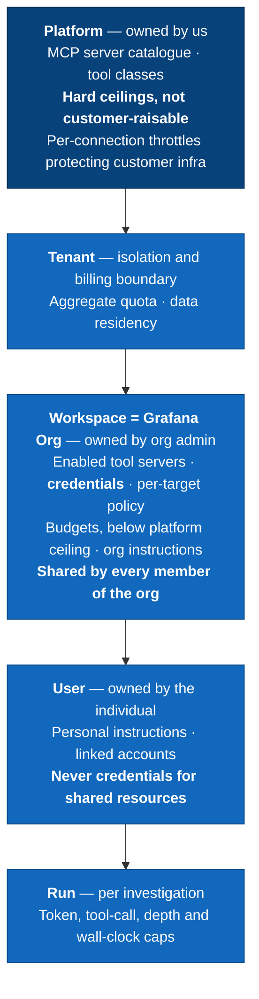

# C4 Level 1 — System Context

> **Status: 🟡 In review — revision 2.**
>
> **Changes in r2:** Web UI dropped from v1; **Grafana App Plugin + Slack only**.
> Admin UX moves into the plugin's full-page routes. Added §4 (configuration and
> limit scopes), J8 (platform operator), and the consequences of Grafana becoming
> the sole rich surface.
>
> **Method:** the UX comes first. §1–§4 describe what people experience and what
> they configure. §5 is the diagram those journeys force into existence. §6 states
> what it commits us to; §7 lists what is still open.

---

## 1. Who this is for

Four actors, distinguished by what they are allowed to do, not by job title.

| Actor | What they want | Where they are | Default role source |
|---|---|---|---|
| **On-call engineer** | "Something is broken at 03:00. Tell me what and why before I finish reading the alert." | Slack first, then Grafana | Grafana `Editor` → `responder` |
| **SRE team member** | "Join an investigation someone else started. Follow up. Approve or reject the fix." | Grafana, occasionally Slack | Grafana `Editor` → `responder` |
| **Org admin** | "Connect our datasources, clusters and repos. Set what the agent may touch and what it costs." | Grafana plugin config pages | Grafana `Admin` → `workspace_admin` |
| **Platform operator** | "Run this thing. Cap what any customer can consume. Know what it did and why." | Ops tooling, telemetry sinks | `platform_admin`, out of band |

There is no "AI user" persona. The agent is not an actor — it is the system acting
on an actor's behalf, which is why every journey names the human it is
attributable to.

---

## 2. The core loop

The whole product is one loop. Everything else is an affordance around it.

```
  Signal  ──▶  Triage  ──▶  Investigate  ──▶  Explain  ──▶  Propose  ──▶  Approve  ──▶  Act  ──▶  Record
  (alert,      (auto,       (evidence      (hypothesis  (a concrete   (a human)    (gated)   (postmortem,
   ask,         read-only)   gathering)     + confidence) change)                             audit, learn)
   schedule)
```

Two properties are load-bearing and shape everything downstream:

- **Everything left of "Approve" is read-only.** Triage and investigation run with
  no human present. That is what makes 03:00 useful.
- **"Approve" is the only place authority is granted.** It is a human act, and it
  is the boundary between an assistant and a liability.

---

## 3. UX journeys

The diagram in §5 contains nothing that is not justified by a journey here.

### J1 — Alert fires, nobody is awake *(the flagship journey)*

1. An alert fires in **Grafana Alerting** or **Alertmanager** and hits the harness webhook.
2. The harness normalises it and, if auto-triage is enabled for that org, starts a **read-only** investigation with no human attached.
3. It gathers evidence: queries **Prometheus/Mimir, Loki, Tempo** via the org's Grafana datasources; inspects the relevant **Kubernetes** workloads; checks recent deploys in **GitHub**.
4. It produces a hypothesis with a confidence score and cited evidence.
5. It posts to the incident **Slack** channel and annotates the alert in **Grafana** — *"Likely cause: OOMKill loop on `payment-api` after deploy `a3f91c`. Confidence 0.82. 4 pieces of evidence."*
6. **Nothing was changed.** No page escalated, no pod restarted.

**Requires:** running with no user session, and being *structurally* incapable of writing in that mode.

### J2 — On-call picks it up in Slack

1. Engineer wakes, reads the Slack summary, replies in thread: *"what did the memory look like before the deploy?"*
2. The harness answers in-thread, streaming, with a rendered graph.
3. Engineer taps **"Open investigation"** → a deep link into the **Grafana plugin** with the full trajectory, evidence and tool calls already there. No context lost, no re-run.

**Requires:** Slack is a first-class conversational surface, not a notification channel; and an investigation started on one surface continues on the other.

### J3 — Deep dive in Grafana, in context

1. Engineer is already on a dashboard. Opens the harness panel or side pane in the **Grafana App Plugin**.
2. Attaches context by reference — *this panel, this dashboard, this alert rule, this time range* — rather than describing it in prose.
3. Asks *"why did this spike?"*; gets an answer with **jump-to-Explore / jump-to-dashboard** links so every claim is verifiable in one click.

**Requires:** consuming Grafana object references as structured context; every assertion traceable to a query the human can re-run.

### J4 — Propose, approve, act *(the sharp edge)*

1. Investigation concludes: memory limit is too low.
2. The agent **proposes** a remediation — a **GitHub** PR raising the limit — and pauses.
3. The proposal shows: exact diff, blast radius, what it is based on, confidence, and how to reject.
4. **Approval happens in the Grafana plugin, never in Slack.** A Slack approve button produces a signed, single-use, short-lived deep link into the plugin; the human confirms there.
5. The harness opens the PR **as the agent's own bot identity**, with the approving human recorded in the PR body. A **Jira/ServiceNow** ticket is updated.
6. If the action were escalation rather than code, it would page via **PagerDuty/iLert**.

**Requires:** proposal and execution as separate steps with a human gate; the approver recorded and non-repudiable. See §7 Q3 — how we re-authenticate without a first-party web app is now an open problem.

### J5 — Two people, one incident

1. Alice starts the investigation. Bob joins mid-run and sees the same live stream.
2. Bob can steer — add context, redirect, cancel — without restarting.
3. Alice's laptop dies. Bob approves the fix. The investigation survives both.

**Requires:** investigations are **org-owned, multi-viewer, and outlive their initiator** — not user-owned.

### J6 — Afterwards

1. The closed investigation is a permanent, readable artefact: timeline, evidence, tool calls, hypothesis, who approved what.
2. It feeds the postmortem and the ticket.
3. Engineers rate it — thumbs per message, a review per investigation — feeding evaluation, never the live agent.

**Requires:** a durable auditable record, and a feedback path that is never a runtime dependency.

### J7 — Org admin sets it up *(revised for Grafana-only)*

1. Admin opens the harness app's **configuration pages inside Grafana** (full-page plugin routes, not a panel).
2. Connects datasources, clusters, repos, ticketing. Datasource connections can be **adopted from existing Grafana datasources** rather than re-entered — they are already org-scoped.
3. Sets per-target policy: **read-only / may propose / may act**.
4. Enables tool servers from the platform catalogue. Enabling a **write-capable** class needs an extra deliberate grant (see §4).
5. Sets budgets — which can only ever be set *below* the platform ceiling. Sees spend. Gets stopped gracefully at the cap.

**Requires:** all config is **org-scoped and shared**; per-user variation comes from role filtering, not from separate configs.

### J8 — Platform operator holds the ceiling *(new)*

1. Operator sets **hard, non-raisable limits**: concurrency, token spend, tool calls per run, graph depth, wall-clock per run.
2. Sets **per-connection** throttles protecting *customer* infrastructure — K8s API QPS, Loki query concurrency — independent of which org is spending.
3. When 20 alerts fire at once, buckets stop one org's incident storm from starving another *or* from saturating a shared control plane.
4. Breaches are visible as telemetry, and an at-cap run terminates gracefully with whatever hypothesis it has.

**Requires:** a limit hierarchy where the effective value is the minimum across scopes, enforced at the Tool Gateway.

---

## 4. Configuration and limit scopes

The answer to *"is config shared?"* and *"who is an admin?"* in one place.



**Effective limit = `min(platform, tenant, workspace, user, run)`.** A scope may
only ever tighten, never loosen, what the scope above it allows.

### Config sharing

| Thing | Scope | Shared? |
|---|---|---|
| MCP server catalogue | Platform | Global |
| Which servers are enabled | Workspace | Shared across org |
| Downstream credentials | Workspace | Shared across org, resolved per call |
| Per-target read/propose/act policy | Workspace | Shared across org |
| Agent instructions | Workspace **and** user | Workspace wins on conflict |
| Slack ↔ IdP account link | User | Private |
| **Which tools a given user may invoke** | Derived at call time from role | Not config — an authorisation filter |

Last row is the important one. Everyone in an org sees the same configuration;
what differs is what each person is permitted to invoke, decided per call at the
Tool Gateway. Per-user tool config would fragment the audit trail and make
"what can the agent do here?" unanswerable.

### Role mapping

| Grafana org role | Harness role | May approve writes? |
|---|---|---|
| `Admin` | `workspace_admin` | Yes, if workspace policy allows |
| `Editor` | `responder` | Yes, if workspace policy allows |
| `Viewer` | `observer` | **No** |

Overridable by IdP group mapping, which wins where configured.

**Deliberate exception:** Grafana Org Admin is a statement about Grafana, not
about who may authorise an AI agent to write to production. Inheriting *read*
config rights is free — a Grafana admin already sees every datasource. But
**enabling a write-capable tool class** requires `platform_admin` or an explicitly
mapped IdP group. One extra deliberate step, once per capability, never per action.

---

## 5. The diagram

```mermaid
flowchart TB
    %% ---------- People ----------
    subgraph PEOPLE["Actors"]
        direction LR
        ONCALL["<b>On-call Engineer</b><br/><i>[Person]</i><br/>Triages incidents.<br/>Approves remediations."]
        TEAM["<b>SRE Team Member</b><br/><i>[Person]</i><br/>Joins, steers and reviews<br/>investigations."]
        ORGADMIN["<b>Org Admin</b><br/><i>[Person]</i><br/>Grafana Org Admin.<br/>Owns connections, policy,<br/>budgets."]
        PLATOP["<b>Platform Operator</b><br/><i>[Person]</i><br/>Sets hard ceilings.<br/>Runs and monitors<br/>the harness."]
    end

    %% ---------- Our system ----------
    HARNESS["<b>Graft Agent Harness</b><br/><i>[Software System]</i><br/><br/>Investigates production incidents using LLM agents.<br/>Gathers evidence, forms hypotheses, proposes remediations,<br/>and executes them only after human approval.<br/><br/>API-first. Every action attributable to a person."]

    %% ---------- Surfaces ----------
    subgraph SURFACES["Surfaces — v1"]
        direction LR
        GRAFANA["<b>Grafana</b><br/><i>[External System]</i><br/>Hosts our App Plugin: panels,<br/>full-page routes, config pages.<br/><b>The only rich surface in v1.</b><br/>J2, J3, J4, J5, J6, J7"]
        SLACK["<b>Slack</b><br/><i>[External System]</i><br/>Conversational surface<br/>and incident channel.<br/>J1, J2"]
        WEBUI["<b>Web UI</b><br/><i>[DEFERRED — post-v1]</i><br/>First-party SPA.<br/>Same API, no private<br/>capabilities."]
    end

    %% ---------- Triggers ----------
    subgraph TRIGGERS["Triggers — what starts an investigation"]
        direction LR
        ALERTING["<b>Alerting Sources</b><br/><i>[External System]</i><br/>Grafana Alerting, Alertmanager.<br/>Normalised webhook. J1"]
    end

    %% ---------- Evidence ----------
    subgraph EVIDENCE["Evidence sources — read-only, always"]
        direction LR
        TELEMETRY["<b>Observability Stack</b><br/><i>[External System]</i><br/>Prometheus / Mimir, Loki, Tempo.<br/>Via Grafana datasources. J1, J3"]
        K8S["<b>Kubernetes Clusters</b><br/><i>[External System]</i><br/>GKE, ACK. Workloads, events,<br/>state. J1"]
        CLOUD["<b>Cloud APIs</b><br/><i>[DEFERRED — post-v1]</i><br/>GCP, AliCloud.<br/>Infrastructure state."]
        KNOWLEDGE["<b>Knowledge Sources</b><br/><i>[DEFERRED — post-v1]</i><br/>Runbooks, docs, web search."]
    end

    %% ---------- Action targets ----------
    subgraph ACTIONS["Action targets — gated behind human approval"]
        direction LR
        GITHUB["<b>Source Control</b><br/><i>[External System]</i><br/>GitHub. Deploy history read;<br/>PRs opened as bot. J1, J4"]
        ITSM["<b>ITSM / Ticketing</b><br/><i>[External System]</i><br/>Jira, ServiceNow, ITSI.<br/>J4, J6"]
        PAGING["<b>Paging / On-call</b><br/><i>[External System]</i><br/>PagerDuty, iLert.<br/>Read schedules in v1;<br/>writes open — §7 Q5"]
        REGISTRY["<b>Artifact Registry</b><br/><i>[DEFERRED — post-v1]</i><br/>Harbor. Image provenance."]
    end

    %% ---------- Platform ----------
    subgraph PLATFORM["Platform dependencies"]
        direction LR
        IDP["<b>Identity Provider</b><br/><i>[External System]</i><br/>Entra ID, Keycloak, Okta, Auth0.<br/>Pluggable. Authn + groups."]
        LLM["<b>LLM Providers</b><br/><i>[External System]</i><br/>Commercial APIs and<br/>self-hosted models."]
        SECRETS["<b>Secret Store</b><br/><i>[External System]</i><br/>Workspace-scoped<br/>downstream credentials."]
        TELSINK["<b>Telemetry Sinks</b><br/><i>[External System]</i><br/>OTLP. Traces, metrics, logs,<br/>agent trajectories."]
    end

    SANDBOX["<b>Code Execution Sandbox</b><br/><i>[DEFERRED — Phase 2]</i><br/>Micro-VM execution.<br/>Seam exists in v1."]

    %% ---------- Relationships ----------
    ONCALL -->|"Triages, converses,<br/>requests approval"| SLACK
    ONCALL -->|"Investigates in context,<br/>confirms approvals"| GRAFANA
    TEAM -->|"Joins, steers,<br/>reviews, approves"| GRAFANA
    TEAM -->|"Follows up"| SLACK
    ORGADMIN -->|"Configures connections,<br/>policy, budgets"| GRAFANA
    PLATOP -->|"Sets hard ceilings,<br/>observes behaviour"| HARNESS
    PLATOP -->|"Monitors health"| TELSINK

    GRAFANA -->|"Plugin backend<br/>proxies to API"| HARNESS
    SLACK <-->|"Events, streamed replies,<br/>interactions"| HARNESS
    ALERTING -->|"Webhook,<br/>normalised event"| HARNESS
    WEBUI -.->|"Post-v1"| HARNESS

    HARNESS -->|"Queries metrics,<br/>logs, traces"| TELEMETRY
    HARNESS -->|"Reads workload<br/>state and events"| K8S
    HARNESS -.->|"Post-v1"| CLOUD
    HARNESS -.->|"Post-v1"| KNOWLEDGE

    HARNESS -->|"Reads deploys;<br/>opens PRs once approved"| GITHUB
    HARNESS -->|"Creates and<br/>updates tickets"| ITSM
    HARNESS -->|"Reads on-call schedules"| PAGING
    HARNESS -.->|"Post-v1"| REGISTRY

    HARNESS -->|"Authenticates users,<br/>resolves groups"| IDP
    HARNESS -->|"Inference"| LLM
    HARNESS -->|"Resolves workspace<br/>credentials"| SECRETS
    HARNESS -->|"Emits telemetry<br/>and trajectories"| TELSINK
    HARNESS -.->|"Phase 2"| SANDBOX

    %% ---------- Styling ----------
    classDef person fill:#08427b,stroke:#052e56,color:#ffffff
    classDef system fill:#1168bd,stroke:#0b4884,color:#ffffff
    classDef external fill:#999999,stroke:#6b6b6b,color:#ffffff
    classDef deferred fill:#cccccc,stroke:#8a8a8a,color:#333333,stroke-dasharray: 6 4
    classDef groupbox fill:#f7f7f7,stroke:#d0d0d0,color:#333333

    class ONCALL,TEAM,ORGADMIN,PLATOP person
    class HARNESS system
    class GRAFANA,SLACK,ALERTING,TELEMETRY,K8S,GITHUB,ITSM,PAGING,IDP,LLM,SECRETS,TELSINK external
    class WEBUI,CLOUD,KNOWLEDGE,REGISTRY,SANDBOX deferred
    class PEOPLE,SURFACES,TRIGGERS,EVIDENCE,ACTIONS,PLATFORM groupbox
```



### Reading notes

- **Grafana carries three roles now:** human surface (J3), gateway to telemetry
  (J1), *and* identity asserter (§7 Q1). That concentration is the main risk
  created by dropping the Web UI, and it makes the Grafana ID-token question
  blocking rather than merely important.
- **The Web UI is drawn dashed, not deleted.** It is post-v1 and must never gain a
  capability the plugin lacks. Keeping it visible preserves the "one API, thin
  surfaces" rule that makes adding it later cheap.
- **Evidence and action targets are separate groups** because the read/write split
  is the safety model, not an implementation detail. Everything in *Evidence* is
  reachable with no human present. Nothing in *Actions* is.
- **Deferred integrations are dashed** so the diagram doubles as a scope boundary.

---

## 6. What this diagram commits us to

| # | Commitment | Forced by |
|---|---|---|
| 1 | **One API, thin surfaces.** No surface has private capabilities. Web UI post-v1 must add nothing new. | J2 — cross-surface continuity |
| 2 | **Investigations are org-owned**, multi-viewer, and outlive their initiator. | J5 |
| 3 | **Read and write are architecturally separate**, not policy-separate. Human-absent runs cannot write. | J1, J4 |
| 4 | **Approval is a distinct, attributable human act, and happens in Grafana.** Slack launches it, never performs it. | J4 |
| 5 | **The agent has no ambient credentials.** Every downstream call resolves credentials per workspace. | J7 |
| 6 | **Every claim links back to a query a human can re-run.** Evidence is cited, not asserted. | J3 |
| 7 | **Config is org-scoped and shared; per-user variation is authorisation, not configuration.** | J7 |
| 8 | **Limits form a ceiling chain; platform caps are not customer-raisable.** Per-connection throttles protect customer infrastructure independently of org quota. | J8 |
| 9 | **Workspace = Grafana Org.** Datasource connections are adopted from Grafana, not re-entered. | J7 |

Commitment 3 is the one I would most defend: it is what makes J1 shippable. You
can let an agent loose on production telemetry at 03:00 precisely because the
write path structurally does not exist on that code path.

---

## 7. Still open

1. **Minimum Grafana version — now blocking.** With Grafana the only rich surface,
   it is also our only strong human-identity assertion. If we fall back to a
   plugin-signed JWT on older Grafana, our strongest proof that a human approved a
   production change is a shared secret. **Recommendation: set a minimum Grafana
   version that supports ID-token forwarding, and refuse approvals below it.**
   Needs verification: exact version, feature-toggle status, header, JWKS, claims.
2. **Does the harness reach Kubernetes directly, or only via Grafana?** Drawn
   direct, which J1 needs, but it is the largest source of credential complexity
   in the system.
3. **How do we re-authenticate an approver with no first-party web app?** Either
   (a) trust the Grafana session and treat plugin presence as sufficient, or
   (b) serve a minimal server-rendered approval page that does its own OIDC
   round-trip. (a) is simpler and probably fine; (b) is what a strict
   non-repudiation reading demands. Depends on the compliance answer.
4. **Deployment model** — per-customer install or shared SaaS? Determines whether
   `Tenant` in §4 is a live runtime concept or a single row.
5. **PagerDuty writes in v1?** Drawn as read-only schedules. Creating incidents is
   a high-trust action for a young system; I would defer it.
6. **Compliance regime in scope** (SOC2 / ISO27001 / none yet)? Drives audit
   retention and question 3.

---

## 8. Next steps

1. Confirm §3 journeys and §4 scopes — if a journey is wrong, everything
   downstream of it is wrong.
2. Confirm or challenge the §6 commitments.
3. I draw **L2 Containers**: plugin backend, API, orchestrator, Tool Gateway,
   durable event log, identity boundary.
4. Only then: implementation detail.
