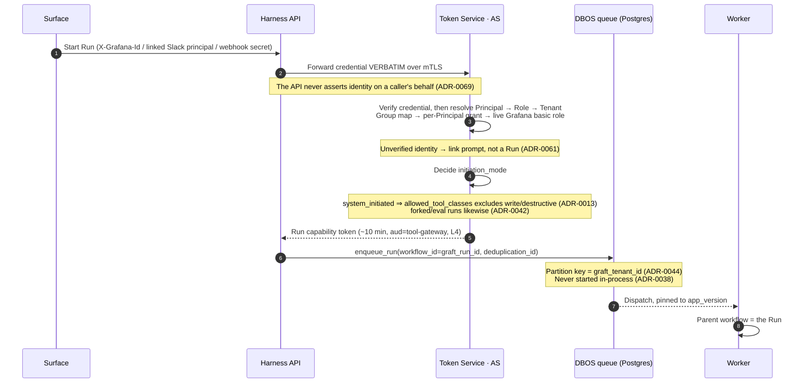
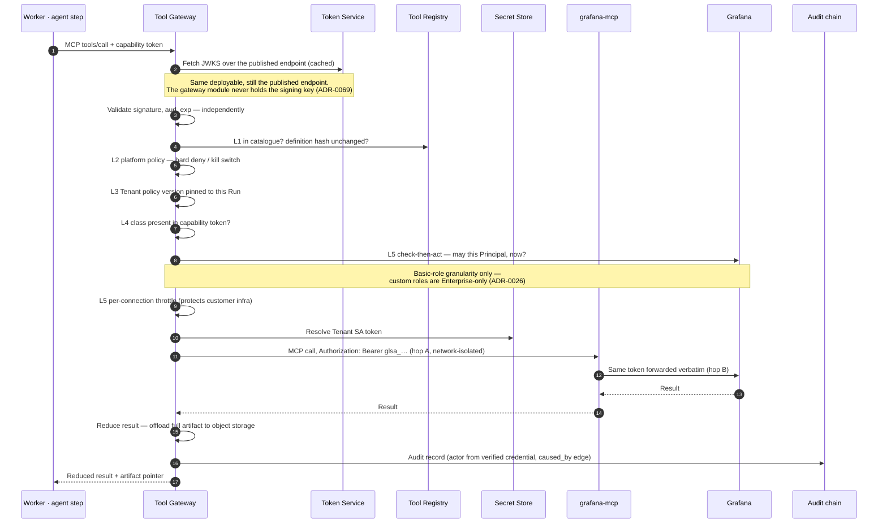
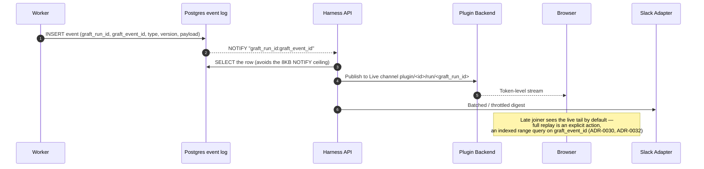
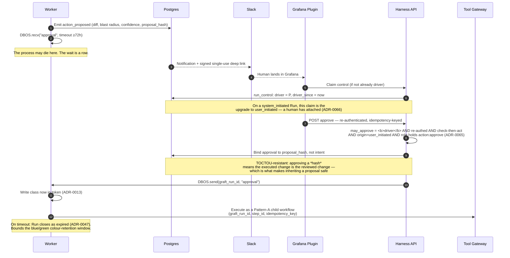
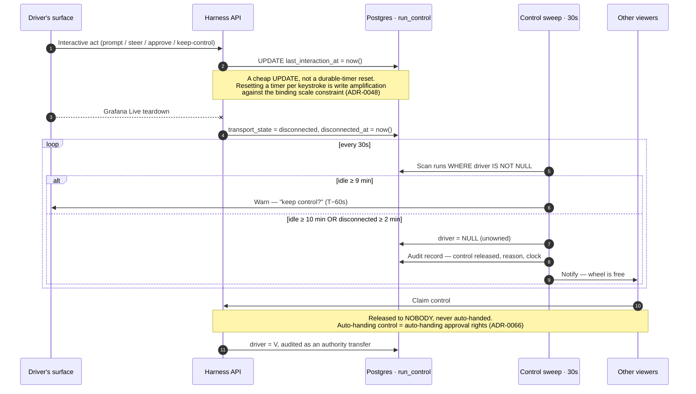
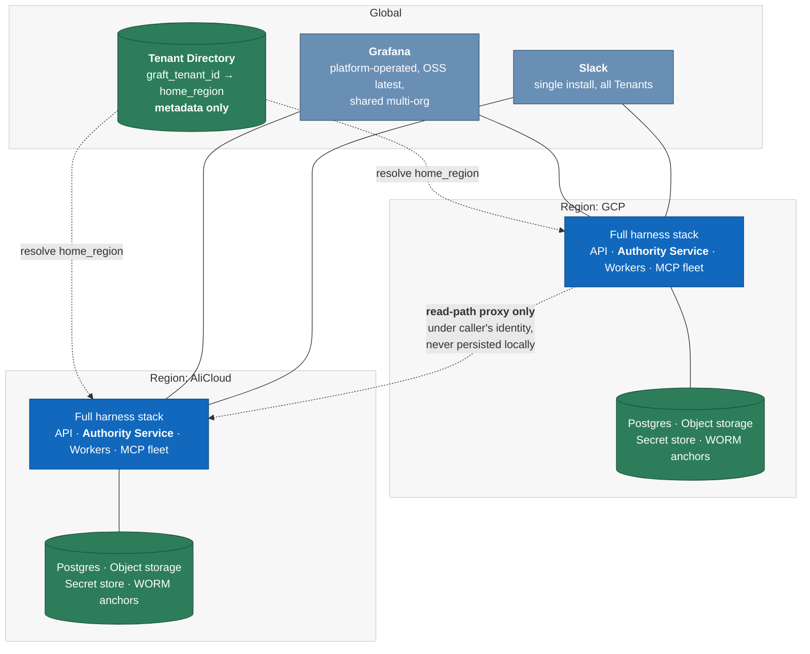

# C4 Level 2 — Containers

> **Status: 🟡 In review — revision 2.**
>
> Derived from [`c4-l1-system-context.md`](./c4-l1-system-context.md) r4, the
> [Decision Register](../adr/DECISION-INDEX.md) (ADR-0001–ADR-0069) and the eleven design
> documents in [`../design/`](../design/).
> [`../GLOSSARY.md`](../GLOSSARY.md) is normative — where this document conflicts
> with it, this document is a bug.
>
> **Changes in r2 (decisions taken 2026-09-13):**
>
> | # | Change | Driver |
> |---|---|---|
> | 1 | **Token Service, Tool Gateway and Tool Registry merge into one deployable — the Authority Service.** Three containers become one, with three modules and five enforced invariants. | ADR-0069 |
> | 2 | **No direct clients on customer systems.** `k8s-mcp` is now an invariant, not a preference; `pagerduty-mcp` added. | ADR-0068 |
> | 3 | **Approval follows the driver**, so section 4.4 and the authority model change, and a **fifth flow** (section 4.5, control liveness) is added. | ADR-0065, ADR-0066 |
> | 4 | **`run_control` added to Postgres**; the 30s control sweep added to scheduled workflows. | ADR-0066 |
>
> **Rule for this level:** every container here must be traceable to a **locked
> decision**, not to an implementation preference. Section 8 lists what was deliberately
> *not* made a container, and why — that list is as load-bearing as the diagram.

---

## 1. What L1 forced

L1 committed to sixteen things. Seven of them cannot be honoured by a monolith,
and those seven are what the container boundaries are actually made of.

| L1 commitment | Container it forces | Why a boundary, not a module |
|---|---|---|
| **3** — read/write architecturally separate | **Authority Service**, separate from the workers | In-process policy enforcement is not a security boundary. The primary threat is **indirect prompt injection from application logs** — text the agent reads and then acts on. A library the agent imports is inside the blast radius; a network service with its own token validation is not (ADR-0007). |
| **4** — approval by the current driver, re-authenticated in Grafana | **Grafana plugin backend** + **Token Service module** + **`run_control` state** | The identity assertion (`X-Grafana-Id`) exists only on the Grafana request path, and *who holds the wheel* is server-side state that must be evaluated even when every client is gone (ADR-0009, ADR-0066). |
| **5** — no ambient credentials, no ambient Tenant context | **Authority Service** + **Secret Store** | Credential resolution happens per call, keyed by `graft_tenant_id`, in a process the agent cannot introspect (ADR-0050, ADR-0018). |
| **10** — capability is a five-layer intersection | **Authority Service** (gateway + registry modules) | L5 must re-evaluate *per call*, which is what makes the L2 kill switch effective on in-flight Runs (ADR-0063). |
| **13** — run data never leaves its home region | **Regional deployment boundary** + **Tenant Directory** | Two independent stacks, one globally-replicated metadata-only directory. Not a config flag (ADR-0049). |
| **14** — the durable wait is the product | **Orchestrator workers** with DBOS embedded + **Postgres** | A multi-hour HITL wait cannot be a process staying alive. It is a database row and a `recv` (ADR-0037, ADR-0045, ADR-0047). |
| **15** — no direct clients on customer systems | **MCP server fleet** | The lattice, credential resolution, throttles, result reduction and audit all live at the gateway. A direct client bypasses five controls at once — and is invisible in the audit chain rather than merely undesirable (ADR-0068). |

Everything else is a consequence.

---

## 2. The diagram

```mermaid
flowchart TB

  %% ================= PEOPLE =================
  subgraph PEOPLE["Principals"]
    direction LR
    HUMAN["<b>On-call / SRE / Tenant Admin</b><br/><i>[Person]</i>"]
    PLATOP["<b>Platform Operator</b><br/><i>[Person]</i><br/>Never drives, never approves"]
  end

  %% ================= EDGE SURFACES =================
  subgraph EDGE["Surfaces — thin adapters, no private capability"]
    direction LR

    subgraph PLUGIN["Grafana App Plugin"]
      direction TB
      PFE["<b>Plugin Frontend</b><br/><i>[Container: TypeScript, React, @grafana/ui]</i><br/>Panels, full-page routes, config pages.<br/>Subscribes to Grafana Live for<br/>token-level streaming.<br/>Diff view for proposed changes.<br/><b>Driver badge, T−60s keep-control prompt.</b><br/>ADR-0001, ADR-0029, ADR-0031, ADR-0034, ADR-0066"]
      PBE["<b>Plugin Backend</b><br/><i>[Container: Go, Grafana plugin SDK]</i><br/>Proxies browser → Harness API.<br/>Grafana Live StreamHandler:<br/>SubscribeStream / RunStream / PublishStream.<br/><b>Subscribe/teardown is the disconnect-clock signal.</b><br/>Channel authz against plugin-context identity<br/>and Run ownership. Forwards X-Grafana-Id verbatim.<br/><b>Never asserts authorization itself</b> — ADR-0023, ADR-0066"]
      PFE -->|"REST + Live<br/>WebSocket"| PBE
    end

    SLACKAD["<b>Slack Adapter</b><br/><i>[Container: Python]</i><br/>Socket Mode outbound WebSocket.<br/>Resolves Tenant via SlackChannel binding<br/>or per-Principal default.<br/>Issues link prompts to unverified users.<br/><b>Batched / throttled output only.</b><br/>Signed single-use approval deep links.<br/><b>No transport liveness → idle clock only.</b><br/>ADR-0020, ADR-0034, ADR-0051, ADR-0052, ADR-0061, ADR-0066"]

    HOOK["<b>Webhook Ingress</b><br/><i>[Container: Python]</i><br/>Grafana Alerting / Alertmanager →<br/>normalised event. Verifies shared secret.<br/>Tenant from source GrafanaOrg.<br/>deduplication_id on the queue.<br/>ADR-0002, ADR-0042, ADR-0051"]

    WEBFE["<b>Web Frontend</b><br/><i>[DEFERRED — post-v1]</i><br/>Same API. OIDC + explicit<br/>Tenant switcher. ADR-0002, ADR-0064"]
  end

  %% ================= CORE =================
  subgraph CORE["Harness core — one regional deployment"]
    direction TB

    API["<b>Harness API</b><br/><i>[Container: Python, FastAPI]</i><br/>The single API. Forwards <b>every</b> inbound surface<br/>credential verbatim to the AS — never asserts identity<br/>on a caller's behalf.<br/>REST back-channel: cancel · signal · approve ·<br/><b>request/grant/release/force-release control</b> —<br/>idempotency-keyed, identical across all surfaces.<br/>Run list (Mine / Tenant). Artifact fetch.<br/>Cross-region read proxy.<br/>ADR-0001, ADR-0033, ADR-0034, ADR-0049, ADR-0064, ADR-0066, ADR-0069"]

    ORCH["<b>Orchestrator Workers</b><br/><i>[Container: Python StatefulSet, DBOS Transact embedded]</i><br/>The Run <b>is</b> the durable workflow (Pattern B).<br/>Parent = Run · child = sub-agent · step = 1 LLM or 1 tool call.<br/>Partitioned durable queues keyed by graft_tenant_id.<br/>send/recv for HITL waits and steering signals.<br/>Blue/green executor IDs, auto-hashed app version.<br/><b>All Runs enqueued, never started in-process.</b><br/>ADR-0037–ADR-0048"]

    AGENT["<b>Agent Graph</b><br/><i>[Component inside the worker: LangGraph + DeepAgents]</i><br/>Compiled with <b>no checkpointer</b> — DBOS steps are the<br/>single source of execution truth.<br/>Planner, sub-agents, hypothesis, evidence.<br/>Max depth ~15, loop breakers, per-Run token caps.<br/>Prompt layers: platform → Tenant → Principal.<br/>ADR-0003, ADR-0039, ADR-0040, ADR-0044, ADR-0062"]

    RUNTIME["<b>runtime seam</b><br/><i>[Component: the sole importer of dbos]</i><br/>enqueue_run · await_human · signal · sleep_until ·<br/>cancel · resume · fork · list_*<br/>The natural chokepoint for audit emission, event<br/>publication, Tenant scoping and ceiling checks.<br/><b>Not a swappable engine port.</b> ADR-0048"]

    REAPER["<b>Scheduled Workflows</b><br/><i>[Container: DBOS scheduled workflows]</i><br/>Version-aware <b>reaper</b> (resumes stale executors'<br/>PENDING work onto a live matching-version worker).<br/><b>Control sweep every 30s</b> — idle and disconnect clocks.<br/>Tenant backfill + SA <b>drift reconciler</b>, token rotation,<br/>infra-memory refresh */15, stale-Run auto-close,<br/>approval expiry. ADR-0038, ADR-0047, ADR-0053, ADR-0058, ADR-0066"]

    ORCH --- AGENT
    ORCH --- RUNTIME
  end

  %% ================= AUTHORITY =================
  subgraph AUTH["Authority Service — one deployable, three modules, separate ports. ADR-0069"]
    direction TB
    TOKEN["<b>Token Service / MCP AS</b> <i>[module]</i><br/>Verifies <b>raw</b> surface credentials itself:<br/>X-Grafana-Id against <code>/api/signing-keys/keys</code>,<br/>Slack linked Principal, webhook secret.<br/>Resolves Principal → Role → Tenant. Decides initiation_mode.<br/>Mints the <b>run capability token</b>: ~10 min,<br/>aud=tool-gateway, allowed_tool_classes[].<br/>Publishes OIDC discovery + JWKS.<br/><b>Sole holder of the signing key. Issues only.</b><br/>ADR-0009, ADR-0010, ADR-0019, ADR-0027, ADR-0056, ADR-0063-L4"]
    GW["<b>Tool Gateway</b> <i>[module]</i><br/><b>The security boundary — separate process from the agent.</b><br/>Resource Server only. Validates tokens <b>independently</b><br/>over the published JWKS, <b>including on loopback</b>.<br/><b>Holds the public JWKS and nothing else.</b><br/>Publishes RFC 9728 protected-resource metadata.<br/>Enforces the five-layer lattice at <b>L5, per call</b>.<br/>Check-then-act against the Principal's own Grafana permission.<br/>Resolves Tenant credentials per call. Per-connection throttles.<br/>Result reduction + artifact offload. Audit emission. HITL gate.<br/><b>ToolExecutor seam for the Phase-2 sandbox.</b><br/>ADR-0004, ADR-0007, ADR-0070, ADR-0007, ADR-0018, ADR-0023, ADR-0034, ADR-0044, ADR-0063, ADR-0068"]
    REG["<b>Tool Registry</b> <i>[module]</i><br/>Tool definitions <b>pinned by hash</b> — a changed upstream<br/>name/description/schema is <b>not enabled</b> until re-approved.<br/>ToolClass, required Role, <b>our curated description</b>.<br/>Upstream descriptions stored for diffing only,<br/><b>never forwarded to the model</b>.<br/>Discovery yields review candidates, never capability. ADR-0063"]
    GW --- REG
  end

  %% ================= MCP SERVERS =================
  subgraph MCPS["Upstream MCP servers — streamable HTTP only, never stdio. The ONLY path to a customer system. ADR-0070, ADR-0068"]
    direction LR
    GMCP["<b>grafana-mcp</b><br/><i>[Container: Go — one logical service,<br/>stateless, horizontally scaled]</i><br/>GRAFANA_FORWARD_HEADERS=Authorization.<br/>Client cache keyed by credential.<br/>Isolation comes from the SA token per call,<br/><b>not</b> from process separation.<br/>Built-in caller-auth <b>not used</b>. ADR-0018"]
    KMCP["<b>k8s-mcp</b><br/><i>[Container]</i><br/>Impersonation headers carry<br/>graft_run_id outward.<br/><b>Design pending</b> — section 9. ADR-0011, ADR-0015, ADR-0068"]
    GHMCP["<b>github-mcp</b><br/><i>[Container]</i><br/>GitHub App <b>bot identity</b>,<br/>never user impersonation. ADR-0011"]
    ITMCP["<b>jira / servicenow-mcp</b><br/><i>[Container]</i>"]
    PDMCP["<b>pagerduty / ilert-mcp</b><br/><i>[Container]</i><br/><b>read class only in v1.</b><br/>Suppression and maintenance<br/>windows <b>hard-denied at L2,<br/>permanently</b>. ADR-0067"]
    SBX["<b>Sandbox Executor</b><br/><i>[DEFERRED — Phase 2]</i><br/>Micro-VM. Seam exists now. ADR-0004"]
  end

  %% ================= DATA =================
  subgraph DATA["State — per region, never leaves it (ADR-0049)"]
    direction LR
    PG[("<b>Postgres</b><br/><i>[Container]</i><br/>Run state · <b>run_control</b> (driver, clocks) ·<br/><b>event log</b> (monotonic graft_event_id,<br/>LISTEN/NOTIFY fan-out, indexed replay) ·<br/><b>audit chain</b> (insert-only, hash-chained causal DAG) ·<br/>DBOS system DB · tool policy versions ·<br/>graft_ref_kind / graft_external_ref · heartbeats.<br/><b>FORCE ROW LEVEL SECURITY</b> on graft_tenant_id,<br/>established with <b>SET LOCAL</b>, never SET.<br/>ADR-0015, ADR-0030, ADR-0037, ADR-0050, ADR-0060, ADR-0066")]
    OBJ[("<b>Object Storage</b><br/><i>[Container]</i><br/>Tool artifacts (steps return pointers,<br/>never payloads) + <b>object-lock WORM</b><br/>anchors for audit chain heads.<br/>ADR-0015, ADR-0034, ADR-0041")]
    VAULT[("<b>Secret Store</b><br/><i>[Container]</i><br/>Tenant-scoped downstream credentials,<br/>namespaced by graft_tenant_id.<br/>Holds the HSM-backed platform<br/>Grafana Server Admin credential.<br/>ADR-0011, ADR-0022, ADR-0050")]
  end

  TDIR[("<b>Tenant Directory</b><br/><i>[Container — global, replicated, metadata only]</i><br/>graft_tenant_id → home_region.<br/><b>No run data, ever.</b> ADR-0049")]

  %% ================= OBSERVABILITY =================
  subgraph OBS["Observability pipeline (ADR-0008)"]
    direction LR
    COLL["<b>OTel Collector</b><br/><i>[Container]</i><br/>PII / secret / <b>PAN</b> scrubbing,<br/>sampling, graft.tenant.id tagging.<br/>Audit records are <b>never sampled</b>.<br/>ADR-0008, ADR-0015, ADR-0025"]
    OPSINK["<b>Operational sink</b><br/><i>[External]</i><br/>Tempo / Mimir / Loki"]
    EVAL["<b>Eval sink</b><br/><i>[External — internal use only]</i><br/>Langfuse or Phoenix.<br/>Trajectories, prompt-version<br/>comparison, eval datasets.<br/><b>No product feature may read it.</b> ADR-0071"]
    COLL --> OPSINK
    COLL --> EVAL
  end

  %% ================= EXTERNAL =================
  subgraph EXT["External systems"]
    direction LR
    GRAF["<b>Grafana</b><br/><i>[External — platform-operated]</i><br/>OSS latest, shared multi-org.<br/>Surface · identity asserter ·<br/>authorization oracle · datasource proxy.<br/>ADR-0021"]
    SLACKX["<b>Slack</b><br/><i>[External]</i><br/>Events API + OIDC"]
    IDPX["<b>IdP</b><br/><i>[External]</i><br/>Entra / Keycloak / Okta / Auth0"]
    LLMX["<b>LLM Providers</b><br/><i>[External]</i><br/>Commercial + self-hosted"]
    CUST["<b>Customer systems</b><br/><i>[External]</i><br/>Prometheus/Mimir · Loki · Tempo ·<br/>Kubernetes · GitHub · Jira/ServiceNow ·<br/>PagerDuty/iLert"]
  end

  %% ================= EDGES =================
  HUMAN --> PFE
  HUMAN --> SLACKX
  PLATOP --> API
  PLATOP --> OPSINK

  GRAF -->|"hosts, signs<br/>X-Grafana-Id"| PFE
  SLACKX <-->|"Socket Mode"| SLACKAD
  GRAF -->|"alert webhook"| HOOK

  PBE -->|"REST, forwards<br/>X-Grafana-Id"| API
  SLACKAD --> API
  HOOK --> API
  WEBFE -.-> API

  API -->|"forwards raw credential<br/><b>over mTLS</b>, AS port"| TOKEN
  TOKEN -->|"verify signing keys"| GRAF
  TOKEN -->|"verify OIDC"| IDPX
  TOKEN -->|"verify Sign in<br/>with Slack"| SLACKX

  API -->|"enqueue_run · signal ·<br/>cancel · control ops"| ORCH
  API -->|"resolve home_region"| TDIR
  API -->|"events, replay, artifacts,<br/>run_control"| PG
  API --> OBJ

  ORCH -->|"MCP, bearing the run capability<br/>token — <b>MCP port</b>"| GW
  ORCH -->|"inference"| LLMX
  ORCH -->|"steps, events,<br/>run state"| PG
  REAPER --> PG
  REAPER -->|"reconcile SAs,<br/>rotate tokens"| GRAF

  GW -->|"JWKS over the published<br/>endpoint, <b>even on loopback</b>"| TOKEN
  GW -->|"check-then-act:<br/>may this Principal?"| GRAF
  GW -->|"resolve Tenant<br/>credential per call"| VAULT
  GW -->|"Authorization: Bearer glsa_…<br/><i>hop A: network-isolated / mTLS</i>"| GMCP
  GW --> KMCP
  GW --> GHMCP
  GW --> ITMCP
  GW --> PDMCP
  GW -.->|"Phase 2"| SBX
  GW -->|"audit records"| PG
  GW -->|"large results"| OBJ

  GMCP -->|"hop B: same SA token,<br/>forwarded verbatim"| GRAF
  KMCP --> CUST
  GHMCP --> CUST
  ITMCP --> CUST
  PDMCP --> CUST
  GRAF -->|"datasource proxy"| CUST

  PG -->|"LISTEN/NOTIFY<br/>graft_run_id:graft_event_id"| API
  API -->|"publish to<br/>Live channel"| PBE
  API -->|"batched digest"| SLACKAD

  ORCH -.->|"OTLP"| COLL
  GW -.->|"OTLP"| COLL
  API -.->|"OTLP"| COLL

  %% ================= STYLE =================
  classDef person fill:#08427b,stroke:#052e56,color:#ffffff
  classDef container fill:#1168bd,stroke:#0b4884,color:#ffffff
  classDef security fill:#a6304a,stroke:#752034,color:#ffffff
  classDef store fill:#2d7d5a,stroke:#1d5139,color:#ffffff
  classDef external fill:#999999,stroke:#6b6b6b,color:#ffffff
  classDef operated fill:#6a8fb5,stroke:#3d5a75,color:#ffffff
  classDef deferred fill:#cccccc,stroke:#8a8a8a,color:#333333,stroke-dasharray: 6 4
  classDef groupbox fill:#f7f7f7,stroke:#d0d0d0,color:#333333
  classDef authbox fill:#f7e9ec,stroke:#a6304a,color:#333333

  class HUMAN,PLATOP person
  class PFE,PBE,SLACKAD,HOOK,API,ORCH,AGENT,RUNTIME,REAPER,GMCP,KMCP,GHMCP,ITMCP,PDMCP,COLL container
  class GW,TOKEN,REG security
  class PG,OBJ,VAULT,TDIR store
  class GRAF operated
  class SLACKX,IDPX,LLMX,CUST,OPSINK,EVAL external
  class WEBFE,SBX deferred
  class PEOPLE,EDGE,CORE,MCPS,DATA,OBS,EXT,PLUGIN groupbox
  class AUTH authbox
```

**Colour key:** **crimson** marks the three modules that carry *authority*. They
now ship as one deployable but remain three modules with three sets of rules. If
you are reviewing this diagram for security, those three plus Postgres RLS are
the whole story. **Green** marks state.

---

## 3. The Authority Service — why merging is safe (ADR-0069)

r1 drew the Token Service, Tool Gateway and Tool Registry as three deployables.
They are now **one deployable with three modules**. This is an operability
decision, and it is only defensible because of what it does *not* change.

**The boundary that matters is untouched.** ADR-0007 requires separation from the
**agent/worker process** — because in-process policy enforcement is not a
boundary when the primary threat is a model acting on injected text it just read.
It does **not** require separation of the Authorization Server from the Resource
Server; ADR-0019 explicitly anticipated co-location and demanded only that the RS
validate independently.

Five invariants, each a build-time or config-time fact rather than a convention:

| # | Invariant | How it is enforced |
|---|---|---|
| 1 | **The signing key is reachable only by the Token Service module.** | The gateway module holds the public JWKS and nothing else, so it *cannot* shortcut validation even if someone wants it to. |
| 2 | **The gateway validates independently** — signature, `aud`, `exp` — over the published JWKS endpoint, **including on loopback**. | No shared in-memory token state between modules. |
| 3 | **Separate listeners, separate network policy.** | AS discovery/JWKS/mint on one port, MCP on another, with distinct ingress rules. Preserves ADR-0018's hop-A isolation and makes a future split a DNS change, not a refactor. |
| 4 | **No shared mutable request context.** | Module interface is a call, not a context object. |
| 5 | **Independent rate limits.** | Token minting and tool brokering throttle separately. |

**The AS verifies raw surface credentials itself.** The Harness API forwards
`X-Grafana-Id`, the Slack assertion or the webhook secret **verbatim over mTLS**
rather than asserting a verified identity on the caller's behalf. This is the
same confused-deputy property ADR-0023 exists to protect — it would have been easy to
let the API do the verifying and pass a claim, and it would have quietly
reintroduced exactly the trust relationship we removed from the plugin backend.

**Named decomposition triggers**, so a future split is a decision rather than a
drift:

1. **Exposing the Tool Gateway to external MCP clients.** That would require
   Dynamic Client Registration and change the AS threat model — already flagged
   in `mcp-authorization-server.md` section 7.
2. **Materially divergent scaling profiles** between token minting (cheap, bursty,
   per-run) and tool brokering (expensive, sustained, per-call).

---

## 4. Container register

| Container | Tech | Responsibility | Must **not** | Decisions |
|---|---|---|---|---|
| **Plugin Frontend** | TypeScript, React, `@grafana/ui` | Panels, full-page routes, config pages, diff view, Live subscription, driver badge and keep-control prompt | Call the Harness API directly; hold capability | ADR-0001, ADR-0031, ADR-0034, ADR-0066 |
| **Plugin Backend** | Go, Grafana plugin SDK | Proxy to API; Grafana Live `StreamHandler`; channel authz; forward `X-Grafana-Id`; **emit connect/teardown as the disconnect-clock signal** | Assert authorization on the gateway's behalf (ADR-0023); stream SSE through the Go proxy (ADR-0031) | ADR-0001, ADR-0023, ADR-0031, ADR-0066 |
| **Slack Adapter** | Python, Socket Mode | Tenant resolution by channel binding; link prompts; batched output; approval deep links | Perform approval; stream token-level; report transport liveness it does not have | ADR-0014, ADR-0020, ADR-0034, ADR-0061, ADR-0066 |
| **Webhook Ingress** | Python | Normalise + deduplicate alert events; derive Tenant from source GrafanaOrg | Produce a `user_initiated` Run | ADR-0002, ADR-0013, ADR-0042, ADR-0051 |
| **Harness API** | Python, FastAPI | The single API. Forward surface credentials verbatim. REST back-channel incl. control ops. Run list. Artifact fetch. Cross-region read proxy | Execute tools; mint or verify tokens; **assert a verified identity on a caller's behalf**; persist outside home region | ADR-0001, ADR-0033, ADR-0049, ADR-0064, ADR-0069 |
| **Authority Service · Token Service module** | Python; OIDC, RFC 8707, RFC 9728 | Verify raw surface credentials; resolve Principal→Role→Tenant; mint run capability tokens; publish JWKS | Validate its own tokens; grant a class L3 has not enabled; share the signing key | ADR-0009, ADR-0010, ADR-0019, ADR-0056, ADR-0069 |
| **Authority Service · Tool Gateway module** | MCP both directions | L5 enforcement; check-then-act; credential resolution; throttles; result reduction; audit emission; HITL gate; ToolExecutor seam | Mint tokens; hold the signing key; trust the plugin backend's assertion; forward upstream descriptions to the model | ADR-0007, ADR-0018, ADR-0023, ADR-0044, ADR-0063, ADR-0068, ADR-0069 |
| **Authority Service · Tool Registry module** | Postgres-backed | Hash-pinned definitions, ToolClass, required Role, curated descriptions | Auto-enable discovered tools | ADR-0063 |
| **Orchestrator Workers** | Python StatefulSet; DBOS Transact (MIT, embedded) | Durable Run workflows; partitioned queues; durable timers; signals; blue/green versioning | Call MCP servers or customer systems directly; hold ambient Tenant context | ADR-0037–ADR-0048, ADR-0050, ADR-0068 |
| **Agent Graph** | LangGraph + DeepAgents, no checkpointer | Planning, sub-agents, hypothesis formation, evidence assembly | Be the durability boundary; hold a second checkpointer | ADR-0003, ADR-0039, ADR-0040 |
| **`runtime` seam** | Python module | Sole importer of `dbos`; chokepoint for audit, events, scoping, ceilings | Become a config-swappable engine port | ADR-0048 |
| **Scheduled Workflows** | DBOS cron | Reaper, **30s control sweep**, drift reconciler, rotation, infra-memory refresh, auto-close, approval expiry | Consume Tenant Schedule ceilings (platform timers are not user Schedules) | ADR-0038, ADR-0047, ADR-0053, ADR-0058, ADR-0066 |
| **grafana-mcp** | Go, shared, stateless | Grafana tool surface; forwards `Authorization` verbatim | Use its own caller-auth on hop A; cache across Tenants | ADR-0018 |
| **k8s-mcp** | TBD — **design pending** | The **only** path to customer Kubernetes; impersonation carries `graft_run_id` | Exist as a library inside the worker | ADR-0068, section 9 |
| **pagerduty / ilert-mcp** | TBD | Schedules, rotation, incident detail — `read` only in v1 | Ever expose suppression or maintenance windows | ADR-0067 |
| **Postgres** | PostgreSQL, RLS | Run state, `run_control`, event log, audit chain, DBOS system DB, policy versions, identity mapping | Be reachable without `SET LOCAL graft.tenant_id`; hold large artifacts | ADR-0015, ADR-0030, ADR-0050, ADR-0066 |
| **Object Storage** | Object-lock capable | Artifacts + WORM audit anchors | Hold anything mutable | ADR-0015, ADR-0034, ADR-0041 |
| **Secret Store** | Vault-class, HSM-backed for platform creds | Tenant-scoped credentials | Be read by anything except the Authority Service and provisioning workflows | ADR-0011, ADR-0022, ADR-0050 |
| **Tenant Directory** | Globally replicated, metadata only | `graft_tenant_id → home_region` | Contain Run data of any kind | ADR-0049 |
| **OTel Collector** | OpenTelemetry | Scrub PII/secret/PAN, sample, tag, fan out | Sample audit records | ADR-0008, ADR-0025 |

---

## 5. The five flows that define the system

### 5.1 Run creation and the capability token

**Why `dbos_workflow_id = graft_run_id`:** ADR-0042 makes the workflow id
caller-supplied, so the value is ours anyway. Setting them equal stops drift and
makes the idempotency key self-evident (ADR-0060).

### 5.2 A tool call — the five-layer lattice in motion

**The two-hop credential split is the whole multi-tenancy story.** Hop A cannot
use `grafana-mcp`'s built-in caller-auth because that mechanism also wants the
`Authorization` header and cannot coexist with per-call SA-token forwarding on
it. So hop A is protected by network isolation, and `Authorization` is reserved
for hop B (ADR-0018). Isolation between Tenants comes from *the token Grafana receives
per call* — not from running a process per Tenant.

**Every customer system is reached this way** (ADR-0068). The diagram shows Grafana
because it has the most interesting credential story; Kubernetes, GitHub,
ticketing and paging follow the identical path through their own MCP servers.

### 5.3 Streaming — decoupled from orchestration by construction

Three properties fall out of this shape, and all three were design goals:

- **One writer.** Run state and events commit in the same transaction, so there
  is no dual-write risk and no hot/cold fallback to design (ADR-0030 — chosen over a
  Redis-Streams split).
- **The orchestrator choice is not visible here.** We deliberately do not use
  DBOS's `set_event`/streaming. Swapping the engine would not touch this flow
  (ADR-0045).
- **Narration lives entirely on this path.** Posting to Slack and annotating
  Grafana never touch the Tool Gateway and carry no ToolClass, which is precisely
  why a structurally read-only 03:00 Run can still tell you what it found (ADR-0067).

### 5.4 The durable approval wait

### 5.5 Control liveness — the flow that only exists because control is authority

**Slack drivers have no disconnect clock** — Socket Mode gives us no per-Principal
liveness signal — so they run on the idle clock alone. A documented asymmetry,
and a mild one, since a Slack driver must land in Grafana to approve anyway.

**Force-release** is a separate, `tenant_admin`-only path into the same state
transition, emitting a non-sampled audit record naming forcer, displaced driver
and any pending `proposal_hash`. We chose **detection over friction**: no
cool-down, because during an incident a deliberate delay is itself a harm — but a
force-release followed by the forcer approving in the same Run is flagged as a
self-escalation pattern and tracked as a platform metric.

---

## 6. Deployment topology

**Two deployments, not one logical system** (ADR-0049). Each region has its own
workers and its own DBOS system database; **there is no cross-region workflow
recovery**, which is what makes multi-region tractable rather than a distributed
consensus problem. Run data, events, artifacts and audit records never leave
their home region; audit chains are wholly in-region and anchor to in-region WORM
storage.

> **The trap this design makes structurally impossible:** `grafana_org_id` is a
> region-local integer, so org `5` exists in *both* deployments meaning different
> Tenants. `graft_external_ref`'s primary key includes `ref_scope` for exactly
> this reason (ADR-0060). `graft_tenant_id` is globally unique and externally sourced
> — we adopt the key, we do not mint it — which is what makes a customer spanning
> both regions coherent.

**ADR-0069 helps here in a way worth naming:** the Authority Service is a *per-region*
deployable, and merging three into one cuts the per-region operational surface by
two services across two clouds — which is most of the reason the merge is worth
doing at all.

### 6.1 Deploy and recovery

| Mechanism | Behaviour | Decision |
|---|---|---|
| **Versioning** | DBOS app version = **auto-hash of workflow source**, deliberately *not* a git SHA or image tag — a prompt-only change must not force a full drain | ADR-0046 |
| **In-flight Runs** | Finish on their original version. New work enqueues pinned to the latest | ADR-0046 |
| **Colour retirement** | Gated in the pipeline on `list_workflows(app_version, status=[ENQUEUED,PENDING])` returning empty — **a machine check, not a human eyeball** | ADR-0046 |
| **Recovery** | Workers are a StatefulSet; executor IDs carry ordinal **and** colour (`blue-0`, `green-0`). A version-aware reaper resumes stale executors' work onto a live matching-version worker | ADR-0038 |
| **Capacity** | Two colours run concurrently during structural deploys — **plan for double peak workers and Postgres connections** | ADR-0048 risk X7 |
| **Binding constraint** | **Postgres connection count (pooler), not engine throughput.** Our workload sits 2–3 orders of magnitude below DBOS's >40K steps/sec single-Postgres benchmark | ADR-0048 |

---

## 7. Where authority lives — the one-page security read

```mermaid
flowchart LR
    subgraph UNTRUSTED["Untrusted by construction"]
        direction TB
        LOGS["Application logs, tool output,<br/>upstream tool descriptions,<br/>custom instructions"]
        MODEL["LLM output"]
    end

    subgraph TRUSTBOUNDARY["Trust boundary — the agent cannot cross this in-process"]
        direction TB
        GW2["<b>Authority Service</b><br/>separate process from the worker ·<br/>independent token validation ·<br/>signing key isolated to the AS module"]
    end

    subgraph AUTHORITY["Authority, in order"]
        direction TB
        A1["L1/L2 Platform — kill switch"]
        A2["L3 Tenant policy — versioned, step-up"]
        A3["L4 Capability token — minted before any instruction is read"]
        A4["L5 Call-time — Grafana permission, Role, throttle"]
        A5["<b>Human gate — the current driver,<br/>re-authenticated, bound to proposal_hash</b>"]
    end

    LOGS --> MODEL --> GW2
    GW2 --> A1 --> A2 --> A3 --> A4 --> A5
    A5 --> EFFECT["Effect on a customer system<br/><i>reached only via MCP</i>"]

    classDef bad fill:#a6304a,stroke:#752034,color:#ffffff
    classDef gate fill:#08427b,stroke:#052e56,color:#ffffff
    classDef ok fill:#2d7d5a,stroke:#1d5139,color:#ffffff
    class LOGS,MODEL bad
    class GW2,A1,A2,A3,A4,A5 gate
    class EFFECT ok
```

Six invariants, each a container boundary or a data binding rather than a check:

1. **The capability token is minted before any untrusted text is read.** An
   instruction saying *"you may restart pods without asking"* has literally no
   effect (ADR-0062). The mitigation is structural, not a filter.
2. **`system_initiated` cannot write** because the token never names a write
   class — not because a check said no (ADR-0013). Forked/eval Runs inherit this,
   since `fork_workflow` deliberately re-executes and would otherwise re-file a
   Jira ticket (ADR-0042).
3. **Upstream tool descriptions never reach the model.** A third party's
   description in model context is a direct prompt-injection channel (ADR-0063).
4. **No ambient Tenant context, ever.** Scope travels as an explicit argument
   through the `runtime` seam; thread-locals plus async task switching is the
   classic cross-tenant leak (ADR-0050).
5. **No direct clients on customer systems.** A direct client bypasses the
   lattice, credential resolution, throttles, reduction and audit in one move
   (ADR-0068).
6. **Approval binds to `proposal_hash`, not to intent.** This is what makes
   driver-based approval safe: whoever holds the wheel approves *exactly* the
   artefact that was reviewed, so inheriting a pending proposal cannot inherit a
   different one (ADR-0065).

---

## 8. Compliance surface (PCI-DSS, ADR-0025)

| Requirement | Container that satisfies it | Mechanism |
|---|---|---|
| Tamper evidence (10.5.2) | Postgres audit chain + Object Storage | Insert-only hash-chained causal DAG, periodically anchored to object-lock WORM |
| Retention | Postgres + Object Storage | 12 months minimum, 3 months hot |
| Step-up auth (8.4.2) | Harness API + Grafana | Re-authentication to enable a write/destructive ToolClass, and again at approval |
| Least privilege | Scheduled Workflows + Grafana | SA role recomputed to the minimum across enabled Tools on every policy change; drift reconciler asserts it |
| Cardholder data | OTel Collector | PAN detection and scrubbing **before** data reaches either the audit chain or the eval sink |
| Attribution | Authority Service | Actor derives from a **verified credential**, never from agent or tool output — and **control transfers are audit records**, so the chain shows how an approver came to hold authority (ADR-0065) |

> **Open tension (D8b).** The eval sink must pass through the *same* scrubbing
> pipeline as the audit chain, or it becomes an unscrubbed liability sitting next
> to a compliant one. This still rubs against ADR-0071's "never a runtime dependency"
> framing for forensics. Deferred to the Evals & Benchmarks session alongside the
> PAN detector — same piece of work.

---

## 9. Deliberately **not** containers

This list is where most of the design work actually went.

| Not a container | Why | Decision |
|---|---|---|
| **A separate Token Service deployment** | Logically distinct, physically merged. ADR-0019 only ever required independent validation, which is preserved by module boundary plus key isolation. Split triggers are named, so it is a decision and not a drift | ADR-0069 |
| **A separate Tool Registry service** | It is a Postgres-backed lookup on the gateway's hot path. A network hop per tool call to read our own table buys nothing | ADR-0069 |
| **A separate LangGraph service** | LangGraph is demoted from "the orchestrator" to "graph structure invoked beneath the durability boundary". A separate service would reintroduce the checkpointing it was demoted to remove | ADR-0039, ADR-0040 |
| **DBOS Conductor / Temporal** | Explicit product constraint: no paid plans, no separate orchestration service. Work rediscovery is ~150 lines we own, not a durable engine we build | ADR-0037, ADR-0038 |
| **Redis** | Postgres alone gives transactional consistency with Run state — one writer, no dual-write risk — and needs no trimming, retention or hot/cold fallback design at our scale | ADR-0030 |
| **A K8s client inside the worker** | Convenient and forbidden. It would bypass the lattice, credential resolution, throttles, reduction and audit simultaneously, and be invisible in the audit chain | ADR-0068 |
| **Per-Tenant `grafana-mcp` process** | Isolation comes from the SA token Grafana receives per call. Process-per-Tenant is cost without a security gain | ADR-0018 |
| **A `RunController` driver port** | DBOS's value comes from decorators on *our* functions, and determinism constraints cannot be hidden behind an interface. Replaced by the thin `runtime` seam, which earns its keep as an audit/event/scoping chokepoint | ADR-0048 |
| **A per-surface API** | One API, thin surfaces. The REST back-channel is byte-identical across Grafana, Slack and the post-v1 web frontend | ADR-0001, ADR-0033 |
| **A "chat service" beside a "run service"** | Considered and rejected. Even routine chat needs resumable persistence, end-to-end audit and approved tool calls | ADR-0036 |
| **Thread-level isolation** | Parallel execution for hundreds of Principals is a **scheduling** problem, not an isolation one. Python threads share a heap and prompt injection does not respect task boundaries | ADR-0050 |
| **A durable timer per Run for control liveness** | A 30s sweep over a cheap `UPDATE` column beats resetting a durable timer on every keystroke, against the exact Postgres named as the binding scale constraint | ADR-0066, ADR-0048 |
| **AG-UI as the event protocol** | Our event model is ours, versioned, additive-only. AG-UI is at most a future output adapter for the web frontend — never Grafana, never Slack | ADR-0029 |

---

## 10. Still open at this level

| # | Question | Blocking? | Owner |
|---|---|---|---|
| 1 | **DBOS + async LangGraph + `langchain-mcp-adapters` ergonomics unverified.** Pattern B is DBOS's own pattern but their references are framework-free Python loops, not LangGraph | **Yes — needs an early prototype before L3** | Orchestrator |
| 2 | **DBOS system-database migrations vs `FORCE ROW LEVEL SECURITY`.** DBOS tables are not RLS-aware, and step inputs/outputs checkpointed there may pull the system DB into PCI-DSS scope | **Yes** | Data / compliance |
| 3 | **`k8s-mcp` design.** ADR-0068 settled the *shape* — MCP only, never a direct client — but not the plumbing: which server, how impersonation headers are threaded, how cluster Connections map to credentials, how per-connection QPS throttles bind | **Yes for J1** | Tool track |
| 4 | **Control-clock defaults are guesses.** 10 min idle, 2 min disconnect, 30s sweep. These are now security parameters, and nothing has measured them | **No — but instrument from day one** | Surface / product |
| 5 | **Grafana `authlib` `EnforcementClient` maturity** — supported public API or internal package? And **enforcement-check latency/caching** at alert-storm concurrency | No — fallback is direct API calls | Authority Service |
| 6 | **Grafana Live per-message size/throughput limits are undocumented.** ADR-0034 pushes token-level streaming through it. `max_connections` defaults to 100 per instance and one WebSocket is consumed per browser tab | No — needs a spike | Surface |
| 7 | **Reaper behaviour on routine scale-down**, not just crashes: scaling 8→4 orphans ordinals 4–7. Needs an explicit test, not an argument | No — test gap | Orchestrator |
| 8 | **Langfuse vs Phoenix** for the eval sink; sampling policy (100% for RCA proposed; audit records never sampled) | No | Observability |
| 9 | **OSS MCP gateway spike** — IBM ContextForge, Docker MCP Gateway, Lasso mcp-gateway, Obot as adopt candidates. **Verify maturity, do not assume.** Expect none to cover Tenant-scoped credential binding + K8s impersonation + our HITL model | No | Authority Service |
| 10 | **Tenant Directory replication substrate and staleness budget** — metadata-only, but a stale `home_region` misroutes a read proxy | No | Platform |

---

## 11. Next

1. **L3 — Authority Service.** It now carries three modules and the most
   authority in the system. Components: credential verifier, token minter, JWKS
   publisher, token validator, lattice evaluator, check-then-act client,
   credential resolver, throttle, result reducer, audit emitter, ToolExecutor
   seam, registry.
2. **L3 — Orchestrator.** Components: `runtime` seam, workflow/step decomposition,
   queue partitioning, reaper, control sweep, signal handling, the LangGraph
   invocation boundary.
3. **`k8s-mcp` design pass** (section 10 item 3) — the last customer system without a
   decided path.
4. **Prototype spike** answering section 10 items 1 and 2 — these two can invalidate
   container shapes, and nothing below L2 should be drawn until they are
   answered.
