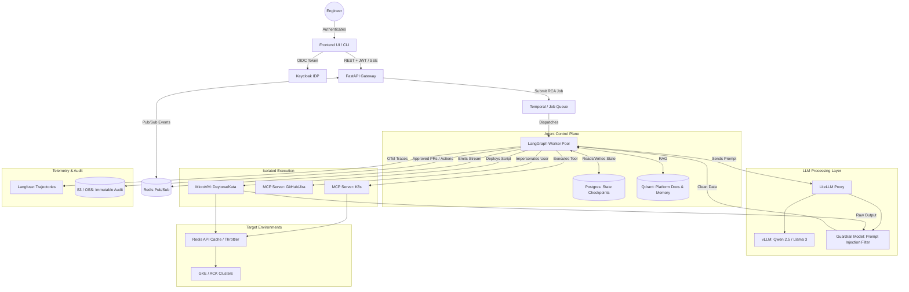

# Q: 
Can you create a final architecture with all the components making sure everything fits to together? Also create a mermaid graph so it's easy to visualise it.

## A: 
This finalized architecture integrates the core LangGraph execution loop with the operational safeguards—rate limiting, log sanitization, and ephemeral sandboxing—required to run safely in multi-cloud production environments (GCP/AliCloud).

## System Data Flow & Integration Points

* **Authentication & Streaming:** The user authenticates via **Keycloak**. The **FastAPI Gateway** validates the JWT and opens a Server-Sent Events (SSE) connection. As the agent thinks, **Redis Pub/Sub** streams the live tokens and tool logs back to the UI in real-time.
* **Job Management & Cancellation:** **Temporal** acts as the async orchestrator. If a user clicks "Cancel RCA" in the UI, Temporal intercepts the command, gracefully kills the **LangGraph Worker**, and spins down the associated MicroVM sandbox to prevent runaway compute costs.
* **State Persistence:** Every node execution in **LangGraph** is checkpointed to **Postgres**. If a Kubernetes node dies mid-RCA, a new worker picks up the exact thread state and resumes seamlessly.
* **The LLM Pipeline:** **LiteLLM** unifies API keys and routes traffic to **vLLM** instances running on local GPU nodes (GKE or ACK). This keeps all diagnostic data strictly within your VPC.

## Critical Safeguards Implemented

To address the highest risks of an autonomous SRE system, this architecture enforces three hard boundaries:

| Safeguard | Component | Purpose |
| --- | --- | --- |
| **Log Sanitizer** | Guardrail Model | Raw outputs from the MicroVM and K8s API are passed through a fast classification model (e.g., Llama Guard) before entering LangGraph. This prevents indirect prompt injection from malicious application logs. |
| **API Throttler** | Redis Cache | SRE agents can accidentally DDoS control planes during outages. The MCP servers route all read-heavy Kubernetes queries (`get pods`, `get events`) through a Redis read-through cache with a 5-second TTL. |
| **Execution Isolation** | Kata / Daytona | The LangGraph worker *never* runs code. It pushes generated Python/Bash scripts to ephemeral, network-restricted MicroVMs. Once the RCA completes, the VM is destroyed, ensuring no leaked credentials persist. |
